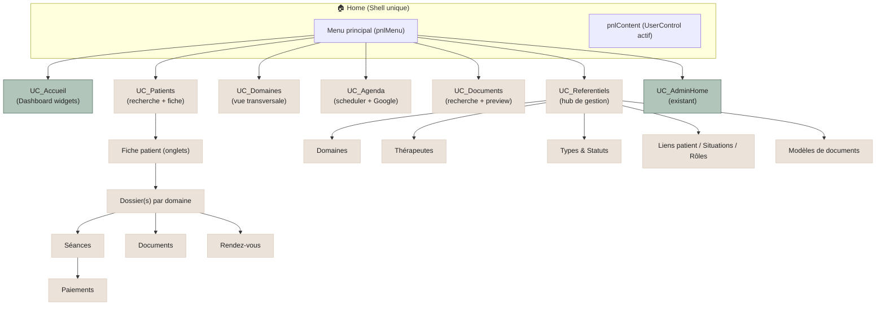
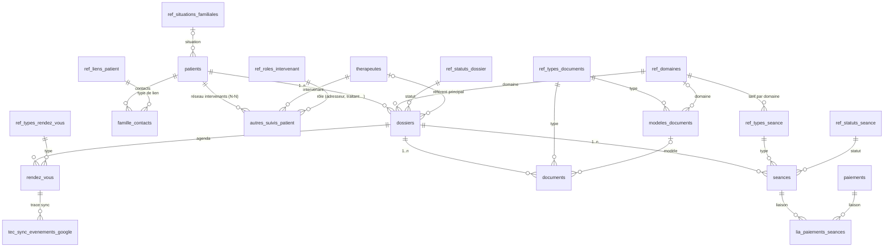
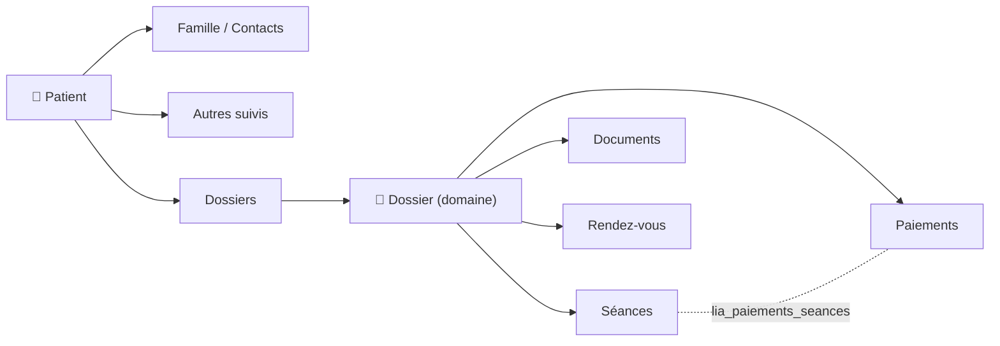
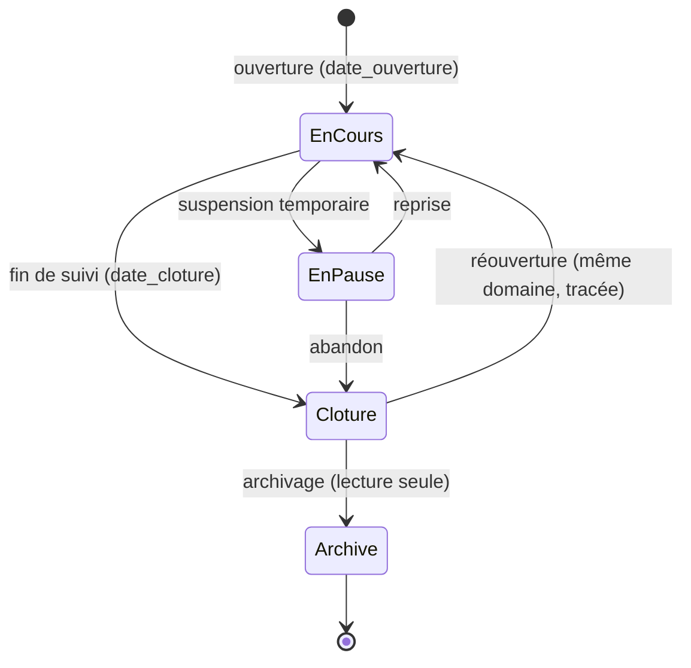
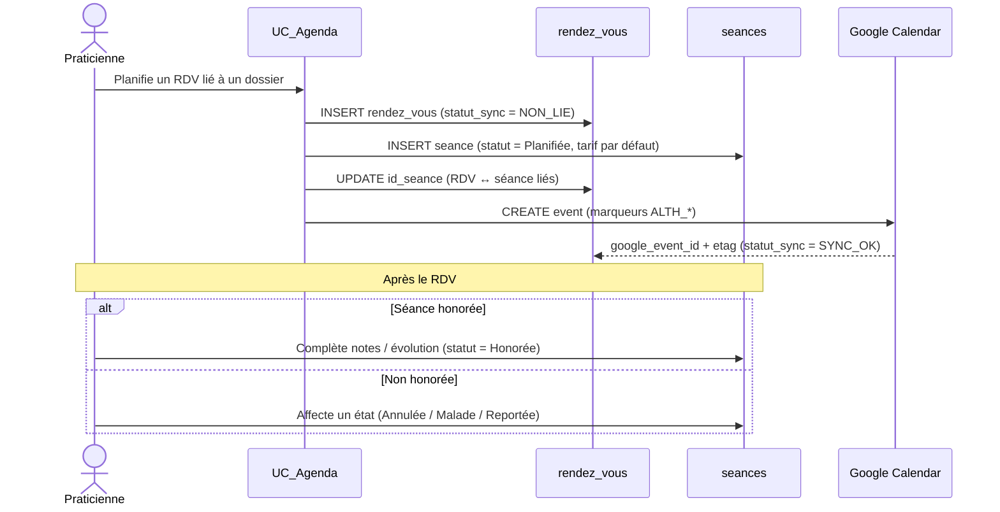
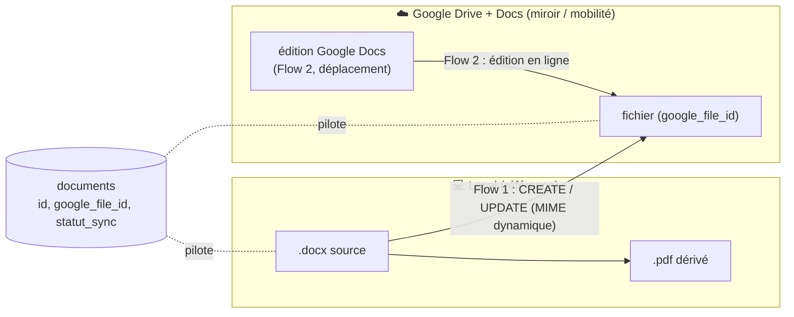
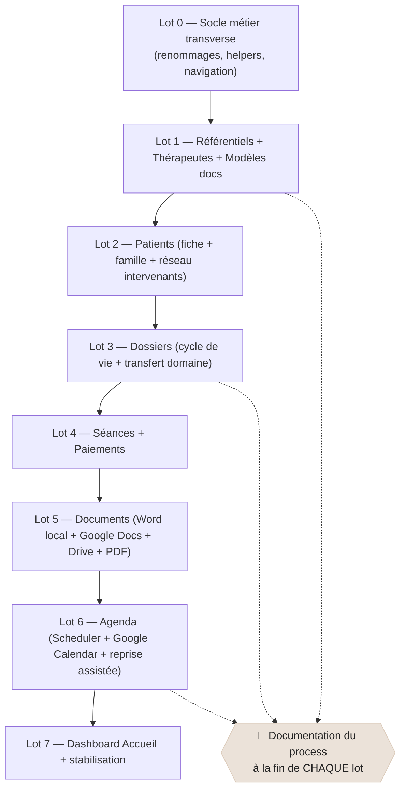

# 🌿 Althéa — Plan de conception du cœur métier (Patients, Dossiers, Référentiels, Documents, Agenda)

> **Type** : Document de conception fonctionnelle et technique (plan directeur de la phase métier)
> **Date de rédaction** : 08/06/2026
> **Statut** : 🟢 Décisions de cadrage **actées** le 08/06/2026 (Q1/Q1bis/Q2/Q3/Q4/Q5/Q6/Q7/Q7bis/Q8/Q9/Q10) — prêt pour le Lot 0
> **Auteur** : Joëlle (Manou) — assisté
> **Portée** : Phases 2 → 4 du `Planning_actions_Althéa.md`

---

## 0. Comment lire ce document

Ce document **n'est pas une décision figée**. C'est un **plan de travail proposé**, critique et argumenté, destiné à :

1. transformer ta note de cadrage en feuille de route exploitable ;
2. aligner chaque brique sur **l'antériorité** (architecture, DB, patterns UI déjà actés) ;
3. **lister les arbitrages à acter** avant de coder (section [§13 Questions ouvertes](#13-questions-ouvertes--décisions-à-acter)).

> ⚠️ **Règle d'or du projet** (rappel `Rules.md`) : *réfléchir avant de coder, valider étape par étape, ne rien accumuler de non stabilisé.* Ce plan respecte cette logique : **on gèle le périmètre d'un lot avant de l'implémenter.**

### Sources de vérité utilisées

| Source | Apport pour ce plan |
|--------|---------------------|
| `Docs/Database/backup_NoData_althea.sql` | Schéma métier **réel** (tables, FK, contraintes) |
| `Docs/Database/Database_technique.md` | Dictionnaire des tables et relations |
| `Docs/Rules/ARCHITECTURE_DECISIONS.md` | ADR-01 → ADR-15 (cadre non négociable) |
| `Docs/Poc/Gestion_documentaire_Althea.md` | Flows documentaires validés |
| `Docs/Poc/Gestion_Calendrier_Althea.md` | Socle agenda Google validé |
| `Docs/Todo/Planning_actions_Althéa.md` | Phases et jalons |
| `UI/Controls/Administration/UC_*` | Patterns UI de référence à réutiliser |

---

## 🟢 Décisions actées (08/06/2026) — amendent l'antériorité

> Issues de l'échange de cadrage. Elles **complètent et amendent** ce qui précède. Les questions résiduelles restent en [§13](#13-questions-ouvertes--décisions-à-acter).

### D-Q4 — Stockage 100 % fichiers, chemin déterministe, **nom seul** en DB

- **Aucun fichier/image en base** : uniquement sur **disque** (+ miroir Google Drive). La DB **ne stocke pas le chemin absolu**, seulement le **nom de fichier** ; le chemin est **reconstruit** à partir de *(nature du document, `id_patient`, `id_dossier`)* + racine paramétrée.
- **Import en 2 temps** : (1) l'U choisit d'abord le **type** de document/image ; (2) le **nom** est soit **automatique** (modèles connus, ex. photo d'identité → `Identite`), soit **saisi** par l'U (hors modèle), **toujours horodaté et reconnaissable**.
- **Documents au niveau patient confirmés** (ex. photo d'identité `…/{id_patient}/Identite.jpg`, sans dossier) → conséquence schéma en [§12 BD-1](#12-impacts-base-de-données--ajustements-proposés) : ajout `documents.id_patient`, `id_dossier` rendu nullable.

### D-Q1 / D-Q2 — « Volet » devient « Domaine »

- **Renommage acté** `ref_volets → ref_domaines` (et `id_volet → id_domaine`, `code_volet → code_domaine`, séquence, FK, index, contraintes), réalisé **maintenant** car **aucun code métier n'en dépend encore**.
- ✅ `domaine`/`domaines` **n'est pas un mot réservé** MariaDB ; préfixé (`ref_domaines`, `id_domaine`) → aucun risque de collision.
- Le bouton de menu **« Domaines »** = **vue d'entrée transversale** par domaine d'activité (Psychologie, Graphothérapie, Réalism, TCA…).

### D-Q6 — Séance créée tôt + **statut** (aucune table à créer)

- Un RDV **lié à un dossier** peut **générer sa séance dès la planification**, avec un **statut** issu de `ref_statuts_seance` (**table déjà existante**).
- États typiques : *Planifiée, Honorée, Annulée (patient), Annulée (praticien), Patient malade, Reportée…* → ouvre la voie aux **statistiques d'annulation**.
- L'U **complète** la séance (notes/évolution) si honorée, sinon lui **affecte un état**. Les RDV **libres** (sans dossier) ne génèrent **pas** de séance.

### D-Q8 — Google (Drive + Calendar + Docs) = **pilier V1**

- La **synchronisation Google n'est pas optionnelle** : elle fait partie intégrante du périmètre V1 (bidirectionnelle).
- **Google Docs (Flow 2) reste un pilier V1** au même titre que Word local : l'appli n'étant **pas encore web/portable**, la praticienne doit pouvoir **créer/modifier un document en déplacement** via Drive/Docs.
- Prévoir la **reprise assistée** des RDV existants à l'installation : **semi-automatique**, **validée par l'U**, avec liaison à un patient/dossier — cf. POC agenda, section *« Reprise future de l'existant »*.

### D-Q1bis — `medecins` devient `therapeutes` + réseau d'intervenants normalisé

- **Renommage acté** `medecins → therapeutes` (`id_therapeute`, `code_therapeute` préfixe `TH`) pour **englober tous les intervenants** (médecin traitant, psychiatre, logopède, kiné, adresseur/orienteur…). Ajout d'un champ `profession`.
- **Nouveau référentiel `ref_roles_intervenant`** : *Adresseur/Orienteur, Médecin traitant, Psychiatre, Logopède, Autre thérapie…*
- 🟢 **Option A actée** : `autres_suivis_patient` **devient la table de liaison N-N** `(id_patient, id_therapeute, id_role, date_debut, date_fin, commentaire_rtf/txt)`. Le **rôle est porté par la liaison** → un même thérapeute peut être *adresseur* pour l'un et *médecin traitant* pour l'autre. Fini le texte libre dénormalisé.
- `dossiers.id_medecin_traitant → id_therapeute_traitant` (raccourci « référent principal » du dossier, **en plus** du réseau N-N). Voir [§12 BD-6](#12-impacts-base-de-données--ajustements-proposés).

### D-Q1ter — Approfondissements transverses actés

- **Tarifs par domaine** : `ref_types_seance` reçoit `id_domaine` → un même libellé (« bilan ») peut avoir un **tarif distinct** selon le domaine (Realism, Graphothérapie…).
- **« Qui a adressé le patient »** : résolu par le rôle *Adresseur* de la N-N (aucun champ dédié).
- **Transfert de dossier** entre domaines : tracé et **figé** sur les séances passées (cf. D-Q10).
- **Commentaires enrichis** : ciblage RTF (cf. D-Q7bis).

### D-Q4bis — UC **physique** par référentiel (main totale sur le design)

- 🟢 **Décision révisée** : on **abandonne** le composant générique unique. **Un UserControl physique par référentiel** → la praticienne garde la **maîtrise complète du design** de chaque écran.
- Pour éviter la dette de copier-coller : **classe de base non visuelle `UC_ReferentielBase`** (hérite de `UserControl`) factorisant CRUD/binding/validation/droits ; chaque référentiel conserve **son propre `.Designer.vb`** dessiné librement.

### D-Q5 — Réouverture de dossier (même domaine uniquement)

- 🟢 **Acté** : un dossier **clôturé** peut être **rouvert** *(Clôturé → En cours)*, **à condition de rester dans le même domaine**, transition **tracée**.
- Un dossier **archivé** est **terminal** → tout nouveau suivi impose **l'ouverture d'un nouveau dossier**.

### D-Q7 — Documents : Word local **et** Google Docs prioritaires en V1

- 🟢 **Acté** : **Flow 1 (Word local)** = synchro Drive **dès la sauvegarde** + export PDF ; **Flow 2 (Google Docs)** = pilier V1 pour la **mobilité**.
- Les **notes** (séances/patient/dossier) restent éditées via `UC_RichTextEditor`, **consultables dans l'appli**, exportables à la demande.
- D'autres modes de création (autres applications que Word/Google Docs) sont envisagés **plus tard**, hors V1.

### D-Q7bis — `UC_RichTextEditorSimple` ciblé pour les commentaires

- 🟢 **Acté** : créer un **`UC_RichTextEditorSimple`** (variante compacte du `UC_RichTextEditor`, **rtf + txt**) pour les champs `commentaire`.
- **Ciblage** : enrichi sur **`famille_contacts`** et **`autres_suivis_patient`** ; les autres `commentaire` (`paiements`, `modeles_documents`, `therapeutes`) restent en **texte simple**.

### D-Q9 — Mono-utilisateur V1, **multi-utilisateur anticipé**

- 🟢 **Acté** : V1 = praticienne **seule**, mais on **laisse la voie ouverte** sans migration douloureuse plus tard.
- Anticipation à coût minimal : `id_utilisateur` **nullable** sur `rendez_vous` (et `dossiers`), et **un `google_calendar_id` par utilisateur** côté configuration. Aucun mécanisme de partage/droits par enregistrement en V1.

### D-Q10 — Tarifs par domaine + transfert de dossier

- 🟢 **Acté** : les **tarifs dépendent du domaine** (raison d'être des domaines, avec les modèles de documents) → `id_domaine` sur `ref_types_seance` (D-Q1ter).
- Un dossier **ouvert dans un domaine peut être transféré** dans un autre : **documents, notes et séances restent attachés** au dossier et au patient ; les **séances passées gardent leur tarif figé** (`seances.tarif_seance`) ; le transfert est **tracé**.

---

## 1. Ce sur quoi on s'appuie (antériorité acquise)

Avant tout nouveau code, rappelons ce qui est **déjà acté et stable** — et qui **contraint** la conception métier :

- ✅ **Architecture 4 couches** `Core / Metier / UI / Utils` — séparation stricte (ADR-04). Aucun SQL dans l'UI, aucune UI dans le métier.
- ✅ **Point d'accès DB unique** `DatabaseManager` (ADR-05) + **SQL centralisé** dans des modules `Query<Domaine>` (ADR-06).
- ✅ **Une seule Form `Home`** + UserControls injectés via `NavigationManager` (ADR-09), contexte partagé `UserControlContext`.
- ✅ **Rôles** User / SuperUser / Admin + élévation temporaire (ADR-08).
- ✅ **DialogChoix** remplace tout MessageBox (ADR-11), **UtilsIcons** centralise les icônes d'état (ADR-12).
- ✅ **UC_RichTextEditor** pour les notes formatées + **règle double colonne `xxx_rtf` / `xxx_txt`** (ADR-15).
- ✅ **Schéma DB métier déjà créé** : `patients`, `dossiers`, `seances`, `paiements`, `documents`, `rendez_vous`, référentiels, liaisons — avec séquences MariaDB et codes lisibles générés (`PA000001`, `DO000001`…).
- ✅ **Assets du menu Home déjà dessinés** : `patients`, `domaines`, `agenda`, `documents`, `referentiels`, `outils_admin` → la navigation cible est **déjà anticipée graphiquement**.
- 🧪 **POC documentaire et agenda validés** (Syncfusion DocIO + Google Drive/Docs/Calendar), **non intégrés**.

> 💡 **Conséquence forte** : la DB métier étant déjà modélisée, la phase qui s'ouvre est **majoritairement applicative** (métier + UI), pas une refonte de schéma. On code **par-dessus** un socle existant. Les rares ajustements de schéma nécessaires sont isolés en [§12](#12-impacts-base-de-données--ajustements-proposés).

---

## 2. Vision cible en une image



---

## 3. Modèle de domaine (basé sur le schéma réel)

Ce diagramme reflète **exactement** les tables et clés étrangères présentes dans `backup_NoData_althea.sql`. Il sert de **contrat** pour les couches `Metier` et `Query`.



### Lectures clés du modèle (et leurs conséquences)

| Constat dans le schéma | Conséquence de conception |
|------------------------|---------------------------|
| `dossiers.id_domaine` **NOT NULL** *(ex-`id_volet`, D-Q1)* | Un dossier appartient **toujours** à un domaine. Le domaine **pilote** modèles de documents, types de séance et tarifs. Un dossier peut être **transféré** vers un autre domaine (D-Q10), docs/notes/séances **restant attachés**. |
| `medecins` → `therapeutes` *(D-Q1bis)* + `autres_suivis_patient` dénormalisé | 🟢 Renommage en **référentiel d'intervenants** ; `autres_suivis_patient` **devient la liaison N-N** `patient ↔ therapeute ↔ ref_roles_intervenant` ([§12 BD-6](#12-impacts-base-de-données--ajustements-proposés)). |
| `ref_types_seance.tarif_defaut` **sans `id_domaine`** | 🟢 **D-Q10** : ajout `ref_types_seance.id_domaine` → tarifs **différenciés par domaine** ([§12 BD-7](#12-impacts-base-de-données--ajustements-proposés)). |
| `documents.id_dossier` **NOT NULL** (schéma actuel) | 🟢 **D-Q4** : un document peut être **niveau patient** (photo d'identité) **ou** niveau dossier → ajout `documents.id_patient` + `id_dossier` rendu **nullable** ([§12 BD-1](#12-impacts-base-de-données--ajustements-proposés)). |
| `paiements` n'a **aucun FK direct** vers patient/dossier | Le lien passe par `lia_paiements_seances` (N-N). Un paiement peut couvrir **plusieurs séances** ; une séance peut être réglée **en plusieurs fois**. Le « solde patient » est donc **calculé**, jamais stocké. |
| `rendez_vous` : `id_patient`, `id_dossier`, `id_seance` **nullable** | L'agenda accepte des RDV « libres » (perso, prospect) **et** des RDV métier. Cohérent avec le POC « calendrier mixte ». |
| `famille_contacts.commentaire` / `autres_suivis_patient.commentaire` en `text` simple | 🟢 **D-Q7bis** : passage en `commentaire_rtf` + `commentaire_txt` (éditeur `UC_RichTextEditorSimple`) ([§12 BD-8](#12-impacts-base-de-données--ajustements-proposés)). |
| Aucune colonne `id_utilisateur` sur `rendez_vous`/`dossiers` | 🟢 **D-Q9** : ajout **nullable** anticipé (mono-user V1, multi-user futur sans migration douloureuse) ([§12 BD-9](#12-impacts-base-de-données--ajustements-proposés)). |
| `seances.*_rtf` / `*_txt` + `dossiers.*_rtf` / `*_txt` déjà présents | ✅ La DB est **déjà prête** pour `UC_RichTextEditor` (règle double format respectée). Aucun ajout nécessaire. |
| `rendez_vous` porte déjà `google_event_id`, `google_calendar_id`, `statut_sync_google` | ✅ Le branchement agenda↔Google est **prévu nativement** dans le schéma. |
| `documents` porte déjà `google_file_id`, `chemin_pdf_relatif`, `chemin_miniature_relatif`, `est_document_image_metier` | ✅ Les 4 flows du POC documentaire sont **modélisables sans modif** majeure. |

---

## 4. Référentiels vs tables métier : qui gère quoi, et où

C'est **le point structurant** de ta note. Voici la classification proposée, dérivée des liens réels du schéma.

### 4.1 Référentiels « purs » → écrans de gestion dédiés (zone Référentiels)

Gérés via un **hub `UC_Referentiels`** (coque type `UC_AdminHome`), accessibles aux rôles habilités.

| Référentiel | Table | Particularité | Pattern UI conseillé |
|-------------|-------|---------------|----------------------|
| **Domaines** *(ex-Volets)* | `ref_domaines` *(renommé, D-Q1)* | Pilote tarifs, modèles, types | UC physique dédié |
| Statuts dossier | `ref_statuts_dossier` | Cycle de vie | UC physique dédié |
| Statuts séance | `ref_statuts_seance` | | UC physique dédié |
| Types de séance | `ref_types_seance` | **porte `tarif_defaut`** + `id_domaine` *(D-Q10)* | UC physique dédié |
| Types de document | `ref_types_documents` | | UC physique dédié |
| Types de RDV | `ref_types_rendez_vous` | | UC physique dédié |
| Liens patient | `ref_liens_patient` | (père, mère, tuteur…) | UC physique dédié |
| Situations familiales | `ref_situations_familiales` | | UC physique dédié |
| **Rôles d'intervenant** *(nouveau, D-Q1bis)* | `ref_roles_intervenant` | adresseur, médecin traitant, logopède… | UC physique dédié |
| **Thérapeutes** *(ex-Médecins, D-Q1bis)* | `therapeutes` | Référentiel **riche** (adresse, spécialité, `profession`) partagé entre dossiers et patients | **Liste + Form** (type `UC_Utilisateurs`) |
| **Modèles de documents** | `modeles_documents` | Liés domaine + type + fichier `.docx` | **Liste + Form** + sélecteur de fichier |

> 🟢 **D-Q4bis (acté)** : **un UserControl physique par référentiel** (la praticienne garde la **main totale sur le design**). Pour éviter la dette de copier-coller, on factorise le **non-visuel** dans une **classe de base `UC_ReferentielBase`** (CRUD, binding, validation, droits) ; chaque écran conserve **son propre `.Designer.vb`**. (cf. [§7.3](#73-uc-physique--classe-de-base-uc_referentielbase-d-q4bis)).

### 4.2 Tables métier rattachées au **Patient** → gérées depuis la fiche patient

| Table | Onglet de la fiche patient |
|-------|----------------------------|
| `famille_contacts` (→ `ref_liens_patient`) | Onglet « Famille / Contacts » |
| `autres_suivis_patient` (réseau N-N → `therapeutes` + `ref_roles_intervenant`, D-Q1bis) | Onglet « Intervenants / Autres suivis » |
| `dossiers` (liste) | Onglet « Dossiers » (point d'entrée vers le dossier) |

### 4.3 Tables métier rattachées au **Dossier** → gérées depuis le dossier ouvert

| Table | Emplacement |
|-------|-------------|
| `seances` (→ types, statuts) | Onglet « Séances » du dossier |
| `documents` (→ types, modèles) | Onglet « Documents » du dossier |
| `rendez_vous` | Onglet « Agenda » du dossier **et** vue agenda globale |
| `paiements` (via `lia_paiements_seances`) | Onglet « Paiements / Suivi financier » du dossier |



---

## 5. Cycle de vie du dossier

Ta note : *« Le dossier est en cours, ou en pause, ou clôturé, ou archivé. »* → géré par `ref_statuts_dossier`. Voici la machine à états proposée (les transitions doivent être **sécurisées et tracées**, jamais libres).



**Règles proposées :**
- `Archivé` = **lecture seule** (aucune séance/document/paiement modifiable) **et terminal** : tout nouveau suivi impose **un nouveau dossier**.
- Toute transition est **journalisée** (`GestionLog`) et confirmée via `DialogChoix`.
- `date_cloture` obligatoire au passage en `Clôturé` ; `historique_archive_rtf/txt` figé à l'archivage.
- 🟢 **D-Q5 (acté)** : un dossier **clôturé** peut être **rouvert** *(Clôturé → En cours)* **à condition de rester dans le même domaine**, transition tracée. Un nouveau suivi dans un **autre** domaine = **nouveau dossier**.

---

## 6. Distinction Rendez-vous ⟷ Séance (à clarifier absolument)

Le schéma sépare clairement deux objets que la note tend à mélanger :

| `rendez_vous` | `seances` |
|---------------|-----------|
| Objet **agenda** (planification) | Objet **clinique** (suivi réalisé) |
| Projeté dans Google Calendar | Source de vérité métier, jamais dans Google |
| Peut être perso/libre (sans dossier) | Toujours rattachée à un dossier |
| Porte `date_heure_debut/fin`, sync Google | Porte notes, évolution, tarif, paiements |

Relation prévue par le schéma : `rendez_vous.id_seance` (nullable) → **un RDV lié à un dossier peut générer sa séance dès la planification**, que l'U **statue** ensuite via `ref_statuts_seance`.



> 🟢 **D-Q6 (acté)** : à la création d'un **RDV lié à un dossier**, Althéa **propose de créer la séance** (statut initial *Planifiée*). Après le RDV, l'U **complète** la séance (notes/évolution) si honorée, sinon lui **affecte un état** (Annulée patient/praticien, Malade, Reportée…). Les RDV **libres** (sans dossier) ne génèrent **pas** de séance. ✅ Aucune table à créer : `ref_statuts_seance` **existe déjà** dans le schéma.

### 6.1 États de séance (seed `ref_statuts_seance`) et statistiques

Le statut de séance alimente directement les **statistiques d'annulation** souhaitées. Jeu de valeurs initial proposé (à valider en Lot 1) :

| `code_statut_seance` | Libellé | Compte comme honorée ? | Facturable ? |
|----------------------|---------|------------------------|--------------|
| `PLANIFIEE` | Planifiée | — | selon règle |
| `HONOREE` | Honorée | ✅ | ✅ |
| `ANNULEE_PATIENT` | Annulée par le patient | ❌ | selon délai |
| `ANNULEE_PRATICIEN` | Annulée par la praticienne | ❌ | ❌ |
| `MALADE` | Patient malade | ❌ | ❌ |
| `REPORTEE` | Reportée | ❌ | ❌ |
| `ABSENT` | Absence non excusée | ❌ | ✅ (selon règle) |

> 💡 Ces codes permettront des indicateurs simples (taux d'annulation, motifs, no-show) sans table supplémentaire. La **facturabilité** d'un état (ex. absence non excusée facturée) relève d'une **règle métier** dans `GestionSeances`, pas du référentiel lui-même.

---

## 7. Patterns UI à réutiliser (ne rien réinventer)

L'antériorité fournit **3 patrons** éprouvés. La règle : **choisir le patron selon la longueur de liste et le nombre de champs**, exactement comme tu l'as intuité.

### 7.1 Patron « Hub / Coque » — modèle `UC_AdminHome`
Pour : `UC_Referentiels` (et éventuellement `UC_Patients`, `UC_Domaines`).
Rôle : écran d'entrée avec tuiles/boutons vers les sous-écrans, gestion des droits, header de contexte.

### 7.2 Patron « Liste + Form modale » — modèle `UC_Utilisateurs` + `UtilisateurEdition`
Pour : **listes longues, beaucoup de champs** → Patients, Thérapeutes, Modèles de documents, Dossiers.
Caractéristiques : DataGridView + recherche/filtres + Form d'édition séparée (Création / Modification / Consultation).

### 7.3 UC physique + classe de base `UC_ReferentielBase` (D-Q4bis)
Pour : **tous les `ref_*`** → **un UserControl physique par référentiel** (design 100 % maîtrisé).

> 🟢 **D-Q4bis (acté) — UC physique, sans copier-coller la logique**
> La praticienne veut garder la **main totale sur le design** → chaque référentiel a **son propre écran et son `.Designer.vb`**. Pour ne pas dupliquer la logique 9 fois, on factorise le **non-visuel** dans une **classe de base `UC_ReferentielBase`** (hérite de `UserControl`) : chargement, CRUD via `GestionReferentiel`, binding, validation, gestion des droits, journalisation. Chaque `UC_Ref<X>` **hérite** de cette base et ne s'occupe **que de son visuel**.
> **Avantages** : design libre **et** logique mutualisée/testée une fois.
> **À ne pas faire** : recopier intégralement `UC_Parametres` (visuel + logique) pour chaque référentiel → dette technique immédiate.

---

## 8. Stockage des fichiers, nommage et synchronisation

> 🟢 **Principe acté (D-Q4)** : **aucun fichier en base** (disque + miroir Drive uniquement). La DB stocke le **nom de fichier**, jamais le chemin absolu ; le **chemin est déterministe**, reconstruit depuis *(nature du document, `id_patient`, `id_dossier`)* + racine paramétrée (`tec_parametres`).

**Import en 2 temps** : (1) l'U choisit le **type** de document/image ; (2) le **nom** est **automatique** (modèles connus, ex. photo d'identité) ou **saisi** par l'U (hors modèle), **toujours horodaté et reconnaissable**.

Le POC documentaire a **déjà tranché** l'arborescence **niveau dossier** ; on la reprend, **complétée d'un niveau patient** (pour la photo d'identité et les pièces administratives globales).

### 8.1 Arborescence locale (référence métier)

```
{RacineDocuments}/
  Patients/
	{id_patient}/
	  Identite.jpg          → photo d'identité (nom fixe, sans timestamp)
	  Documents/            → pièces administratives niveau patient
	  {id_dossier}/
		Documents/      → .docx (source) + .pdf (dérivé)
		Photos/         → images métier + _thumb (miniatures)
```

- `{RacineDocuments}` = **paramètre `tec_parametres`** (jamais en dur). → vérifier/ajouter la clé.
- **Niveau patient** (sans dossier) : `…/{id_patient}/Identite.jpg` (nom **fixe**, écrase la précédente) et `…/{id_patient}/Documents/…` (pièces administratives).
- **Chemin déterministe** : reconstructible depuis *(nature, `id_patient`, `id_dossier`)* — la DB n'a donc besoin que du **nom de fichier** (D-Q4).
- Miroir Google Drive `Althea/Patients/{id}/{id}/...` **basé sur les ID**, jamais sur le chemin (cf. POC : `GetOrCreateDriveFolder`).

### 8.2 Convention de nommage (pour sync bidirectionnelle fiable)

```
{Type}_{id_patient}_{id_dossier}_{yyyyMMdd_HHmmss}[_index].{ext}
ex : Anamnese_000012_000007_20260608_142530.docx
	 Photo_000012_000007_20260608_142530_01.jpg
```

- Préfixe **lisible** (`Anamnese`, `Seance_Rapport`, `Courrier`…) dérivé de `ref_types_documents`.
- **Timestamp** = unicité + tri naturel + réconciliation Google.
- ⚠️ **Le nom de fichier n'est JAMAIS un identifiant métier** (piège explicite du POC). L'identité = `id_document` + `google_file_id` en base.
- 🟢 **D-Q4** : seul le **nom** est stocké en DB (`nom_fichier`) ; le **chemin relatif** reste renseigné (`chemin_relatif`) **pour robustesse**, mais peut être **recalculé** à tout moment. Exception nommage : la **photo d'identité** garde un **nom fixe** (`Identite`, sans timestamp) car elle **remplace** la précédente.

### 8.3 Règles documentaires (rappel POC, non négociables)

- DOCX = **source éditable** ; PDF = **dérivé reconstructible** (jamais critique, jamais source).
- Image métier = **donnée**, jamais remplacée par son PDF ; miniatures **locales uniquement**.
- Upload Google : **CREATE si `google_file_id` absent, sinon UPDATE** (jamais recréer).
- MIME type **toujours dynamique**.

> 🟢 **D-Q7 (acté) — deux flux d'édition de premier plan en V1** :
> - **Flow 1 — Word local** : édition `.docx` locale, **synchro Drive dès la sauvegarde**, export PDF (cas principal au cabinet).
> - **Flow 2 — Google Docs** : édition **en ligne** pour la **mobilité** (déplacements), l'appli n'étant pas encore web/portable. Même `google_file_id`, réconciliation par la convention de nommage.
>
> Les deux flux pointent vers **le même document métier** (`documents.id_document` + `google_file_id`). D'autres modes de création (autres applications) sont **hors V1**.



---

## 9. Opportunités Syncfusion (au-delà de DocIO)

Tu as la **licence Community** : autant l'exploiter là où le « maison » serait coûteux **sans casser l'existant**. Mon conseil est **chirurgical**, pas un remplacement global.

| Besoin | Contrôle Syncfusion | Verdict | Justification |
|--------|---------------------|---------|---------------|
| Preview rapide PDF (ta demande) | `PdfViewerControl` | ✅ **Adopter** | Aucun équivalent maison ; indispensable au « preview = sauvegarde PDF ». |
| Agenda / séances | `ScheduleControl` (puis `SfScheduler`) | ✅ **Adopter** | Déjà validé au POC ; mapping Google OK. |
| Dashboard Accueil (RV du jour, prochain patient…) | `TileLayout` / `HubTile` | 🟸 **Évaluer** | Joli et « friendly », mais l'Accueil est prévu **en dernier** → décider à ce moment. |
| Recherche patient (autocomplétion) | `SfComboBox` / `AutoComplete` | 🟸 **Évaluer** | Confort réel ; peut aussi se faire en maison. |
| Listes patients/documents volumineuses | `SfDataGrid` | ⚠️ **Pas en V1** | `DataGridView` + `UtilsDataGrid` déjà standardisés. Migrer = rupture de cohérence. À reconsidérer si volumétrie/perf le justifie. |
| Layouts avancés (volets ancrables) | `DockingManager` | ❌ **Éviter en V1** | Complexité > valeur ; `Home` mono-écran suffit. |

> 🧭 **Principe directeur** : *« Syncfusion là où il n'existe pas d'équivalent maison (PDF, Scheduler) ; statu quo là où le maison est déjà standardisé (grilles, boutons, dialogues). »*
> **À ne pas faire** : introduire `SfDataGrid` + `DataGridView` en parallèle → deux standards = confusion et double maintenance.

---

## 10. À FAIRE ✅ / À NE PAS FAIRE ❌

### ✅ À faire
- **Geler le périmètre de chaque lot** avant de coder (validation étape par étape).
- **Un module `Query<Domaine>` + un module `Gestion<Domaine>`** par entité (Patients, Dossiers, Séances, Paiements, Documents, Agenda, Référentiels).
- Réutiliser **`UC_RichTextEditor`** pour les notes (`*_rtf/*_txt`) et **`UC_RichTextEditorSimple`** pour les commentaires ciblés (D-Q7bis).
- **Factoriser** le non-visuel des référentiels dans **`UC_ReferentielBase`** (UC physiques hérités, design libre — D-Q4bis).
- **Calculer** le solde patient (jamais le stocker).
- Tracer toutes les **transitions de statut**, les **transferts de dossier** et actions sensibles (`GestionLog`).
- Centraliser la **racine de stockage** dans `tec_parametres`.
- Brancher Google **après** le CRUD local **dans le même lot** (ordre d'implémentation) — Google (Drive + Calendar + **Docs**) **faisant partie de la V1** (pilier, D-Q8).

### ❌ À ne pas faire
- ❌ Mettre du SQL ou de la logique métier dans un UserControl.
- ❌ Recréer un dialogue : **toujours `DialogChoix`**.
- ❌ **Recopier la logique** d'un référentiel dans chaque écran (utiliser `UC_ReferentielBase`).
- ❌ Utiliser le **nom de fichier** comme identifiant métier.
- ❌ Faire dépendre la logique métier de la **couleur** ou du **titre** d'un événement Google (cf. POC).
- ❌ Démarrer Documents/Agenda **avant** que Patients/Dossiers soient solides.
- ❌ Migrer toutes les grilles vers Syncfusion « parce qu'on a la licence ».
- ❌ Stocker un RTF sans son TXT (casse la recherche — ADR-15).

---

## 11. Roadmap proposée (lots livrables)

Découpage en **lots autonomes et testables**, **sans échéances ni cadence** (travail en solo, à ton rythme). Chaque lot suit le même rituel : **gel du périmètre → implémentation → recette → 📝 documentation du process** (tu documentes après chaque étape pour ne pas perdre le fil). On n'enchaîne un lot qu'une fois le précédent **documenté**.



> 🌿 **Pas de Gantt daté volontairement** : tu travailles seule, retraitée, avec d'autres obligations. La progression se mesure en **jalons « fait / pas fait »**, pas en jours. Mieux vaut un lot **terminé et documenté** que trois lots à moitié faits.

### Détail des lots

| Lot | Contenu | Modules créés | Pré-requis | Sortie de lot (avant 📝 doc) |
|-----|---------|---------------|------------|---------------|
| **0** | Renommages (Domaine, Thérapeutes), helper de chemins **déterministes**, conventions de nommage, extension menu `Home`, squelette navigation | `Utils` + nav `Home` | BD-0, BD-6 (renommages) | Boutons menu actifs (placeholders) |
| **1** | Référentiels (UC physiques + `UC_ReferentielBase`) + Thérapeutes + Rôles intervenant + Modèles docs | `GestionReferentiel`, `QueryReferentiels`, `UC_ReferentielBase`, `UC_Ref<X>` | Lot 0 | Tous les `ref_*` + `therapeutes` éditables |
| **2** | Recherche patient + fiche multi-onglets + famille + **réseau intervenants N-N** | `GestionPatients`, `QueryPatients`, `UC_Patients`, `PatientEdition`, `UC_RichTextEditorSimple` | Lot 1 | CRUD patient complet |
| **3** | Dossiers par domaine + machine à états + **transfert de domaine** + champs RTF | `GestionDossiers`, `QueryDossiers`, `UC_Dossier` | Lot 2 | Dossier ouvrable, statuts + transfert gérés |
| **4** | Séances (RTF, tarif **par domaine**) + Paiements (N-N) + solde calculé | `GestionSeances/Paiements` + Queries | Lot 3 | Suivi clinique + financier |
| **5** | Intégration POC documentaire — **Flow 1 Word local + Flow 2 Google Docs** + PDF + Drive + preview | `GestionDocuments`, `QueryDocuments` | Lot 3 (idéal Lot 4) | Flux documentaires opérationnels |
| **6** | Intégration POC agenda (Scheduler, Google Calendar) **+ reprise assistée des RDV existants** | `GestionAgenda`, `QueryRendezVous` | Lot 3 | Agenda **sync Google bidirectionnelle** |
| **7** | Dashboard Accueil (widgets) + recette transverse | `UC_Accueil` enrichi | Lots 2-6 | V1 interne |

> 🔎 **Pourquoi cet ordre ?** Patients/Dossiers sont la **colonne vertébrale** : tout s'y rattache. Documents et Agenda (les POC) arrivent **après** car ils consomment `id_patient`/`id_dossier`. L'Accueil arrive en dernier (ta volonté) car il **agrège** tout le reste.

---

## 12. Impacts base de données / ajustements proposés

La DB est globalement prête. Points à **instruire** (aucun n'est bloquant pour démarrer le Lot 1) :

| # | Sujet | Proposition | Priorité |
|---|-------|-------------|----------|
| BD-0 | 🟢 **D-Q1 — Renommage** `ref_volets → ref_domaines` (+ `id_volet → id_domaine`, `code_volet`, `libelle_volet`, séquence, FK, index, contraintes) | Script de migration **versionné** ; régénérer les diagrammes `Docs/Database/Diagrams/` | **Avant Lot 1** |
| BD-1 | 🟢 **D-Q4 — Documents niveau patient** (photo) **et** niveau dossier | Ajouter `documents.id_patient` (NOT NULL) + rendre `documents.id_dossier` **nullable** ; `id_seance`/`id_rendez_vous` restent nullables | Modèle avant Lot 5 ; à intégrer dès le Lot 2 si la photo patient est gérée tôt |
| BD-2 | Vérifier la **clé `tec_parametres`** pour la racine de stockage documents | Ajouter `DOC_RACINE_STOCKAGE` si absente | Avant Lot 5 |
| BD-3 | Valeurs des référentiels (`ref_statuts_dossier`, etc.) | Vérifier le **jeu de données initial** (seed) cohérent avec la machine à états | Lot 1 |
| BD-4 | Scripts SQL métier **versionnés** (dette DT-03) | Produire les scripts `CREATE`/seed au fil des lots | Continu |
| BD-5 | Index full-text sur `*_txt` pour la recherche | À évaluer selon volumétrie | Lot 4/5 |
| BD-6 | 🟢 **D-Q1bis — Renommage** `medecins → therapeutes` (+ `id_medecin → id_therapeute`, code `TH`, ajout `profession`) ; `dossiers.id_medecin_traitant → id_therapeute_traitant` ; **création `ref_roles_intervenant`** ; **transformation `autres_suivis_patient` en liaison N-N** (`id_therapeute`, `id_role`, `date_debut/fin`, `commentaire_rtf/txt`) | Script de migration **versionné** + reprise des données existantes ; régénérer diagrammes | **Avant Lot 1** (renommage) ; N-N **avant Lot 2** |
| BD-7 | 🟢 **D-Q10 — Tarifs par domaine** : ajouter `ref_types_seance.id_domaine` (FK `ref_domaines`) | Migration + seed des types par domaine | **Avant Lot 4** (modèle dès Lot 1) |
| BD-8 | 🟢 **D-Q7bis — Commentaires enrichis** : `famille_contacts.commentaire` et `autres_suivis_patient.commentaire` → `commentaire_rtf` + `commentaire_txt` | Migration colonnes (les autres `commentaire` restent `text`) | **Avant Lot 2** |
| BD-9 | 🟢 **D-Q9 — Anticipation multi-user** : ajouter `id_utilisateur` **nullable** sur `rendez_vous` et `dossiers` (FK `sec_utilisateurs`) ; prévoir `google_calendar_id` par utilisateur | Migration colonnes (aucune contrainte NOT NULL en V1) | **Avant Lot 3** (dossiers) / Lot 6 (agenda) |
| BD-10 | **Traçabilité transfert de dossier** (D-Q10) : historiser le changement de `dossiers.id_domaine` | Via `GestionLog` (option : table `tec_transferts_dossier`) | Avant Lot 3 |

> ⚠️ **Toute modification de schéma passe par un script versionné** dans `Docs/Database/` (ADR-01) + une entrée `tec_meta_schema`.

---

## 13. Questions ouvertes / décisions à acter

## 13. Questions ouvertes / décisions actées

✅ **Toutes les questions de cadrage sont désormais actées** (08/06/2026) :

1. ~~**Q1 — Vocabulaire**~~ → 🟢 **ACTÉ (D-Q1)** : renommage `ref_volets → ref_domaines` en DB **et** « Domaine » en UI (uniformisation complète).
2. ~~**Q2 — Bouton « Domaines »**~~ → 🟢 **ACTÉ (D-Q2)** : **vue d'entrée transversale** par domaine d'activité.
3. ~~**Q3 — Composant référentiel**~~ → 🟢 **ACTÉ (D-Q4bis)** : **UC physique par référentiel** (design libre) + **classe de base `UC_ReferentielBase`** pour mutualiser le non-visuel.
4. ~~**Q4 — Documents niveau patient**~~ → 🟢 **ACTÉ (D-Q4)** : stockage 100 % fichiers, **chemin déterministe**, **nom seul** en DB ; documents **niveau patient** (photo) **et** niveau dossier → schéma `documents` étendu ([§12 BD-1](#12-impacts-base-de-données--ajustements-proposés)).
5. ~~**Q5 — Réouverture de dossier**~~ → 🟢 **ACTÉ (D-Q5)** : réouverture autorisée **si même domaine** (tracée) ; **archivé = terminal** → nouveau dossier obligatoire.
6. ~~**Q6 — Création de séance**~~ → 🟢 **ACTÉ (D-Q6)** : séance **créée dès la planification** d'un RDV lié à un dossier, avec un **statut** (`ref_statuts_seance`) ; l'U complète ou statue ensuite.
7. ~~**Q7 — Édition documents**~~ → 🟢 **ACTÉ (D-Q7)** : **Flow 1 Word local** (synchro Drive à la sauvegarde + PDF) **et Flow 2 Google Docs** (mobilité) = piliers V1 ; notes via `UC_RichTextEditor`. Autres applis plus tard.
8. ~~**Q8 — Périmètre Google**~~ → 🟢 **ACTÉ (D-Q8)** : Google Drive, Calendar **et Docs** = **pilier V1** (sync bidirectionnelle) ; **reprise assistée** des RDV existants à l'installation.
9. ~~**Q9 — Multi-utilisateur**~~ → 🟢 **ACTÉ (D-Q9)** : mono-user V1, mais **anticipé** (`id_utilisateur` nullable + `google_calendar_id` par utilisateur) pour un multi-user futur sans migration douloureuse.
10. ~~**Q10 — Tarifs par domaine**~~ → 🟢 **ACTÉ (D-Q10)** : tarifs **différenciés par domaine** (`ref_types_seance.id_domaine`) ; **transfert de dossier** entre domaines possible, docs/notes/séances **restant attachés**, tarifs passés **figés**.

> 💡 **Nouveau (D-Q1bis)** : renommage `medecins → therapeutes` + **réseau d'intervenants normalisé** (`autres_suivis_patient` devient la liaison N-N patient↔thérapeute↔rôle).

---

## 14. Risques & points de vigilance

| Risque | Impact | Mitigation |
|--------|--------|------------|
| **Feature creep** (le périmètre s'étend) | Élevé | Gel explicite par lot (déjà au planning) |
| Dépendance Google (Drive/Calendar/Docs) — **pilier V1** | Élevé | File de synchro + retry + suivi via `statut_sync_google` ; mode dégradé temporaire hors-ligne (resync différée) |
| **Renommages DB** (`ref_volets`, `medecins`) avec données existantes | Moyen | Scripts de migration **versionnés** + reprise de données ; renommages **tôt** (Lot 0) car peu/pas de code dépendant |
| **Transformation `autres_suivis_patient`** (texte libre → N-N) | Moyen | Reprise assistée des lignes existantes (mapping vers `therapeutes` + rôle) ; à faire **avant Lot 2** |
| Sur-ingénierie UI Syncfusion | Moyen | Adoption chirurgicale (§9) |
| Cœur métier sans tests | Élevé | Recette à chaque fin de lot ; réutiliser la trame `PLAN_TESTS_*` |
| Incohérence RDV/Séance | Moyen | 🟢 **D-Q6 acté** : séance créée tôt + statut `ref_statuts_seance` |
| Photo/doc patient bloqué par `id_dossier NOT NULL` | Moyen | 🟢 **D-Q4 acté** : `documents.id_patient` + `id_dossier` nullable (BD-1) |
| Reprise de l'agenda existant chez la praticienne | Moyen | Reprise **assistée** (POC) : suggestion + validation manuelle |

---

## 15. Prochaine étape recommandée

1. **Toutes les décisions de cadrage actées** ✅ — le plan est **prêt pour l'implémentation**.
2. **Migrations préalables (Lot 0)** : produire les **scripts versionnés** des renommages **BD-0** (`ref_volets → ref_domaines`) et **BD-6** (`medecins → therapeutes` + `ref_roles_intervenant` + N-N `autres_suivis_patient`), puis régénérer les diagrammes.
3. Lancer le **Lot 0** (socle transverse) : renommages, helper de chemins **déterministes**, activation des boutons de menu `Home` en placeholders. **Puis 📝 documenter le process.**
4. Enchaîner sur le **Lot 1 — Référentiels** : lot à faible risque qui **rode `UC_ReferentielBase`** et débloque tout le reste (domaines, types, statuts, thérapeutes, rôles, modèles).

> 🌿 *« Friendly, mais sécurisé et professionnel — pas du bricolage. »* Ce plan vise exactement cet équilibre : on capitalise sur l'existant, on factorise, on intègre les POC au bon moment, et on garde la maîtrise totale du local avant d'ouvrir vers le cloud. **À ton rythme, un lot terminé et documenté à la fois.**

---

### Annexe — Correspondance note initiale → sections de ce plan

| Idée de ta note | Traitée en |
|-----------------|-----------|
| Accueil avec widgets (en dernier) | §2, Lot 7 |
| Patients, dossiers, référentiels | §3, §4, Lots 1-3 |
| Volets/Domaines = domaines d'activité | §4.1, D-Q1/D-Q2 (acté) |
| Médecins → Thérapeutes + réseau d'intervenants | §3, §4.1, §4.2, D-Q1bis (acté) |
| Dossier en cours/pause/clôturé/archivé + réouverture | §5, D-Q5 (acté) |
| Agenda synchronisé Google | §6, Lot 6 |
| Documents générés (Word local + Google Docs) + PDF + Drive | §8, §9, Lot 5, D-Q7 (acté) |
| Commentaires enrichis (RichTextEditorSimple) | D-Q7bis, §12 BD-8 |
| Path par patient/dossier + nommage + timestamp | §8.1, §8.2, D-Q4 (acté) |
| Upload photos / pièces externes | §8, BD-1, D-Q4 (acté) |
| Recherche + preview rapide de document | §9 (PdfViewer), Lot 5 |
| Référentiels = UC physique + classe de base | §7.3, D-Q4bis (acté) |
| Tables métier gérées depuis Patient ou Dossier | §4.2, §4.3 |
| Tarifs par domaine + transfert de dossier | D-Q10, §12 BD-7/BD-10 |
| Multi-utilisateur anticipé | D-Q9, §12 BD-9 |
| Bénéfice des contrôles Syncfusion | §9 |
