# Althéa - Charte graphique

> Dernière mise à jour : 07 juin 2026

## Charte Couleurs

|   Hex    |      RGB      |                            Sample                            |        Nom        | UITheme             |
| :------: | :-----------: | :----------------------------------------------------------: | :---------------: | ------------------- |
| \#7a9b87 | 122; 155; 135 |  |       Sauge       | ColorSauge          |
| \#5f7d6e | 95; 125; 110  |  |    Sauge foncé    | ColorSaugeFonce     |
| #b2c5ba  | 178; 197; 186 |  |    Sauge clair    | ColorSaugeClair     |
| #4b695a  |  75, 105, 90  |  | Sauge très foncé  | ColorSaugeTresFonce |
| \#0b5f7d |  11; 95; 125  |  | Bleu pétrole foncé | ColorMauveFonce *(nom historique)* |
| #e6dee2  | 230, 222, 226 |  | Mauve très clair  | ColorMauveTresClair |
| \#f4efea | 244; 239; 234 |  |    Beige clair    | ColorBeigeClair     |
| \#ebe2d9 | 235, 226, 217 |  |       Beige       | ColorBeige          |
| \#dac9b8 | 218; 201; 184 |  |    Beige foncé    | ColorBeigeFonce     |
| \#D8B4A0 | 216; 180; 160 |  |    Beige rosé     | ColorRoseBeige      |
| \#4A4A4A |  74; 74; 74   |  |    Gris foncé     | ColorGrisFonce      |
| \#323232 |  50; 50; 50   |  |  Gris très foncé  | ColorGrisTresFonce  |
| #a0a0a0  | 160, 160, 160 |  | Gris moyen foncé  | ColorGrisMoyenFonce |
| #d2d2d2  | 210, 210, 210 |  |    Gris Moyen     | ColorGrisMoyen      |
| #ececec  | 236, 236, 236 |  |    Gris clair     | ColorGrisClair      |
| #fafafa  | 250, 250, 250 |  |  Gris très clair  | ColorGrisTresClair  |
| \#dee6e1 | 222, 230, 225 |  |  Gris Vert Clair  | ColorGrisVertClair  |
| \#ffffff | 255; 255; 255 |  |       Blanc       | ColorBlanc          |
| #782828  |  120, 40, 40  |  | Rouge moyen foncé | ColorRougeMoyenFonce |
| #c26a76  | 194, 106, 118 |  |    Rose foncé     | ColorRoseFonce      |
| #c18445 | 193, 132, 69 |  | Orange moyen foncé | ColorOrangeMoyenFonce |
| #4582c1 | 69, 130, 193 |  | Bleu moyen | ColorBleuMoyen |

- Sous forme de Properties dans le module UITheme.vb
- `ColorMauveFonce` conserve ici son nom historique dans le code, bien que la teinte documentée corresponde visuellement à un bleu pétrole foncé.
- Répertoire : Utils/

------

## Images

### Splash image

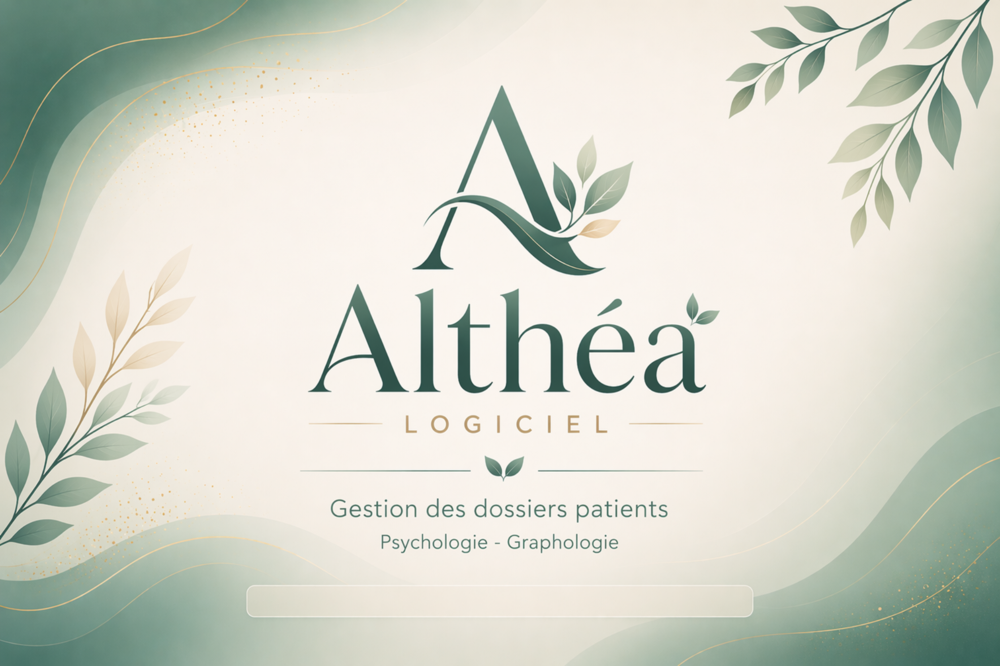

- Nom : Splash_Althea_Main_from_image.png
- Format : .png
- Répertoire : /Assets/Splash/

------

### Fonds

#### pnlForm

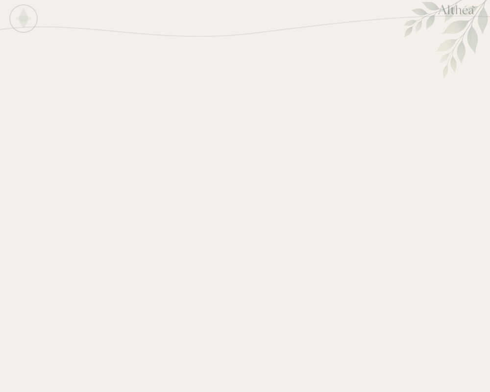

- Nom : Fond_1000x800_Feuille4.png
- Format : .png
- Répertoire : /Assets/Fond/

#### pnlHeader (Home)

- Contenu dans picTitre
- Image : BackgroundImage
- Background Layout : Stretch
- BackColor : Transparent
- Size : 191; 48

#### UC (pnlForm)

- Nom : Fond_1000x770_FeuilleCoupee1.png
- Format : .png
- Répertoire : /Assets/Fond/

#### Panel Action

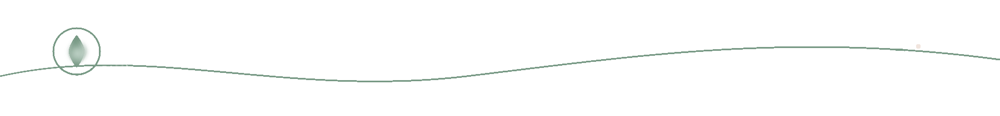

- Nom : Althea_Bandeau_Haut_Trans.png
- Format : .png
- Répertoire : /Assets/Fond/

------

## Fond petit formulaire

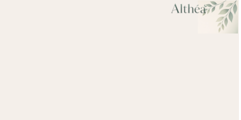

- Dans Form DialogChoix, pnlMain
- BackgroundImage : Center (Resources)

- Format : .png
- Répertoire : /Assets/Fond/

------

## Pictures

#### Logo 2

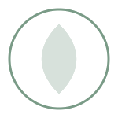

- Nom : Fond_icone_Transp.png
- Contenu : dans picTitre des pnlTitre des UserControls
- BackGroundImage : Stretch (Resources)
- Format : .png
- Répertoire : /Assets/Logos

------

## Boutons

#### Modèle Standard

- Height min : 40
- Icone png 32x32 (Assets/Boutons_ico_32/)
- Image : System.Drawing.Bitmap au format .png
- ImageAlign : MiddleLeft
- BackColor : ColorSauge (122;155;135)
- ForeColor : White
- FlatStyle : Flat
- Font : Calibri 10 pt
- Tag : nom_normal
- TextAlign : MiddleLeft
- TextImageRelation : ImageBeforeText
- UseVisualStyleBackColor : False

#### Modèle Tuile (large)

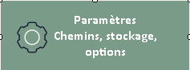

- Height min : 90
- Icone png 48x48 (Assets/Boutons_ico_48/)
- Image : System.Drawing.Bitmap au format .png
- ImageAlign : MiddleCenter
- BackColor : ColorSauge (122;155;135)
- ForeColor : White
- FlatStyle : Flat
- Font : Calibri 12 pt - Bold
- Tag : nom_normal
- TextAlign : MiddleCenter
- TextImageRelation : ImageBeforeText
- UseVisualStyleBackColor : False

#### Modèle Home

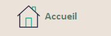

- Height min : 60
- Icone png 48x48 (Assets/Boutons_ico_48/)
- Image : System.Drawing.Bitmap au format .png
- ImageAlign : MiddleLeft
- BackColor : ColorBeige (235; 226; 217)
- ForeColor : ColorSaugeFonce (95; 125; 110)
- FlatStyle : Flat
- Font : Calibri 13 pt - Bold
- Tag : nom
- TextAlign : MiddleLeft
- Padding : 10; 0; 0; 0
- TextImageRelation : ImageBeforeText
- UseVisualStyleBackColor : False

#### Panel Actions

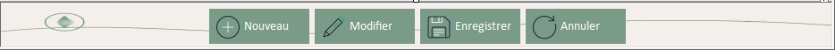

#### Panel Menu (Home)

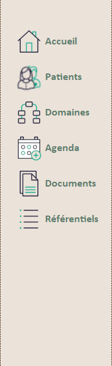

#### Icones .png pour les différents boutons

- Catalogue détaillé en [annexe - bibliothèque d'icônes](#annexe-icones).
- Répertoires :
  - Home : `/Assets/Boutons_Home/`
  - Standard : `/Assets/Boutons_ico_32/`
  - Tuile : `/Assets/Boutons_ico_48/`

------

## Icônes Application et Forms

- Nom : Althea_A _96x96.ico
- Format : .ico
- Répertoire : /Assets/Appli_Ico/

------

## Icônes/Images Techniques

### Icônes d'état (DataGridView, listes)

| Nom       | Image                                                        | Fonction                          | Module      |
| --------- | ------------------------------------------------------------ | --------------------------------- | ----------- |
| OFF_32x32 |  | Non OK discret / Inactif          | UtilsIcons  |
| OK_32x32  |  | OK / Actif (ColorSaugeFonce 95; 125; 110) | UtilsIcons  |
| LOCK_32x32 |  | Compte verrouillé (priorité haute) | UtilsIcons |
| NO_32x32 |  | Refus / Désactivé | UtilsIcons |

- Répertoire : /Assets/Tech_Ico/
- Format : .png
- Size : 32x32
- Usage : DataGridView, PictureBox, ImageList
- Gestion centralisée via `Utils/UtilsIcons.vb`
- **Règle de priorité** : Verrouillé > Actif > Inactif

### Icônes DialogChoix (animées)

| Type | Image | Fonction | Format |
|------|-------|----------|--------|
| Information |  | Message informatif | GIF animé |
| Warning |  | Avertissement | GIF animé |
| Error |  | Erreur | GIF animé |
| Success |  | Succès | GIF animé |
| Question |  | Question utilisateur | GIF animé |
| Loading |  | Opération en cours | GIF animé |
| Processing | 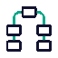 | Traitement en cours | GIF animé |

- Répertoire : /Assets/Dialogue_ico/
- Format : .gif (animation supportée)
- Tailles recommandées : 64x64 ou 96x96
- Usage : `UI/Forms/Communs/DialogChoix.vb`
- Affichage dynamique selon le `TypeDialogue`

------

## Annexe - Bibliothèque d'icônes

### Boutons : catalogue détaillé

| Type     | png _normal                                                  | png_hover/selected                                           | png_Disabled                                                 | Tag                          |
| -------- | ------------------------------------------------------------ | ------------------------------------------------------------ | ------------------------------------------------------------ | ---------------------------- |
| Home     |  |  |  | accueil                      |
| Home     |  |  |  | agenda                       |
| Home     |  |  |  | documents                    |
| Home     |  |  |  | domaines                     |
| Home     |  |  |  | outils_admin                 |
| Home     |  |  |  | patients                     |
| Home     |  |  |  | referentiels                 |
| Home     |  |                                                              |                                                              | forcer_password              |
| Standard |  |  |  | annuler_normal               |
| Standard | 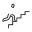 | 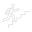 |  | eleverAcces_normal           |
| Standard |  |  |  | enregistrer_normal           |
| Standard |  |  |  | fermer_normal                |
| Standard |  |  |  | login_normal                 |
| Standard |  |  |  | modifier_normal              |
| Standard |  |  |  | modifierPW_normal            |
| Standard |  |  |  | nouveau_normal               |
| Standard |       |        |     | no_normal                    |
| Standard |  |  |  | retourRole_normal            |
| Standard |  |  |  | testerConnexion_normal       |
| Standard |  |  |  | valider_normal               |
| Standard |  |  |  | voir_normal                  |
| Standard |  |  |  | verrouiller_normal           |
| Standard |  |  |  | reset_password_normal        |
| Standard |  |  |  | resetText_normal             |
| Standard |  |  |  | activer_normal               |
| Standard |  |  |  | actualiser_normal            |
| Standard |  |  |  | rechercherUser_normal        |
| Standard |      |       |    | yes_normal                   |
| Tuile    |  |  |  | configurationDatabase_normal |
| Tuile    |  |  |  | logs_normal                  |
| Tuile    |  |  |  | parametres_normal            |
| Tuile    |  |  |  | sauvegarde_normal            |
| Tuile    |  |  |  | utilisateurs_normal          |
| Tuile    |  |                                                              |                                                              | domaines_normal              |
| Tuile    |  |                                                              |                                                              | liensPatient_normal          |
| Tuile    |  |                                                              |                                                              | roleIntervenant_normal       |
| Tuile    | 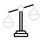 |                                                              |                                                              | situationFamiliale_normal    |
| Tuile    |  |                                                              |                                                              | statutDossier_normal         |
| Tuile    |  |                                                              |                                                              | statutSeance_normal          |
| Tuile    |  |                                                              |                                                              | typeDocument_normal          |
| Tuile    |  |                                                              |                                                              | typeRendezvous_normal        |
| Tuile    |  |                                                              |                                                              | typeSeance_normal            |

------

> **Contact** : ***Joëlle (Manou) - Les Artefacts de Manou***
>
> Projet réalisé pour ma fille, Psychologue et Graphologue, pour l'aider à gérer ses patients et documents de manière structurée, fiable et évolutive.
> - Site web P.Nguyen Duy: https://pearlnguyenduy.be/
> - mailto: `joelle@nguyen.eu`
>
> - GitHub privé: Althea https://github.com/AngeljoNG/Althea
> - GitHub public : Althea None

[TOC]
