# 📘 **Documentation technique – Forms Althéa**

>  *Dernière mise à jour : 10/06/2026*
---

## **Vue d'ensemble – Écrans, classes et niveau de complétude**

Ce tableau récapitule l'ensemble des écrans de l'application, leur classe correspondante et leur niveau de complétude actuel (code + documentation).

| Écran / Composant                  | Classe                   | Type            | Niveau de complétude                 |
| ---------------------------------- | ------------------------ | --------------- | ------------------------------------ |
| Accueil applicatif                 | `Home`                   | Form            | ✅ Complet                            |
| Configuration connexion            | `ConfigurationConnexion` | Form            | ✅ Complet                            |
| Authentification                   | `Login`                  | Form            | ✅ Complet                            |
| Changement de mot de passe         | `ChangePassword`         | Form            | ✅ Complet                            |
| Élévation d'accès                  | `ElevationAcces`         | Form            | ✅ Complet                            |
| **Dialogue de choix personnalisé** | **`DialogChoix`**        | **Form**        | **✅ Complet**                        |
| **Édition utilisateur**            | **`UtilisateurEdition`** | **Form**        | **✅ Complet**                        |
| Gestion des paramètres             | `UC_Parametres`          | UserControl     | ✅ Complet                            |
| Hub d'administration               | `UC_AdminHome`           | UserControl     | ✅ Complet                            |
| **Gestion des utilisateurs**       | **`UC_Utilisateurs`**    | **UserControl** | **✅ Complet**                        |
| **Éditeur de texte riche (complet)** | **`UC_RichTextEditor`** | **UserControl** | **✅ Complet**                       |
| **Éditeur de texte riche (simple)** | **`UC_RichTextEditorSimple`** | **UserControl** | **✅ Complet**                  |
| **Hub référentiels**               | **`UC_ReferentielHome`** | **UserControl** | **✅ Complet**                        |
| **Base commune référentiels**      | **`UC_ReferentielBase`** | **UserControl** | **✅ Complet** (héritable)            |
| **Référentiel Domaines**           | **`UC_Domaines`**        | **UserControl** | **✅ Complet**                        |
| **Référentiel Liens patient**      | **`UC_LiensPatient`**    | **UserControl** | **✅ Complet**                        |
| **Référentiel Rôles intervenant**  | **`UC_RolesIntervenant`** | **UserControl** | **✅ Complet**                       |
| **Référentiel Situations familiales** | **`UC_SituationsFamiliales`** | **UserControl** | **✅ Complet**                |
| **Référentiel Statuts dossier**    | **`UC_StatutsDossier`**  | **UserControl** | **✅ Complet**                        |
| **Référentiel Statuts séance**     | **`UC_StatutsSeance`**   | **UserControl** | **✅ Complet**                        |
| **Référentiel Types documents**    | **`UC_TypesDocuments`**  | **UserControl** | **✅ Complet**                        |
| **Référentiel Types rendez-vous**  | **`UC_TypesRendezVous`** | **UserControl** | **✅ Complet**                        |
| **Référentiel Types séance**       | **`UC_TypesSeance`**     | **UserControl** | **✅ Complet** (+ tarif_defaut)       |
| Écran d'accueil                    | `UC_Accueil`             | UserControl     | ⬜ Prévu – classe vide, à implémenter |

> [!NOTE]
> Ce tableau doit être mis à jour à chaque avancée significative du projet.

---

## **Form : Home**


> [!IMPORTANT]
>
> Todo : à mettre à jour au fur et à mesure de l'avancée

#### Rôle général

`Home` est la Form principale de l’application Althéa.

Elle joue le rôle de **Shell applicatif** :

- affichage du menu principal
- affichage du contexte général
- hébergement futur des `UserControls` métier
- affichage des messages d’état via `stsStatus`

Elle ne doit pas contenir de logique métier lourde ni d’accès direct à la base de données.

### Responsabilités

- Initialiser le menu principal.
- Gérer l’état visuel du bouton de menu sélectionné.
- Préparer la future navigation vers les environnements métier.
- Afficher le statut courant dans `stsLabelStatus`.
- Héberger les futurs écrans métier dans `pnlContent`.
- Fournir le contexte UI global aux UserControls via `UserControlContext`.
- Centraliser le `StatusStrip`, le `ToolTip`, l’`ErrorProvider` et le contexte affiché.
- Injecter le contexte dans les écrans compatibles via `IContextAwareUserControl`.
- Fournir le contexte aux Forms modales compatibles via `IContextAwareForm`.

### Dépendances

| Élément | Type | Rôle |
|---|---|---|
| `UITheme`            | Module | Palette graphique centralisée : couleurs, chemins d’assets, constantes visuelles. |
| `UtilsButtons`       | Module | Initialisation et comportement des boutons standards. |
| `GestionLog` | Module | Journalise les actions de navigation dans le menu. |
| `ConfigurationConnexion` | Form | Ouverte temporairement via `Button1` pendant la phase de développement. |
| `NavigationManager` | Module / Classe | Sera responsable du chargement centralisé des `UserControls`. |
| `UserControls` | UI | Écrans métier injectés dans `pnlContent`. |
|  |  |  |

### Contrôles

| Contrôle | Type | Rôle |
|---|---|---|
| `pnlForm` | Panel | Conteneur principal de la Form. Sert de fond et regroupe l’ensemble de la structure UI. |
| `pnlHeader` | Panel | Zone supérieure de contexte. Contient le titre/logo et le contexte courant. |
| `picTitre` | PictureBox | Affiche l’élément graphique/titre de l’application. |
| `lblContexte` | Label | Affiche le contexte courant. Pour l’instant général, plus tard patient/dossier/environnement actif. |
| `pnlMenu` | Panel | Menu latéral gauche. Contient les boutons de navigation principaux. |
| `btnAccueil` | Button | Active l’environnement Accueil. Reste sélectionné tant que l’environnement Accueil est actif. |
| `btnPatients` | Button | Active l’environnement Patients. Devra charger plus tard le UserControl patients. |
| `btnDomaines` | Button | Active l’environnement Domaines. Devra charger plus tard le UserControl correspondant. |
| `btnAgenda` | Button | Active l’environnement Agenda. Devra charger plus tard le UserControl agenda. |
| `btnDocuments` | Button | Active l’environnement Documents. Devra charger plus tard le UserControl documents. |
| `btnReferentiels` | Button | Active l’environnement Référentiels. Devra charger plus tard le UserControl de gestion des référentiels. |
| `btnParametres` | Button | Active l’environnement Paramètres. Devra charger plus tard le UserControl paramètres. |
| `btnAdmin` | Button | Active l’environnement Outils / Admin. À préciser selon l’évolution fonctionnelle. |
| `pnlContent` | Panel | Zone centrale dynamique. Destinée à recevoir les futurs `UserControls`. |
| `lblContentPlaceholder` | Label | Label temporaire “contenu dynamique”. Sert uniquement au design provisoire. À supprimer lorsque les UserControls seront chargés. |
| `stsStatus` | StatusStrip | Barre de statut de la Form. |
| `stsLabelStatus` | ToolStripStatusLabel | Affiche l’état courant : Accueil, Patients, Connexion OK, etc. |
| `ttMain` | ToolTip | Prévu pour afficher les aides utilisateur. |
| `errProvider` | ErrorProvider | Prévu pour signaler les erreurs UI. Peu utilisé actuellement dans `Home`. |

### Méthodes principales

| Méthode | Rôle |
|---|---|
| `Home_Load()` | Initialise la Form, prépare les boutons du menu et sélectionne Accueil par défaut. |
| `InitializeHomeMenuButtons()` | Remplit la liste `_homeMenuButtons` et initialise chaque bouton via `UtilsButtons.InitHomeMenuButton`. |
| `SelectHomeMenuButton()` | Marque un bouton comme sélectionné, met à jour le statut et loggue la navigation. |
| `btnAccueil_Click()` | Sélectionne l’environnement Accueil. |
| `btnPatients_Click()` | Sélectionne l’environnement Patients. |
| `btnDomaines_Click()` | Sélectionne l’environnement Domaines. |
| `btnAgenda_Click()` | Sélectionne l’environnement Agenda. |
| `btnDocuments_Click()` | Sélectionne l’environnement Documents. |
| `btnReferentiels_Click()` | Sélectionne l’environnement Référentiels. |
| `btnAdmin_Click()` | Sélectionne l’environnement Outils / Admin. |
| `Button1_Click()` | Ouvre temporairement `ConfigurationConnexion`. À retirer plus tard. |

### Règles importantes

Les boutons du menu Home ne sont pas des boutons standards.

Ils utilisent :

- `Tag = accueil`, `patients`, `agenda`, etc.
- images dans `Assets\Boutons_Home`
- état persistant `selected`
- gestion centralisée via `UtilsButtons.InitHomeMenuButton`

Le bouton sélectionné reste actif jusqu’à ce qu’un autre bouton de menu soit choisi.

À terme, les méthodes Click devront aussi charger un `UserControl` dans `pnlContent`.

Exemple cible :

`SelectHomeMenuButton(btnPatients, "Patients")
LoadView(New UC_PatientsHome())`

------

## **Form : ConfigurationConnexion**

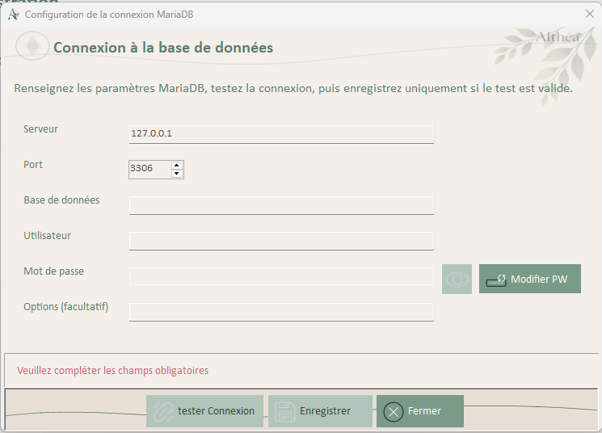

- ### Rôle général

  `ConfigurationConnexion` permet de créer, modifier, tester et enregistrer la configuration locale de connexion à MariaDB.

  Elle est utilisée lorsque :

  - aucune configuration locale n’existe
  - la configuration locale est invalide
  - la connexion échoue au démarrage
  - l’utilisateur veut modifier explicitement les paramètres de connexion

  ### Responsabilités

  - Charger une configuration existante.
  - Permettre la saisie des paramètres de connexion.
  - Tester la connexion avant toute sauvegarde.
  - Chiffrer le mot de passe via DPAPI.
  - Sauvegarder la configuration locale JSON.
  - Ne jamais afficher ni logguer le mot de passe.
  - Gérer proprement l’état des boutons selon les actions utilisateur.

  ### Dépendances

  | Élément              | Type           | Rôle                                                         |
  | -------------------- | -------------- | ------------------------------------------------------------ |
  | `LocalDbConfig`      | Classe         | Représente la configuration locale de connexion : host, port, database, user, options, mot de passe chiffré. |
  | `ConfigManager`      | Module         | Charge et sauvegarde le fichier JSON local.                  |
  | `CryptoManagerDPAPI` | Module         | Chiffre et déchiffre le mot de passe avec DPAPI.             |
  | `DatabaseManager`    | Module         | Initialise et teste la connexion MariaDB.                    |
  | `GestionLog`         | Module         | Journalise les étapes, erreurs et décisions utilisateur.     |
  | `UITheme`            | Module | Palette graphique centralisée : couleurs, chemins d’assets, constantes visuelles. |
  | `UtilsButtons`       | Module | Initialisation et comportement des boutons standards. |
  | `Home`               | Form appelante | Peut ouvrir `ConfigurationConnexion` au démarrage ou depuis les paramètres. |

  ### Variables internes

  | Variable                      | Type                | Rôle                                                         |
  | ----------------------------- | ------------------- | ------------------------------------------------------------ |
  | `_isConnectionTestSuccessful` | Boolean             | Indique si un test de connexion réussi a été effectué. Conditionne l’enregistrement. |
  | `_isFormDirty`                | Boolean             | Indique que la Form a été modifiée depuis le dernier test.   |
  | `_hasUnsavedChanges`          | Boolean             | Indique qu’il existe une modification à enregistrer.         |
  | `_hasStoredEncryptedPassword` | Boolean             | Indique qu’un mot de passe chiffré existe déjà dans la configuration. |
  | `_storedEncryptedPassword`    | String              | Contient le mot de passe chiffré existant, jamais le mot de passe en clair. |
  | `_passwordMode`               | Enum `PasswordMode` | Définit si l’on conserve le mot de passe existant ou si l’utilisateur en saisit un nouveau. |

  ### Enum interne

  | Valeur         | Rôle                                                         |
  | -------------- | ------------------------------------------------------------ |
  | `KeepExisting` | Utilise le mot de passe chiffré déjà stocké. Le champ mot de passe reste désactivé. |
  | `SetNew`       | L’utilisateur doit saisir un nouveau mot de passe. Celui-ci sera chiffré après test réussi. |

  ### Contrôles

  | Contrôle                  | Type                 | Rôle                                                         |
  | ------------------------- | -------------------- | ------------------------------------------------------------ |
  | `pnlForm`                 | Panel                | Conteneur principal avec fond graphique.                     |
  | `pnlTitre`                | Panel                | Zone de titre.                                               |
  | `lblTitreForm`            | Label                | Titre de la Form.                                            |
  | `pnlTop`                  | Panel                | Bandeau d’information supérieur.                             |
  | `lblTop`                  | Label                | Texte explicatif en haut de la Form.                         |
  | `pnlCenter`               | Panel                | Zone centrale contenant le formulaire de connexion et le message de résultat. |
  | `tlpConnexion`            | TableLayoutPanel     | Structure les champs de connexion. Important pour conserver un alignement stable. |
  | `lblHost`                 | Label                | Libellé du serveur MariaDB.                                  |
  | `txtHost`                 | TextBox              | Saisie du host. Valeur conseillée : `127.0.0.1`.             |
  | `lblPort`                 | Label                | Libellé du port.                                             |
  | `nudPort`                 | NumericUpDown        | Saisie du port MariaDB. Valeur habituelle : `3306`.          |
  | `lblDatabaseName`         | Label                | Libellé du nom de la base.                                   |
  | `txtDatabaseName`         | TextBox              | Nom de la base de données Althéa.                            |
  | `lblUserName`             | Label                | Libellé du compte MariaDB.                                   |
  | `txtUserName`             | TextBox              | Utilisateur MariaDB applicatif, par exemple `althea_app`.    |
  | `lblPassword`             | Label                | Libellé du mot de passe.                                     |
  | `txtPassword`             | TextBox              | Mot de passe saisi uniquement si l’utilisateur demande une modification. |
  | `btnVoirPassword`         | Button               | Affiche temporairement le mot de passe pendant l’appui souris. Ne fonctionne que si le champ password est actif. |
  | `btnModifierPassword`     | Button               | Passe la Form en mode `SetNew` pour permettre la saisie d’un nouveau mot de passe. |
  | `lblAdditionalOptions`    | Label                | Libellé des options additionnelles de connexion.             |
  | `txtAdditionalOptions`    | TextBox              | Options complémentaires MySqlConnector.                      |
  | `Panel1`                  | Panel                | Zone visuelle autour du résultat de connexion.               |
  | `lblConnectionResult`     | Label                | Message utilisateur : configuration chargée, test OK, erreur, test requis, etc. |
  | `pnlActions`              | Panel                | Zone basse des boutons d’action.                             |
  | `btnTesterConnexion`      | Button               | Lance le test de connexion avec les valeurs saisies ou stockées. |
  | `btnEnregistrerConnexion` | Button               | Sauvegarde la configuration uniquement après un test réussi et si une modification est à enregistrer. |
  | `btnFermer`               | Button               | Ferme la Form sans valider la configuration.                 |
  | `stsStatus`               | StatusStrip          | Barre de statut.                                             |
  | `stsLabelStatus`          | ToolStripStatusLabel | Message d’état technique ou utilisateur.                     |
  | `ttMain`                  | ToolTip              | Prévu pour l’aide utilisateur.                               |
  | `errProvider`             | ErrorProvider        | Prévu pour signaler visuellement les erreurs de saisie.      |

  ### Méthodes principales

  | Méthode                           | Rôle                                                         |
  | --------------------------------- | ------------------------------------------------------------ |
  | `ConfigurationConnexion_Load()`   | Initialise la Form, les valeurs par défaut, les boutons standards et charge la configuration existante. |
  | `LoadExistingConfiguration()`     | Charge le JSON local si présent et prépare le mode mot de passe. |
  | `OnFieldChanged()`                | Détecte toute modification utilisateur et invalide le test précédent. |
  | `AreRequiredFieldsValid()`        | Vérifie que les champs nécessaires au test sont présents.    |
  | `BuildConfigFromForm()`           | Construit un objet `LocalDbConfig` depuis les champs de la Form, sans traiter le mot de passe. |
  | `btnModifierPassword_Click()`     | Active la saisie d’un nouveau mot de passe.                  |
  | `btnTesterConnexion_Click()`      | Teste la connexion MariaDB via `DatabaseManager`.            |
  | `btnEnregistrerConnexion_Click()` | Chiffre ou conserve le mot de passe, puis sauvegarde la configuration via `ConfigManager`. |
  | `UpdateFormState()`               | Active/désactive les boutons selon l’état de la Form.        |
  | `btnVoirPassword_MouseDown()`     | Affiche temporairement le mot de passe.                      |
  | `btnVoirPassword_MouseUp()`       | Masque à nouveau le mot de passe.                            |
  | `btnVoirPassword_MouseLeave()`    | Masque le mot de passe si la souris quitte le bouton.        |
  | `btnFermer_Click()`               | Ferme la Form sans validation.                               |

  ### Gestion du mot de passe

  Le mot de passe n’est jamais affiché automatiquement.

  Deux cas existent :

  | Cas                                               | Comportement                                                 |
  | ------------------------------------------------- | ------------------------------------------------------------ |
  | Configuration existante avec mot de passe chiffré | `_passwordMode = KeepExisting`, `txtPassword.Enabled = False`, le mot de passe stocké est utilisé pour tester. |
  | Nouvelle configuration ou modification explicite  | `_passwordMode = SetNew`, `txtPassword.Enabled = True`, l’utilisateur doit saisir le mot de passe. |

  Le bouton `Modifier PW` est volontairement séparé : il évite d’effacer ou de remplacer accidentellement un mot de passe existant.

  ### Gestion des boutons

  Les boutons de cette Form sont des boutons standards.

  Ils doivent être initialisés via `UtilsButtons.InitStandardButton`.

  | Bouton                    | Tag attendu                   | Rôle                                    |
  | ------------------------- | ----------------------------- | --------------------------------------- |
  | `btnTesterConnexion`      | `tester_connexion_normal`     | Teste la connexion.                     |
  | `btnEnregistrerConnexion` | `enregistrer_normal`          | Sauvegarde la configuration.            |
  | `btnFermer`               | `fermer_normal`               | Ferme la Form.                          |
  | `btnModifierPassword`     | `modifier_normal`             | Active la modification du mot de passe. |
  | `btnVoirPassword`         | à préciser selon asset retenu | Affichage temporaire du mot de passe.   |

  Rappel important :

  - le `Tag` ne contient pas `.png`
  - l’image normale doit exister dans `Assets\Boutons_ico`
  - les variantes `_hover` et `_disabled` sont optionnelles

  ### Règles d’état

  | Situation                                  | Effet UI                                                     |
  | ------------------------------------------ | ------------------------------------------------------------ |
  | Champs obligatoires incomplets             | `btnTesterConnexion.Enabled = False`                         |
  | Test non réussi                            | `btnEnregistrerConnexion.Enabled = False`                    |
  | Test réussi + modifications à enregistrer  | `btnEnregistrerConnexion.Enabled = True`                     |
  | Mot de passe stocké existant               | `txtPassword.Enabled = False`, bouton Modifier actif         |
  | Demande de modification du mot de passe    | `txtPassword.Enabled = True`, test précédent invalidé        |
  | Connexion échouée avec mot de passe stocké | Demande à l’utilisateur de cliquer sur Modifier pour saisir un nouveau mot de passe |
  | Enregistrement réussi                      | Sauvegarde JSON, fermeture avec `DialogResult.OK`            |

## Flowchart

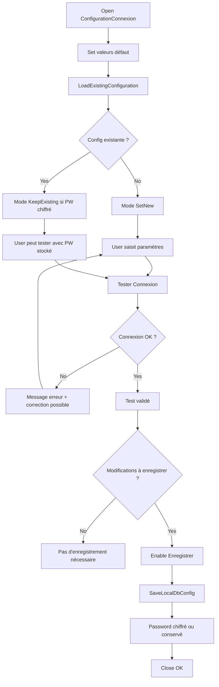

### Points d’attention

Cette Form est sensible car elle touche à la sécurité et au démarrage de l’application.

À ne pas faire :

- ne jamais afficher automatiquement le mot de passe
- ne jamais logguer la connection string complète
- ne jamais enregistrer sans test réussi
- ne jamais appeler directement MariaDB depuis la Form
- ne jamais contourner `DatabaseManager`
- ne jamais supprimer la logique `_passwordMode`

À conserver absolument :

- séparation `ConfigManager` / `CryptoManagerDPAPI` / `DatabaseManager`
- test obligatoire avant sauvegarde
- gestion claire du mot de passe stocké versus nouveau mot de passe
- logs explicites via `GestionLog`

------

## **Form : DialogChoix**

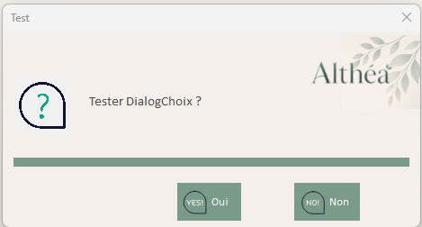

### Rôle général

`DialogChoix` est une Form de dialogue personnalisée qui remplace les `MessageBox` standards dans toute l'application Althéa.

Elle offre :

- Une intégration complète avec `UITheme`
- Des icônes personnalisées animées (GIF)
- Une configuration flexible de 1 à 3 boutons
- Une expérience utilisateur cohérente et professionnelle

### Responsabilités

- Afficher des messages utilisateur de types variés (Information, Avertissement, Erreur, Succès, Question).
- Supporter de 1 à 3 boutons configurables avec des labels personnalisés.
- Mapper les résultats sur `DialogResult` standard (Yes, No, Cancel).
- S'adapter visuellement au thème de l'application via `UITheme`.
- Gérer des icônes animées pour améliorer l'expérience utilisateur.
- Ajuster automatiquement la taille en fonction du contenu.

### Dépendances

| Élément        | Type      | Rôle                                                         |
| -------------- | --------- | ------------------------------------------------------------ |
| `UITheme`      | Module    | Fournit les couleurs, polices et chemins d'assets pour le thème visuel. |
| `UtilsButtons` | Module    | Gestion du style et du comportement des boutons.             |
| `My.Resources` | Resources | Accès aux icônes embarquées (optionnel, peut utiliser des fichiers externes). |

### Enum interne

| Valeur        | Rôle                |
| ------------- | ------------------- |
| `Information` | Message informatif  |
| `Warning`     | Avertissement       |
| `Error`       | Erreur              |
| `Question`    | Question            |
| `Success`     | Succès              |
| `Loading`     | Opération en cours  |
| `Processing`  | Traitement en cours |

### Propriétés publiques

| Propriété      | Type           | Rôle                                              |
| -------------- | -------------- | ------------------------------------------------- |
| `Titre`        | String         | Titre affiché dans la barre de titre de la Form.  |
| `Message`      | String         | Message principal affiché à l'utilisateur.        |
| `TypeDialogue` | `TypeDialogue` | Détermine l'icône et le style visuel du dialogue. |

### Variables privées

| Variable         | Type    | Rôle                                                   |
| ---------------- | ------- | ------------------------------------------------------ |
| `_nombreBoutons` | Integer | Nombre de boutons actuellement configurés (1, 2 ou 3). |

### Contrôles

| Contrôle       | Type       | Rôle                                                         |
| -------------- | ---------- | ------------------------------------------------------------ |
| `pnlForm`      | Panel      | Conteneur principal avec fond thématisé.                     |
| `pnlTitre`     | Panel      | Zone de titre.                                               |
| `lblTitreForm` | Label      | Affiche le titre du dialogue.                                |
| `pnlCenter`    | Panel      | Zone centrale contenant l'icône et le message.               |
| `picIcone`     | PictureBox | Affiche l'icône correspondant au type de dialogue (peut être animée). |
| pnlIcone       | Panel      | Affiche la couleur du type de dialogue                       |
| `lblMessage`   | Label      | Affiche le message principal.                                |
| `pnlActions`   | Panel      | Zone des boutons d'action.                                   |
| `btnBouton1`   | Button     | Premier bouton (mappé sur `DialogResult.Yes`).               |
| `btnBouton2`   | Button     | Deuxième bouton (mappé sur `DialogResult.No`).               |
| `btnBouton3`   | Button     | Troisième bouton (mappé sur `DialogResult.Cancel`).          |

### Méthodes principales

| Méthode                           | Rôle                                                         |
| --------------------------------- | ------------------------------------------------------------ |
| `New()`                           | Constructeur par défaut, initialise les composants.          |
| `SetBoutons(text1, text2, text3)` | Configure les boutons visibles et leurs labels.              |
| `DialogChoix_Load()`              | Initialise la Form : applique le thème, affiche l'icône, ajuste la taille. |
| `AppliquerTheme()`                | Applique les couleurs et polices depuis `UITheme`.           |
| `AfficherIcone()`                 | Charge et affiche l'icône correspondant au `TypeDialogue`.   |
| `AjusterTaille()`                 | Adapte la hauteur de la Form selon le contenu du message.    |
| `RepositionnerBoutons()`          | Ajuste la position et l'espacement des boutons visibles.     |
| `btnBouton1_Click()`              | Ferme le dialogue avec `DialogResult.Yes`.                   |
| `btnBouton2_Click()`              | Ferme le dialogue avec `DialogResult.No`.                    |
| `btnBouton3_Click()`              | Ferme le dialogue avec `DialogResult.Cancel`.                |

### Méthodes statiques (helpers)

Ces méthodes statiques simplifient l'utilisation courante de `DialogChoix` :

| Méthode           | Signature                                                  | Rôle                                                         |
| ----------------- | ---------------------------------------------------------- | ------------------------------------------------------------ |
| `Information()`   | `Information(message As String, [titre])`                  | Affiche un message d'information avec bouton OK.             |
| `Avertissement()` | `Avertissement(message As String, [titre])`                | Affiche un avertissement avec bouton OK.                     |
| `Erreur()`        | `Erreur(message As String, [titre])`                       | Affiche une erreur avec bouton OK.                           |
| `Succes()`        | `Succes(message As String, [titre])`                       | Affiche un message de succès avec bouton OK.                 |
| `Confirmer()`     | `Confirmer(message As String, [titre])`                    | Affiche une question avec boutons Oui/Non. Retourne `DialogResult`. |
| `Question()`      | `Question(message As String, btn1, btn2, [btn3], [titre])` | Affiche une question avec 2 ou 3 boutons personnalisés. Retourne `DialogResult`. |

### Exemples d'utilisation

#### Utilisation simple (méthodes statiques)

```vb
' Information simple
DialogChoix.Information("Opération réussie.")

' Avertissement
DialogChoix.Avertissement("Attention : cette action est irréversible.")

' Erreur
DialogChoix.Erreur("Une erreur s'est produite lors de l'enregistrement.")

' Confirmation
If DialogChoix.Confirmer("Voulez-vous continuer ?") = DialogResult.Yes Then
	' Action confirmée
End If
```

#### Utilisation avancée (configuration manuelle)

```vb
Dim dlg As New DialogChoix()
dlg.Titre = "Suppression"
dlg.Message = "Êtes-vous sûr de vouloir supprimer cet utilisateur ?"
dlg.TypeDialogue = TypeDialogue.Warning
dlg.SetBoutons("Supprimer", "Annuler")

If dlg.ShowDialog() = DialogResult.Yes Then
	' Procéder à la suppression
End If
```

### Gestion des icônes animées

`DialogChoix` supporte les icônes animées au format GIF.

Emplacement des icônes : `Assets\Gif_Animated\`

Noms de fichiers attendus :

- `information_64.gif`
- `warning_64.gif`
- `error_64.gif`
- `question_64.gif`
- `success_64.gif`
- `loading_64.gif`
- `processing_64.gif`

Si un fichier est introuvable, aucune icône n'est affichée (pas de crash).

### Couleurs associées dans pnlIcone

| TypeDialogue             | Couleur dans UITheme  |
| ------------------------ | --------------------- |
| TypeDialogue.Error       | ColorRougeMoyenFonce  |
| TypeDialogue.Warning     | ColorOrangeMoyenFonce |
| TypeDialogue.Success     | ColorGrisVertClair    |
| TypeDialogue.Information | ColorBleuMoyen        |
| TypeDialogue.Question    | ColorSauge            |

### Règles d'état

| Situation            | Effet UI                                                     |
| -------------------- | ------------------------------------------------------------ |
| 1 bouton configuré   | Affiche uniquement `btnBouton1`, centré.                     |
| 2 boutons configurés | Affiche `btnBouton1` et `btnBouton2`, espacés.               |
| 3 boutons configurés | Affiche les trois boutons, espacés uniformément.             |
| Message court        | Form compacte.                                               |
| Message long         | Form étendue en hauteur, avec redimensionnement automatique. |

### Points d'attention

- **Toujours** utiliser `DialogChoix` au lieu de `MessageBox.Show` dans Althéa.
- Les icônes animées ne doivent pas ralentir l'affichage.
- Le mapping `DialogResult` doit rester cohérent : Bouton1=Yes, Bouton2=No, Bouton3=Cancel.
- Les boutons doivent être initialisés via `UtilsButtons` pour respecter le style applicatif.

### Message au repreneur

`DialogChoix` remplace **tous** les `MessageBox` de l'application.

Avant toute modification :

- Vérifier l'impact sur tous les écrans utilisant cette Form.
- Tester les cas 1, 2 et 3 boutons.
- Valider que les icônes animées s'affichent correctement.
- Conserver la cohérence visuelle avec `UITheme`.

---

## **Form : UtilisateurEdition**

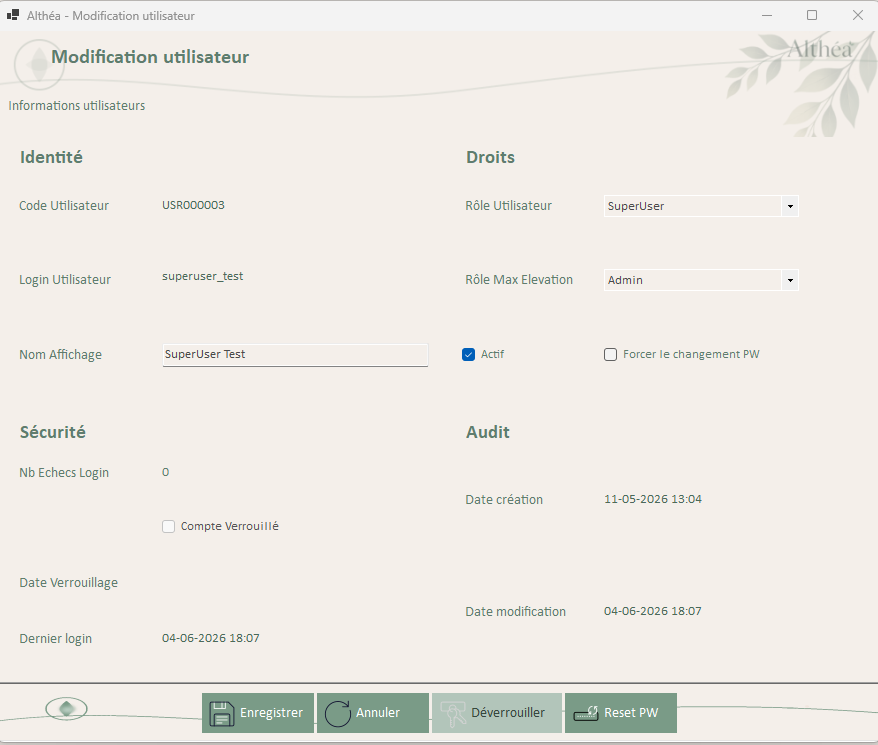

### Rôle général

`UtilisateurEdition` est une Form modale permettant la **création**, la **modification** et la **consultation** d'un utilisateur applicatif.

Elle centralise toutes les actions de gestion utilisateur :

- Création de nouveaux comptes
- Modification des informations utilisateur
- Consultation des détails utilisateur (notamment pour SuperUser)
- Réinitialisation de mot de passe
- Déverrouillage de compte

### Responsabilités

- Afficher et éditer les informations d'un utilisateur.
- Gérer les trois modes : Création, Modification, Consultation.
- Appliquer les règles de sécurité et de validation.
- Permettre les actions administratives (reset password, déverrouillage).
- Générer et afficher un mot de passe temporaire lors de la création.
- Utiliser `DialogChoix` pour tous les retours utilisateur.
- Journaliser toutes les actions sensibles via `GestionLog`.
- Implémenter `IContextAwareForm` pour recevoir le contexte UI.

### Dépendances

| Élément                  | Type   | Rôle                                                         |
| ------------------------ | ------ | ------------------------------------------------------------ |
| `GestionUtilisateurs`    | Module | Couche métier : CRUD utilisateurs, reset password, unlock, etc. |
| `UtilisateurApplication` | Classe | Objet métier représentant un utilisateur.                    |
| `AppRole`                | Enum   | Rôles applicatifs (User, SuperUser, Admin).                  |
| `UserControlContext`     | Classe | Contexte UI injecté pour StatusStrip, ErrorProvider, ToolTip. |
| `PasswordSecurityHelper` | Module | Génération de mots de passe temporaires, validation.         |
| `ChangePassword`         | Form   | Utilisé pour le reset password en mode admin.                |
| `GestionLog`             | Module | Journalisation des actions sensibles.                        |
| `UtilsButtons`           | Module | Initialisation des boutons standards.                        |
| `UtilsValidation`        | Module | Validation des champs de saisie.                             |
| `UITheme`                | Module | Thème visuel de l'application.                               |
| `DialogChoix`            | Form   | Remplace MessageBox pour tous les messages utilisateur.      |

### Enum interne

| Valeur         | Rôle                                                         |
| -------------- | ------------------------------------------------------------ |
| `Creation`     | Mode création d'un nouvel utilisateur. Login éditable, mot de passe auto-généré. |
| `Modification` | Mode modification d'un utilisateur existant. Login non éditable. |
| `Consultation` | Mode lecture seule (pour SuperUser). Tous les champs désactivés sauf actions admin. |

### Variables privées

| Variable         | Type                     | Rôle                                                         |
| ---------------- | ------------------------ | ------------------------------------------------------------ |
| `_context`       | `UserControlContext`     | Contexte UI injecté depuis `UC_Utilisateurs`.                |
| `_mode`          | `ModeUtilisateurEdition` | Mode d'ouverture de la Form (Création, Modification, Consultation). |
| `_idUtilisateur` | Long                     | ID utilisateur en mode Modification/Consultation (0 en Création). |
| `_utilisateur`   | `UtilisateurApplication` | Instance de l'utilisateur en cours d'édition.                |

### Contrôles

| Contrôle                  | Type                 | Rôle                                                         |
| ------------------------- | -------------------- | ------------------------------------------------------------ |
| `pnlForm`                 | Panel                | Conteneur principal.                                         |
| `pnlTitre`                | Panel                | Zone de titre.                                               |
| `lblTitreForm`            | Label                | Titre dynamique selon le mode.                               |
| `pnlCenter`               | Panel                | Zone centrale des champs de saisie.                          |
| `tlpUtilisateur`          | TableLayoutPanel     | Structure les champs utilisateur.                            |
| `lblCodeUtilisateur`      | Label                | Libellé Code utilisateur.                                    |
| `txtCodeUtilisateur`      | TextBox              | Code utilisateur (optionnel, auto-généré si vide).           |
| `lblLoginUtilisateur`     | Label                | Libellé Login.                                               |
| `txtLoginUtilisateur`     | TextBox              | Login utilisateur (non modifiable en mode Modification).     |
| `lblNomAffichage`         | Label                | Libellé Nom d'affichage.                                     |
| `txtNomAffichage`         | TextBox              | Nom affiché dans l'application.                              |
| `lblRoleUtilisateur`      | Label                | Libellé Rôle de base.                                        |
| `cboRoleUtilisateur`      | ComboBox             | Rôle de base de l'utilisateur.                               |
| `lblRoleMaxElevation`     | Label                | Libellé Rôle max élévation.                                  |
| `cboRoleMaxElevation`     | ComboBox             | Rôle maximum autorisé pour élévation temporaire.             |
| `chkActif`                | CheckBox             | Indique si le compte est actif.                              |
| `chkMustChangePassword`   | CheckBox             | Indique si l'utilisateur doit changer son mot de passe.      |
| `lblMDP`                  | Label                | Libellé Mot de passe temporaire (visible uniquement en mode Création). |
| `txtMotDePasseTemporaire` | TextBox              | Affiche le mot de passe temporaire généré (lecture seule).   |
| `lblInfosMDP`             | Label                | Message informatif sur le mot de passe temporaire.           |
| `lblNbEchecsLogin`        | Label                | Nombre d'échecs de connexion.                                |
| `lblCompteVerrouille`     | Label                | Statut de verrouillage du compte.                            |
| `lblDateVerrouillage`     | Label                | Date de verrouillage (si applicable).                        |
| `lblDernierLogin`         | Label                | Date du dernier login réussi.                                |
| `pnlActions`              | Panel                | Zone des boutons d'action.                                   |
| `btnEnregistrer`          | Button               | Enregistre les modifications ou crée l'utilisateur.          |
| `btnResetPassword`        | Button               | Réinitialise le mot de passe (mode Modification/Consultation). |
| `btnDeverrouiller`        | Button               | Déverrouille le compte (mode Modification/Consultation).     |
| `btnFermer`               | Button               | Ferme la Form sans sauvegarder.                              |
| `stsStatus`               | StatusStrip          | Barre de statut locale.                                      |
| `stsLabelStatus`          | ToolStripStatusLabel | Message d'état.                                              |
| `errProvider`             | ErrorProvider        | Signalement des erreurs de saisie.                           |
| `ttMain`                  | ToolTip              | Aides contextuelles.                                         |

### Méthodes principales

| Méthode                       | Rôle                                                         |
| ----------------------------- | ------------------------------------------------------------ |
| `New(mode, idUtilisateur)`    | Constructeur : initialise le mode et l'ID utilisateur.       |
| `SetContext(context)`         | Implémentation de `IContextAwareForm` : reçoit le contexte UI. |
| `UtilisateurEdition_Load()`   | Initialise la Form, charge l'utilisateur si modification/consultation. |
| `ChargerUtilisateur()`        | Charge les données utilisateur depuis la base (mode Modification/Consultation). |
| `AppliquerModeCreation()`     | Configure l'UI pour le mode Création.                        |
| `AppliquerModeModification()` | Configure l'UI pour le mode Modification.                    |
| `AppliquerModeConsultation()` | Configure l'UI pour le mode Consultation (lecture seule).    |
| `InitialiserBoutons()`        | Initialise les boutons via `UtilsButtons`.                   |
| `InitialiserToolTips()`       | Initialise les infobulles.                                   |
| `InitialiserComboRoles()`     | Remplit les ComboBox des rôles.                              |
| `ValiderFormulaire()`         | Valide les champs obligatoires avant sauvegarde.             |
| `btnEnregistrer_Click()`      | Gère la création ou la modification utilisateur.             |
| `btnResetPassword_Click()`    | Ouvre `ChangePassword` en mode AdminReset.                   |
| `btnDeverrouiller_Click()`    | Déverrouille le compte utilisateur.                          |
| `btnFermer_Click()`           | Ferme la Form avec `DialogResult.Cancel`.                    |

### Modes de fonctionnement

#### Mode Création

- Titre : "Création d'un utilisateur"
- Login éditable
- Génération automatique d'un mot de passe temporaire
- Affichage du mot de passe généré à l'administrateur
- `chkMustChangePassword` coché par défaut
- Boutons Reset Password et Déverrouiller désactivés

#### Mode Modification

- Titre : "Modification d'un utilisateur"
- Login **non éditable** (sécurité)
- Pas d'affichage du mot de passe
- Boutons Reset Password et Déverrouiller actifs selon l'état du compte
- Possibilité de modifier rôle, nom d'affichage, état actif

#### Mode Consultation

- Titre : "Consultation d'un utilisateur"
- Tous les champs en lecture seule
- Seuls les boutons Reset Password et Déverrouiller restent actifs (pour SuperUser)
- Pas de modification des informations utilisateur

### Gestion du mot de passe temporaire

En mode **Création** uniquement :

1. Un mot de passe temporaire est généré automatiquement via `PasswordSecurityHelper.GenerateTemporaryPassword()`.
2. Le mot de passe est affiché en clair à l'administrateur dans `txtMotDePasseTemporaire`.
3. L'administrateur **doit** communiquer ce mot de passe à l'utilisateur par un canal sécurisé.
4. `chkMustChangePassword` est coché par défaut, forçant l'utilisateur à changer son mot de passe lors de sa première connexion.

**Sécurité** :

- Le mot de passe temporaire n'est **jamais** loggué.
- Il n'est visible que pendant l'affichage de la Form après création réussie.
- Une fois la Form fermée, le mot de passe n'est plus récupérable (l'admin devra faire un reset si nécessaire).

### Validation

Champs obligatoires :

- Login utilisateur (unique)
- Nom d'affichage
- Rôle de base
- Rôle max élévation (doit être >= Rôle de base)

Règles de validation :

- Login : alphanumériq, sans espaces
- Nom d'affichage : non vide
- Rôle max élévation >= Rôle de base

Affichage des erreurs :

- `errProvider` pour les champs invalides
- `DialogChoix.Erreur()` pour les erreurs bloquantes
- `stsLabelStatus` pour les messages d'état

### Gestion des actions administratives

#### Reset Password

- Disponible en modes Modification et Consultation
- Ouvre la Form `ChangePassword` en mode `AdminReset`
- L'administrateur saisit un nouveau mot de passe temporaire
- `MustChangePassword` est automatiquement coché après reset

#### Déverrouiller

- Disponible uniquement si le compte est verrouillé
- Réinitialise `CompteVerrouille` et `NbEchecsLogin`
- Affiche une confirmation via `DialogChoix.Succes()`

### Règles d'état

| Situation             | Effet UI                                                     |
| --------------------- | ------------------------------------------------------------ |
| Mode Création         | Login éditable, mot de passe généré affiché, Reset/Unlock désactivés. |
| Mode Modification     | Login non éditable, Reset/Unlock actifs selon état compte.   |
| Mode Consultation     | Tout en lecture seule sauf Reset/Unlock.                     |
| Compte verrouillé     | Bouton Déverrouiller activé.                                 |
| Compte non verrouillé | Bouton Déverrouiller désactivé.                              |
| Validation échouée    | Champs en erreur marqués par `errProvider`.                  |
| Enregistrement réussi | Fermeture avec `DialogResult.OK`, rechargement de `UC_Utilisateurs`. |

### Points d'attention

- **Ne jamais** modifier le login en mode Modification (contrainte d'intégrité).
- **Ne jamais** logguer les mots de passe (même temporaires).
- Toujours passer par `GestionUtilisateurs` pour toute opération DB.
- Utiliser `DialogChoix` pour **tous** les messages utilisateur.
- Implémenter correctement `IContextAwareForm` pour utiliser le contexte partagé.
- Le mot de passe temporaire doit être communiqué de manière sécurisée à l'utilisateur final.

### Message au repreneur

`UtilisateurEdition` est une Form critique pour la sécurité applicative.

Avant toute modification :

- Comprendre les trois modes (Création, Modification, Consultation).
- Vérifier l'impact sur `UC_Utilisateurs` et `GestionUtilisateurs`.
- Tester les scénarios de création, modification, reset password, et déverrouillage.
- S'assurer que les mots de passe ne sont **jamais** loggués ou affichés de manière non sécurisée.

------

## **UserControl : UC_Parametres**

##### 1. Mode SuperUser : modification limitée, pas de modification clé / groupe / type
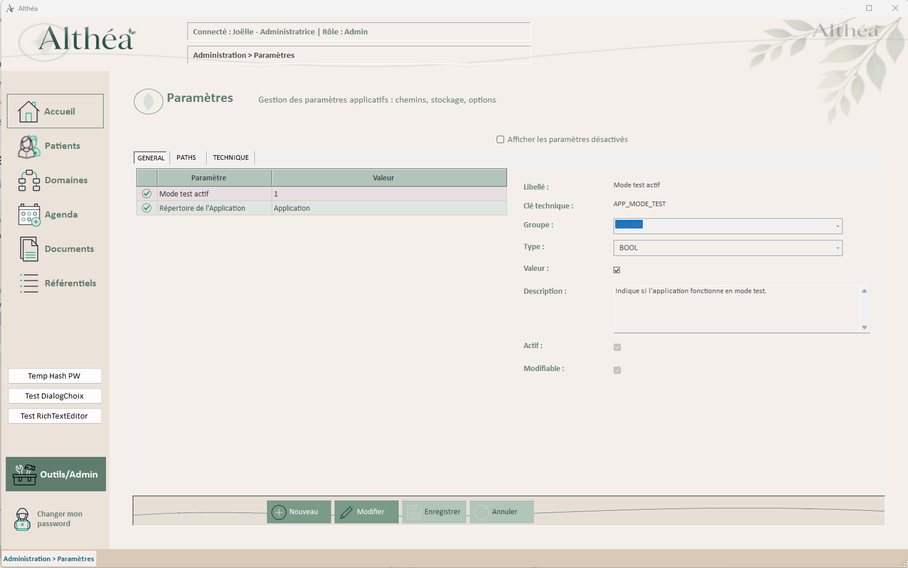

##### 2. Mode Admin : accès complet, création, modification structurelle, désactivation
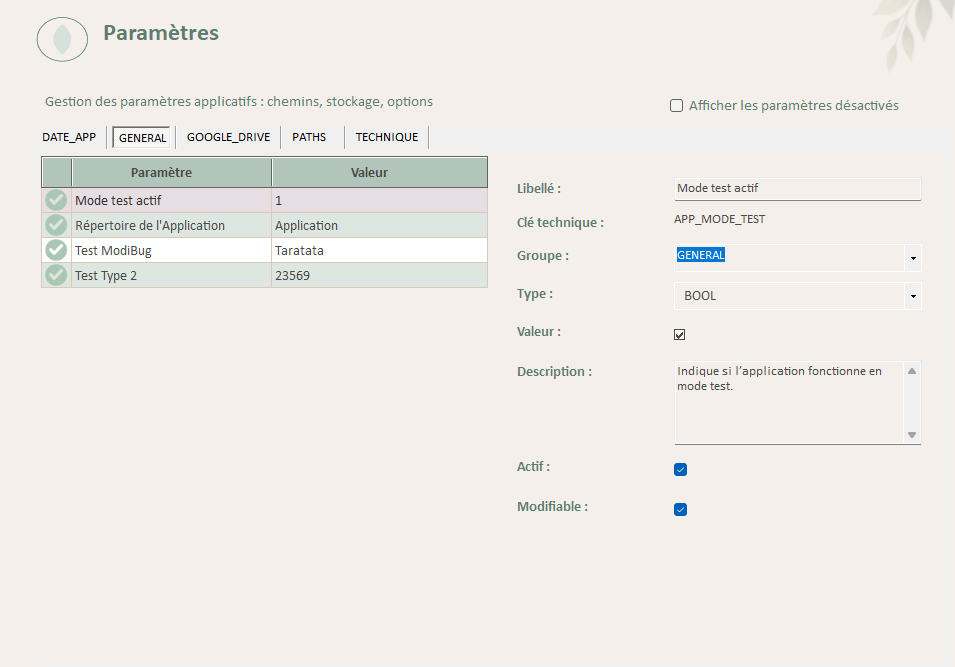


### Rôle général

`UC_Parametres` permet de gérer les paramètres applicatifs stockés en base de données.

Il constitue un module central pour :

- la configuration fonctionnelle de l’application
- la gestion des chemins (PATHS)
- les options techniques et métier

👉 Ce UserControl est également utilisé comme **modèle de conception pour les futurs UC**.

------

### Responsabilités

- Charger les paramètres depuis la base de données
- Les organiser par groupe (onglets)
- Afficher une liste synthétique (DataGridView)
- Afficher un détail dynamique selon le type
- Permettre la modification (selon rôle)
- Gérer la validation avant sauvegarde
- Gérer les états actif / désactivé
- Fournir un retour utilisateur cohérent (status, erreurs, contexte)

------

### Dépendances

| Élément              | Type   | Rôle |
| -------------------- | ------ | ---- |
| `GestionParametres`  | Module | Couche métier des paramètres applicatifs : lecture, création, modification, désactivation. |
| `QueryParametres`    | Module | Requêtes SQL associées à `tec_parametres`, appelées depuis la couche métier. |
| `ParametreApplication` | Classe | Objet métier représentant un paramètre applicatif chargé depuis la base. |
| `UtilsValidation`    | Module | Validation des types et valeurs de paramètres. |
| `UtilsString`        | Module | Normalisation des clés, groupes et codes techniques. |
| `GestionLog`         | Module | Journalisation des actions utilisateur, erreurs et décisions techniques. |
| `UserControlContext` | Classe | Gestion centralisée du contexte UI : status, erreurs, header, tooltips. |
| `UITheme`            | Module | Palette graphique centralisée : couleurs, chemins d’assets, constantes visuelles. |
| `UtilsButtons`       | Module | Initialisation et comportement des boutons standards. |
| `UtilsDataGrid`      | Module | Initialisation visuelle standard des `DataGridView`. |
| `Home`               | Form   | Shell applicatif qui héberge le UserControl et fournit le contexte global. |

------

### Structure UI

Le UserControl est construit dynamiquement :

- `TabControl` → un onglet par groupe
- chaque onglet contient :
  - un `DataGridView` (liste)
  - un `Panel` (détail)

👉 Aucun layout figé : tout est généré à partir des données.

------

### DataGridView

Colonnes principales :

| Colonne            | Rôle                                |
| ------------------ | ----------------------------------- |
| `colEtat`          | Affiche une icône actif / désactivé |
| `LibelleParametre` | Nom du paramètre                    |
| `ValeurParametre`  | Valeur affichée                     |

Comportement :

- sélection d’une ligne → affichage du détail
- paramètres désactivés :
  - icône spécifique
  - couleur atténuée
  - tooltip explicatif

------

### Affichage du détail

Le panneau de droite est dynamique.

Le type du paramètre détermine le contrôle :

| Type          | Contrôle       |
| ------------- | -------------- |
| BOOL          | CheckBox       |
| INT           | NumericUpDown  |
| DECIMAL       | NumericUpDown  |
| DATE          | DateTimePicker |
| STRING / PATH | TextBox        |

👉 Cette approche permet d’éviter les erreurs de saisie et d’améliorer l’expérience utilisateur.

------

### Gestion du groupe

Le champ Groupe utilise :

- ComboBox en mode édition
- TextBox en mode consultation

Fonctionnalités :

- liste des groupes existants
- possibilité de créer un nouveau groupe
- normalisation automatique (MAJUSCULE, sans accents, underscore)

------

### Gestion des états

Un paramètre peut être :

- Actif
- Désactivé

Caractéristiques :

- un paramètre désactivé reste en base
- il peut être réaffiché via le filtre
- il est visuellement différencié

👉 Aucun delete physique → sécurité des données

------

### Validation

La validation est réalisée avant toute sauvegarde :

- champs obligatoires
- unicité de la clé (mode Nouveau uniquement)
- cohérence Type / Valeur

Affichage des erreurs :

- `errProvider` → champ
- `StatusStrip` → message global
- `MessageBox` → uniquement en cas de blocage

------

### Sauvegarde

Deux cas :

| Mode         | Action          |
| ------------ | --------------- |
| Nouveau      | InsertParametre |
| Modification | UpdateParametre |

Après sauvegarde :

- rechargement complet
- restauration de la sélection
- mise à jour UI

------

### Variables internes importantes

| Variable                   | Type    | Rôle                                       |
| -------------------------- | ------- | ------------------------------------------ |
| `_parametres`              | List    | Liste des paramètres chargés               |
| `_parametreCourant`        | Objet   | Paramètre sélectionné                      |
| `_modeEditionParametre`    | Enum    | Nouveau / Modification / Consultation      |
| `_isDirty`                 | Boolean | Indique des modifications non sauvegardées |
| `_suspendSelectionChanged` | Boolean | Évite les événements parasites             |

------

### Méthodes principales

| Méthode                             | Rôle                                          |
| ----------------------------------- | --------------------------------------------- |
| `ChargerParametres()`               | Charge et construit l’ensemble du UserControl |
| `CreerDataGridParametres()`         | Crée la grille standard                       |
| `ConfigurerDataGridParametres()`    | Gère les événements (sélection, affichage)    |
| `InitialiserSelection()`            | Sélectionne le premier élément                |
| `AfficherDetailParametre()`         | Construit le panneau détail                   |
| `AjouterChamp()`                    | Ajoute un champ standard                      |
| `AjouterChampValeur()`              | Ajoute le champ valeur dynamique              |
| `LireValeursDepuisUI()`             | Lit les données depuis l’UI                   |
| `ValiderParametreAvantSauvegarde()` | Validation complète                           |
| `RestaurerSelection()`              | Restaure la sélection après reload            |

------

### Gestion UI globale

Le UserControl utilise `UserControlContext` pour :

- afficher le contexte (`lblContexte`)
- afficher le status (`stsStatus`)
- gérer les erreurs (`errProvider`)
- gérer les tooltips (`ttMain`)

👉 Aucun accès direct aux contrôles globaux depuis le UC

------

### Préparation gestion des rôles

Le comportement du UC dépendra du rôle :

#### Admin

- accès complet
- création
- modification structurelle
- désactivation

#### SuperUser

- modification limitée
- pas de modification clé / groupe / type

#### User

- accès interdit

👉 Cette logique sera implémentée dans un processus dédié.

------

### Points d’attention

À ne pas faire :

- ne pas modifier directement la base depuis l’UI
- ne pas bypasser `GestionParametres`
- ne pas supprimer la validation
- ne pas autoriser la modification de la clé après création

À conserver absolument :

- génération dynamique UI
- validation structurée
- séparation UI / métier
- utilisation de `UserControlContext`

------

### Message au repreneur

👉 `UC_Parametres` est une pièce centrale du projet.

Il sert de référence pour :

- la structuration des futurs UserControls
- la gestion des données dynamiques
- l’architecture UI

👉 Avant toute modification :

- lire ce module entièrement
- comprendre les interactions avec `GestionParametres`
- vérifier l’impact sur la validation et l’UI

👉 Toute évolution doit préserver :

- la cohérence des données
- la lisibilité du code
- la réutilisabilité du modèle

---

## **UserControl : UC_AdminHome**

##### 1. Vue SuperUser : accès limité, pas de configuration technique ni gestion utilisateurs
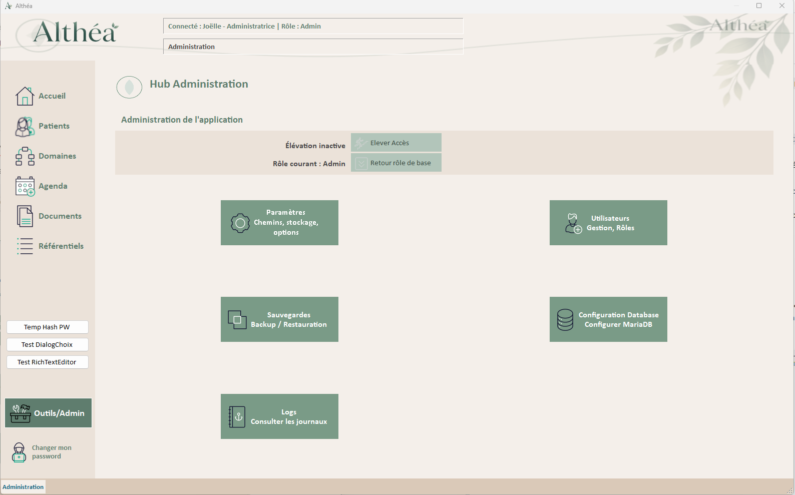

##### 2. Vue Admin : accès complet à tous les modules d’administration
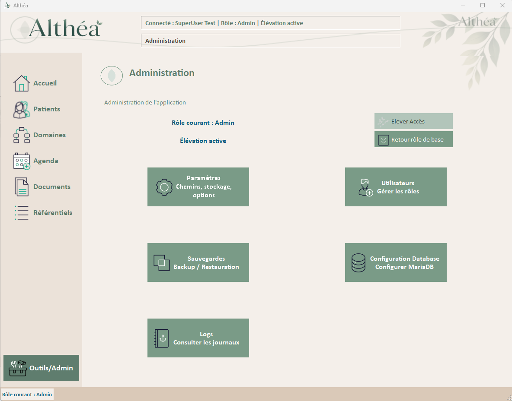

> [!IMPORTANT]
>
> Todo : Mettre à jour au fur et à mesure de l'avancée

### Rôle général

`UC_AdminHome` est le hub d’administration d’Althéa.

Il centralise les accès aux fonctions techniques et administratives de l’application :

- paramètres applicatifs
- gestion future des utilisateurs
- logs
- sauvegardes
- configuration database
- élévation temporaire des droits
- retour au rôle de base

Ce UserControl ne doit pas contenir de logique métier lourde.  
Il joue le rôle d’écran d’orientation et de contrôle d’accès.

---

### Responsabilités

- Afficher les boutons d’accès aux modules d’administration.
- Adapter les droits visibles selon le rôle courant.
- Permettre une élévation temporaire de privilèges.
- Permettre le retour au rôle naturel de l’utilisateur.
- Mettre à jour l’affichage du rôle courant.
- Mettre à jour l’état d’élévation.
- Rediriger vers `Accueil` si l’utilisateur n’a plus les droits nécessaires.
- Ouvrir les Forms techniques modales avec un contexte temporaire propre.
- Journaliser les actions sensibles.

---

### Dépendances

| Élément | Type | Rôle |
|---|---|---|
| `Home` | Form | Shell applicatif qui héberge `UC_AdminHome`, fournit la navigation et le contexte global. |
| `NavigationManager` | Classe | Charge les UserControls dans la zone centrale de `Home`. |
| `UserSession` | Classe | Contient le rôle courant, le rôle de base et l’état d’élévation. |
| `UtilisateurApplication` | Classe | Contient l’utilisateur connecté, son rôle de base et son rôle maximal d’élévation. |
| `AppRole` | Enum | Définit les rôles applicatifs : `User`, `SuperUser`, `Admin`. |
| `ElevationAcces` | Form | Formulaire d’élévation temporaire des droits. |
| `ConfigurationConnexion` | Form | Formulaire de configuration technique de la connexion MariaDB. |
| `UC_Parametres` | UserControl | Module de gestion des paramètres applicatifs. |
| `GestionLog` | Module | Journalisation des accès, erreurs et actions sécurité. |
| `UtilsButtons` | Module | Initialisation des boutons larges 48px et gestion de leurs états visuels. |
| `UITheme` | Module | Palette graphique centralisée, chemins assets et constantes UI. |

---

### Variables internes

| Variable | Type | Rôle |
|---|---|---|
| `_userSession` | `UserSession` | Session courante de l’utilisateur connecté. |
| `_utilisateur` | `UtilisateurApplication` | Utilisateur applicatif authentifié. |

---

### Contrôles

| Contrôle | Type | Rôle |
|---|---|---|
| `pnlForm` | Panel | Conteneur principal avec fond graphique. |
| `pnlTitre` | Panel | Zone de titre du UserControl. |
| `lblTitreForm` | Label | Titre de l’écran Administration. |
| `picTitre` | PictureBox | Illustration ou pictogramme de l’écran. |
| `pnlCenter` | Panel | Zone centrale contenant les informations et le menu. |
| `pnlTop` | Panel | Bandeau explicatif supérieur. |
| `lblTop` | Label | Texte d’introduction de la zone Administration. |
| `pnlRoleCourant` | Panel | Zone indiquant le rôle courant. |
| `lblRoleCourant` | Label | Affiche le rôle actif dans la session. |
| `btnEleverAcces` | Button | Ouvre `ElevationAcces` si une élévation est possible. |
| `pnlElevation` | Panel | Zone d’état de l’élévation. |
| `lblElevation` | Label | Indique si une élévation est active. |
| `btnRetourRoleBase` | Button | Réinitialise le rôle courant vers le rôle naturel. |
| `tblMenu` | TableLayoutPanel | Grille des boutons d’administration. |
| `btnParametres` | Button | Ouvre `UC_Parametres`. |
| `btnUtilisateurs` | Button | Prévu pour ouvrir `UC_Utilisateurs`. |
| `btnLogs` | Button | Prévu pour consulter les logs. |
| `btnSauvegardes` | Button | Prévu pour les sauvegardes/restaurations. |
| `btnConnexionDatabase` | Button | Ouvre `ConfigurationConnexion`. |
| `stsStatus` | StatusStrip | Barre de statut locale. |
| `stsLabelStatus` | ToolStripStatusLabel | Message d’état local du UserControl. |

---

### Méthodes principales

| Méthode | Rôle |
|---|---|
| `UC_AdminHome_Load()` | Initialise les boutons et applique les droits utilisateur. |
| `AppliquerDroitsUtilisateur()` | Active/désactive les zones selon le rôle courant. |
| `ActiverTousLesBoutonsAdmin()` | Active les boutons réservés à Admin. |
| `DesactiverTousLesBoutonsAdmin()` | Désactive les boutons administratifs. |
| `btnParametres_Click()` | Navigue vers `UC_Parametres`. |
| `btnConnexionDatabase_Click()` | Ouvre `ConfigurationConnexion` avec contexte temporaire. |
| `btnEleverAcces_Click()` | Ouvre `ElevationAcces`, applique l’élévation si validée. |
| `btnRetourRoleBase_Click()` | Annule l’élévation via `ResetElevation()`. |

---

### Gestion des droits

Le UserControl travaille toujours sur : `_userSession.CurrentRole` et non uniquement sur le rôle de base utilisateur.

Règles actuelles :

| Rôle courant | Comportement                                                 |
| ------------ | ------------------------------------------------------------ |
| `Admin`      | Accès complet aux boutons d’administration.                  |
| `SuperUser`  | Accès limité aux modules autorisés. Peut rester dans AdminHome après retour rôle base. |
| `User`       | Accès AdminHome interdit sauf élévation préalable.           |

------

### Gestion de l’élévation

`btnEleverAcces` est actif uniquement si :

```
_userSession.CurrentRole < _utilisateur.RoleMaxElevation
```

`btnRetourRoleBase` est actif uniquement si :

```
_userSession.IsElevated = True
```

Le retour au rôle de base doit recalculer les droits immédiatement.

Règle UX validée :

| Cas                                      | Résultat                    |
| ---------------------------------------- | --------------------------- |
| User élevé → retour User                 | Retour automatique Accueil. |
| SuperUser élevé Admin → retour SuperUser | Reste dans AdminHome.       |

------

### Gestion des boutons

Les boutons de `UC_AdminHome` sont des boutons larges 48px.

Initialisation attendue :

```
UtilsButtons.InitLargeIconButton(btnParametres)
UtilsButtons.InitLargeIconButton(btnUtilisateurs)
UtilsButtons.InitLargeIconButton(btnLogs)
UtilsButtons.InitLargeIconButton(btnSauvegardes)
UtilsButtons.InitLargeIconButton(btnConnexionDatabase)
UtilsButtons.InitLargeIconButton(btnEleverAcces)
UtilsButtons.InitLargeIconButton(btnRetourRoleBase)
```

Les images sont stockées dans :

```
Assets\Boutons_ico_48
```

Les `Tag` doivent respecter le format :

```
nom_image_normal
```

------

### Points d’attention

- Ne pas ouvrir directement un UserControl admin hors `Home.NavigateToAdminView`.
- Ne pas modifier le rôle de base utilisateur depuis ce UserControl.
- L’élévation est uniquement une modification de session.
- Les boutons non encore implémentés peuvent rester désactivés ou afficher un statut explicite.
- Toute action liée aux droits doit être logguée en catégorie Security ou UI selon le cas.
- Les contextes modaux doivent être restaurés explicitement au retour.

------

### Message au repreneur

`UC_AdminHome` est le point d’entrée de l’administration.
 Toute modification doit respecter la séparation :

```
Navigation / UI / Sécurité session
```

Il ne doit pas devenir un module métier.
 La future gestion des utilisateurs devra être portée par `UC_Utilisateurs`, pas directement ici.

...

## **UserControl : UC_Accueil**

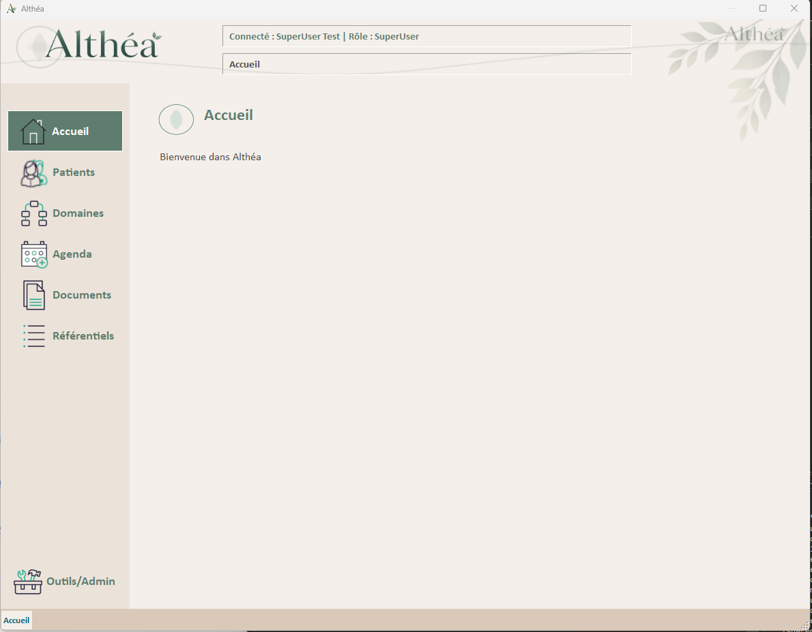

### Rôle général

> [!IMPORTANT]
>
> Ce UserControl est **prévu** mais **n'est pas encore implémenté**.
> La classe `UC_Accueil` existe dans le projet et est actuellement **vide**.
> Documentation à compléter au fur et à mesure de l'avancée.

---

## **UserControl : UC_Utilisateurs**

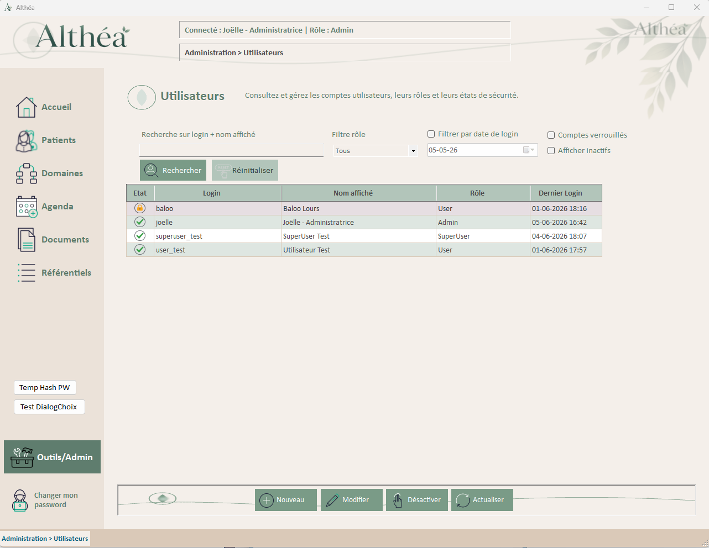

### Rôle général

`UC_Utilisateurs` est le UserControl d'administration permettant de gérer les utilisateurs applicatifs d'Althéa.

Il est chargé dynamiquement dans `Home` via `NavigationManager` lorsque l'utilisateur navigue vers l'administration.

### Responsabilités

- Lister tous les utilisateurs applicatifs.
- Permettre la recherche et le filtrage (par nom, login, rôle, état, date).
- Ouvrir `UtilisateurEdition` en mode Création, Modification ou Consultation.
- Permettre l'activation/désactivation des comptes.
- Afficher les états utilisateur avec des icônes visuelles (actif, inactif, verrouillé).
- Gérer les droits d'accès selon le rôle de l'utilisateur connecté (Admin/SuperUser).
- Journaliser toutes les actions via `GestionLog`.
- Utiliser le contexte UI partagé fourni par `Home`.

### Dépendances

| Élément                  | Type   | Rôle                                                         |
| ------------------------ | ------ | ------------------------------------------------------------ |
| `GestionUtilisateurs`    | Module | Couche métier : chargement liste, activation/désactivation, etc. |
| `UtilisateurApplication` | Classe | Objet métier représentant un utilisateur.                    |
| `AppRole`                | Enum   | Rôles applicatifs.                                           |
| `UserControlContext`     | Classe | Contexte UI injecté par `Home`.                              |
| `UtilsButtons`           | Module | Initialisation des boutons standards.                        |
| `UtilsDataGrid`          | Module | Configuration visuelle des DataGridView.                     |
| `UtilsIcons`             | Module | Centralisation des icônes d'état (actif, inactif, verrouillé). |
| `GestionLog`             | Module | Journalisation des actions.                                  |
| `UITheme`                | Module | Thème visuel.                                                |
| `UtilisateurEdition`     | Form   | Form modale de création/modification/consultation.           |
| `DialogChoix`            | Form   | Remplace MessageBox pour tous les messages.                  |

### Variables privées

| Variable        | Type                              | Rôle                                                         |
| --------------- | --------------------------------- | ------------------------------------------------------------ |
| `_context`      | `UserControlContext`              | Contexte UI injecté par `Home` via `SetContext()`.           |
| `_utilisateurs` | `List(Of UtilisateurApplication)` | Liste complète des utilisateurs chargée depuis la base, utilisée pour filtrage en mémoire. |

### Contrôles principaux

| Contrôle                   | Type                 | Rôle                                             |
| -------------------------- | -------------------- | ------------------------------------------------ |
| `pnlForm`                  | Panel                | Conteneur principal.                             |
| `pnlTitre`                 | Panel                | Zone de titre.                                   |
| `lblTitreForm`             | Label                | Titre "Gestion des utilisateurs".                |
| `pnlFilters`               | Panel                | Zone de filtres et recherche.                    |
| `txtRechercheNom`          | TextBox              | Recherche par nom d'affichage.                   |
| `txtRechercheLogin`        | TextBox              | Recherche par login.                             |
| `cboRoleFiltre`            | ComboBox             | Filtre par rôle.                                 |
| `chkActifsUniquement`      | CheckBox             | Afficher uniquement les utilisateurs actifs.     |
| `chkVerrouillesUniquement` | CheckBox             | Afficher uniquement les comptes verrouillés.     |
| `dtpDateLoginDebut`        | DateTimePicker       | Filtre par date de dernier login (début).        |
| `dtpDateLoginFin`          | DateTimePicker       | Filtre par date de dernier login (fin).          |
| `btnRechercher`            | Button               | Applique les filtres.                            |
| `btnReinitialiserFiltres`  | Button               | Réinitialise tous les filtres.                   |
| `dgvUtilisateurs`          | DataGridView         | Liste des utilisateurs.                          |
| `pnlActions`               | Panel                | Zone des boutons d'action.                       |
| `btnNouveau`               | Button               | Ouvre `UtilisateurEdition` en mode Création.     |
| `btnModifier`              | Button               | Ouvre `UtilisateurEdition` en mode Modification. |
| `btnActiverDesactiver`     | Button               | Active ou désactive le compte sélectionné.       |
| `btnActualiser`            | Button               | Recharge la liste des utilisateurs.              |
| `stsStatus`                | StatusStrip          | Barre de statut locale.                          |
| `stsLabelStatus`           | ToolStripStatusLabel | Message d'état.                                  |

### DataGridView : colonnes principales

| Colonne               | Rôle                                                         |
| --------------------- | ------------------------------------------------------------ |
| `colEtat`             | Icône d'état : actif (vert), inactif (gris), verrouillé (cadenas). |
| `colCodeUtilisateur`  | Code utilisateur.                                            |
| `colLoginUtilisateur` | Login utilisateur.                                           |
| `colNomAffichage`     | Nom d'affichage.                                             |
| `colRoleUtilisateur`  | Rôle de base.                                                |
| `colRoleMaxElevation` | Rôle max élévation.                                          |
| `colActif`            | État actif/inactif (masqué car redondant avec colEtat).      |
| `colCompteVerrouille` | Compte verrouillé oui/non.                                   |
| `colDernierLogin`     | Date du dernier login.                                       |
| `colDateCreation`     | Date de création du compte.                                  |

### Méthodes principales

| Méthode                            | Rôle                                                         |
| ---------------------------------- | ------------------------------------------------------------ |
| `SetContext(context)`              | Implémentation de `IContextAwareUserControl` : reçoit le contexte UI. |
| `UC_Utilisateurs_Load()`           | Initialise le UserControl, charge les utilisateurs.          |
| `InitialiserBoutons()`             | Initialise les boutons standards.                            |
| `InitialiserDataGridView()`        | Configure la grille utilisateurs.                            |
| `InitialiserToolTips()`            | Initialise les infobulles.                                   |
| `InitialiserComboRole()`           | Remplit la ComboBox de filtre par rôle.                      |
| `InitialiserDatePicker()`          | Configure les DateTimePickers.                               |
| `AppliquerDroitsUtilisateur()`     | Active/désactive les boutons selon le rôle connecté.         |
| `ChargerUtilisateurs()`            | Charge la liste complète des utilisateurs depuis la base.    |
| `AfficherUtilisateurs(liste)`      | Affiche une liste filtrée dans la grille.                    |
| `AppliquerFiltres()`               | Filtre la liste en mémoire selon les critères saisis.        |
| `VerifierEtatFiltres()`            | Active/désactive le bouton Réinitialiser selon l'état des filtres. |
| `ReinitialiserFiltres()`           | Réinitialise tous les filtres et affiche la liste complète.  |
| `btnNouveau_Click()`               | Ouvre `UtilisateurEdition` en mode Création.                 |
| `btnModifier_Click()`              | Ouvre `UtilisateurEdition` en mode Modification ou Consultation. |
| `btnActiverDesactiver_Click()`     | Active ou désactive le compte sélectionné.                   |
| `btnActualiser_Click()`            | Recharge la liste des utilisateurs.                          |
| `dgvUtilisateurs_CellFormatting()` | Gère l'affichage des icônes d'état avec priorité au verrouillage. |

### Gestion des icônes d'état

Le UserControl utilise `UtilsIcons` pour afficher des icônes visuelles dans la colonne `colEtat` :

| État              | Icône           | Priorité                                    |
| ----------------- | --------------- | ------------------------------------------- |
| Compte verrouillé | Cadenas rouge   | **Priorité 1** (remplace toutes les autres) |
| Compte actif      | Icône verte (✓) | Priorité 2                                  |
| Compte inactif    | Icône grise (✗) | Priorité 3                                  |

**Règle importante** : Si un compte est verrouillé, l'icône cadenas est affichée même si le compte est marqué actif.

### Gestion des filtres et recherche

Le UserControl propose des filtres riches :

- **Recherche textuelle** : nom d'affichage, login (recherche partielle, insensible à la casse).
- **Filtre par rôle** : User, SuperUser, Admin, ou tous.
- **Filtre par état** : Actifs uniquement, Verrouillés uniquement.
- **Filtre par date** : Plage de dates pour le dernier login.

**Fonctionnement** :

1. Tous les utilisateurs sont chargés en mémoire dans `_utilisateurs`.
2. Les filtres sont appliqués en mémoire (LINQ) sans requête DB supplémentaire.
3. Le bouton Réinitialiser est activé uniquement si au moins un filtre est actif.

### Gestion des droits

Le comportement du UserControl dépend du rôle de l'utilisateur connecté :

#### Admin

- Accès complet
- Création, modification, activation/désactivation
- Ouverture en mode Modification pour tous les utilisateurs

#### SuperUser

- Accès en lecture seule
- Peut consulter les utilisateurs (mode Consultation)
- Peut déverrouiller ou réinitialiser un mot de passe (actions de sécurité)
- **Ne peut pas** créer, modifier ou désactiver des comptes

#### User

- Accès interdit à `UC_Utilisateurs`

### Règles d'état

| Situation                     | Effet UI                                           |
| ----------------------------- | -------------------------------------------------- |
| Aucun utilisateur sélectionné | Boutons Modifier et Activer/Désactiver désactivés. |
| Utilisateur sélectionné       | Boutons activés selon le rôle connecté.            |
| Rôle Admin                    | Bouton Modifier ouvre en mode Modification.        |
| Rôle SuperUser                | Bouton Modifier ouvre en mode Consultation.        |
| Compte actif sélectionné      | Bouton Activer/Désactiver affiche "Désactiver".    |
| Compte inactif sélectionné    | Bouton Activer/Désactiver affiche "Activer".       |
| Filtres actifs                | Bouton Réinitialiser activé.                       |
| Aucun filtre actif            | Bouton Réinitialiser désactivé.                    |

### Points d'attention

- **Ne jamais** accéder directement à la base de données depuis le UserControl.
- Toujours passer par `GestionUtilisateurs` pour toute opération métier.
- Les données sensibles (`password_hash`, `password_salt`) ne sont **jamais** chargées dans ce UserControl.
- Utiliser `DialogChoix` pour **tous** les messages utilisateur.
- Les filtres sont appliqués en mémoire pour améliorer les performances.
- Les icônes d'état doivent respecter la priorité : verrouillé > actif > inactif.

### Message au repreneur

`UC_Utilisateurs` est le point d'entrée de la gestion des utilisateurs applicatifs.

Avant toute modification :

- Comprendre la séparation Admin/SuperUser et leurs droits respectifs.
- Vérifier l'impact sur `UtilisateurEdition` et `GestionUtilisateurs`.
- Tester les scénarios de recherche, filtrage, création, modification, activation/désactivation.
- S'assurer que les droits sont correctement appliqués selon le rôle connecté.
- Valider que les icônes d'état s'affichent correctement avec la bonne priorité.

---

## **UserControl : UC_RichTextEditor**

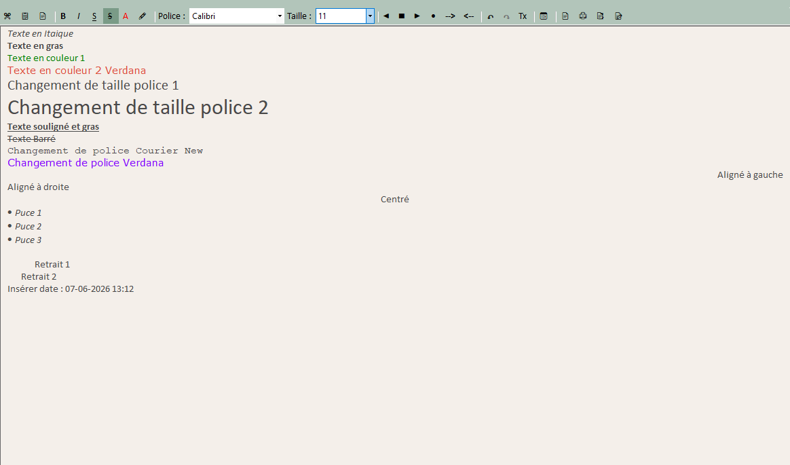

### Rôle général

`UC_RichTextEditor` est un UserControl réutilisable d'édition de texte riche (Rich Text Format - RTF) avec une barre d'outils complète.

Il est destiné à la saisie et à l'édition de documents formatés dans le cadre professionnel psychologique et graphothérapeutique :

- **Anamnèses** : historique complet du patient avec mise en forme structurée
- **Bilans psychologiques/graphothérapeutiques** : comptes-rendus détaillés avec formatage professionnel
- **Comptes-rendus de consultations** : notes de séances formatées et structurées
- **Plans d'accompagnement** : documents évolutifs partagés avec familles, écoles, confrères
- **Correspondances professionnelles** : courriers aux médecins traitants, établissements scolaires

Il offre :
- **30 boutons de toolbar** pour formatage complet (caractères, paragraphes, presse-papiers, insertion, outils)
- **Impression Win32 native** avec API `EM_FORMATRANGE` préservant le formatage RTF complet
- **Export PDF** via Syncfusion pour archivage et envoi
- **Export Word (.docx)** via Syncfusion pour collaboration et modification
- **Sauvegarde double** : RTF (formatage préservé) + TXT (recherche full-text SQL)
- **Modes d'utilisation** : édition complète, lecture seule, toolbar masquable
- **Intégration contexte UI** : implémente `IContextAwareUserControl`

### Responsabilités

- Fournir une interface d'édition de texte riche complète et professionnelle
- Gérer le formatage de caractères (gras, italique, souligné, barré, couleurs)
- Gérer le formatage de paragraphes (alignement, listes, retraits)
- Gérer les polices (9 familles courantes) et tailles (14 tailles de 8 à 72 points)
- Gérer les opérations presse-papiers (couper, copier, coller, annuler, rétablir)
- Permettre l'insertion de date/heure courante
- Permettre l'effacement du formatage
- Fournir une impression native Windows préservant le formatage RTF complet
- Permettre la configuration de mise en page (format papier, marges, orientation)
- Exporter en PDF (Syncfusion) pour archivage et envoi
- Exporter en Word/DOCX (Syncfusion) pour collaboration et modification
- Gérer deux modes d'affichage : édition complète et lecture seule
- Exposer le contenu en deux formats : RTF (formatage) et TXT (recherche)
- S'intégrer au contexte UI partagé (StatusBar, ToolTip, ErrorProvider)
- Adapter son comportement selon le mode (toolbar visible/masquée)

### Dépendances

| Élément | Type | Rôle |
|---|---|---|
| `RichTextEditorHelper` | Module | Helper centralisé contenant toute la logique métier (formatage, impression Win32, exports PDF/Word) |
| `UITheme` | Module | Palette graphique centralisée (couleurs toolbar, boutons, fond éditeur) |
| `UserControlContext` | Classe | Contexte UI partagé (StatusBar, ToolTip, ErrorProvider) injecté via `IContextAwareUserControl` |
| `Syncfusion.DocIO` | NuGet | Conversion RTF → PDF et RTF → DOCX |
| `Syncfusion.DocToPDFConverter` | NuGet | Conversion PDF avancée avec préservation formatage |
| `Syncfusion.Licensing` | NuGet | Gestion licence Syncfusion Community (gratuite < 1M USD revenus) |

### Contrôles principaux

| Contrôle | Type | Rôle |
|---|---|---|
| `tlsToolbar` | ToolStrip | Barre d'outils principale contenant les 30 boutons de formatage et actions |
| `rtbEditor` | RichTextBox | Contrôle d'édition de texte riche natif Windows Forms |
| `btnBold` | ToolStripButton | Bascule le texte sélectionné en gras (Ctrl+B) |
| `btnItalic` | ToolStripButton | Bascule le texte sélectionné en italique (Ctrl+I) |
| `btnUnderline` | ToolStripButton | Bascule le texte sélectionné en souligné (Ctrl+U) |
| `btnStrikethrough` | ToolStripButton | Bascule le texte sélectionné en barré |
| `btnTextColor` | ToolStripButton | Change la couleur du texte sélectionné |
| `btnHighlightColor` | ToolStripButton | Change la couleur de surbrillance du texte |
| `cmbFont` | ToolStripComboBox | Sélection de la police (9 familles : Arial, Calibri, Times, Courier, Verdana, Georgia, Tahoma, Trebuchet, Comic Sans) |
| `cmbFontSize` | ToolStripComboBox | Sélection de la taille (14 tailles : 8, 9, 10, 11, 12, 14, 16, 18, 20, 24, 28, 36, 48, 72) |
| `btnAlignLeft` | ToolStripButton | Aligne le paragraphe à gauche |
| `btnAlignCenter` | ToolStripButton | Centre le paragraphe |
| `btnAlignRight` | ToolStripButton | Aligne le paragraphe à droite |
| `btnBullets` | ToolStripButton | Bascule les puces du paragraphe |
| `btnIncreaseIndent` | ToolStripButton | Augmente le retrait du paragraphe |
| `btnDecreaseIndent` | ToolStripButton | Diminue le retrait du paragraphe |
| `btnCut` | ToolStripButton | Coupe le texte sélectionné (Ctrl+X) |
| `btnCopy` | ToolStripButton | Copie le texte sélectionné (Ctrl+C) |
| `btnPaste` | ToolStripButton | Colle le contenu du presse-papiers (Ctrl+V) |
| `btnUndo` | ToolStripButton | Annule la dernière action (Ctrl+Z) |
| `btnRedo` | ToolStripButton | Rétablit la dernière action annulée (Ctrl+Y) |
| `btnClearFormat` | ToolStripButton | Efface le formatage du texte sélectionné |
| `btnInsertDateTime` | ToolStripButton | Insère la date/heure courante |
| `btnPageSetup` | ToolStripButton | Configure la mise en page (format papier, marges, orientation) |
| `btnPrint` | ToolStripButton | Imprime le document avec dialogue système Windows |
| `btnExportPDF` | ToolStripButton | Exporte le document en PDF (Syncfusion) |
| `btnExportWord` | ToolStripButton | Exporte le document en Word/DOCX (Syncfusion) |

### Propriétés publiques

| Propriété | Type | Rôle |
|---|---|---|
| `RtfContent` | String | Obtient ou définit le contenu RTF complet (formatage préservé) |
| `TextContent` | String | Obtient le contenu texte brut (pour recherche full-text SQL) |
| `ReadOnlyMode` | Boolean | Active/désactive le mode lecture seule (masque automatiquement la toolbar) |
| `ShowToolbar` | Boolean | Affiche/masque manuellement la toolbar |

### Méthodes principales

| Méthode | Rôle |
|---|---|
| `UC_RichTextEditor_Load` | Initialise le contrôle : configuration thème, marges internes, état initial toolbar |
| `DefinirMargesInterieures` | Définit les marges internes du RichTextBox (10px gauche/droite) |
| **Formatage caractères** | |
| `btnBold_Click` | Bascule le gras sur le texte sélectionné via `RichTextEditorHelper.BasculerGras` |
| `btnItalic_Click` | Bascule l'italique sur le texte sélectionné via `RichTextEditorHelper.BasculerItalique` |
| `btnUnderline_Click` | Bascule le souligné sur le texte sélectionné via `RichTextEditorHelper.BasculerSouligne` |
| `btnStrikethrough_Click` | Bascule le barré sur le texte sélectionné via `RichTextEditorHelper.BasculerBarre` |
| `btnTextColor_Click` | Change la couleur du texte via `ColorDialog` et `RichTextEditorHelper.ChangerCouleurTexte` |
| `btnHighlightColor_Click` | Change la couleur de surbrillance via `ColorDialog` et `RichTextEditorHelper.ChangerCouleurFond` |
| **Formatage paragraphes** | |
| `btnAlignLeft_Click` | Aligne à gauche via `RichTextEditorHelper.ChangerAlignement(HorizontalAlignment.Left)` |
| `btnAlignCenter_Click` | Centre via `RichTextEditorHelper.ChangerAlignement(HorizontalAlignment.Center)` |
| `btnAlignRight_Click` | Aligne à droite via `RichTextEditorHelper.ChangerAlignement(HorizontalAlignment.Right)` |
| `btnBullets_Click` | Bascule les puces via `RichTextEditorHelper.BasculerPuces` |
| `btnIncreaseIndent_Click` | Augmente le retrait via `RichTextEditorHelper.AugmenterRetrait` |
| `btnDecreaseIndent_Click` | Diminue le retrait via `RichTextEditorHelper.DiminuerRetrait` |
| **Polices** | |
| `cmbFont_SelectedIndexChanged` | Change la police via `RichTextEditorHelper.ChangerPolice` |
| `cmbFontSize_SelectedIndexChanged` | Change la taille via `RichTextEditorHelper.ChangerTaille` |
| **Presse-papiers** | |
| `btnCut_Click` | Coupe le texte via `RichTextEditorHelper.Couper` |
| `btnCopy_Click` | Copie le texte via `RichTextEditorHelper.Copier` |
| `btnPaste_Click` | Colle le texte via `RichTextEditorHelper.Coller` |
| `btnUndo_Click` | Annule via `rtbEditor.Undo()` |
| `btnRedo_Click` | Rétablit via `rtbEditor.Redo()` |
| **Insertion et nettoyage** | |
| `btnClearFormat_Click` | Efface le formatage via sélection temporaire complète et reset police/couleur |
| `btnInsertDateTime_Click` | Insère date/heure via `RichTextEditorHelper.InsererDateHeure` avec format "dd/MM/yyyy HH:mm" |
| **Impression et exports** | |
| `btnPageSetup_Click` | Configure mise en page via `RichTextEditorHelper.ConfigurerMiseEnPage` |
| `btnPrint_Click` | Imprime via `RichTextEditorHelper.Imprimer` (API Win32 `EM_FORMATRANGE`) |
| `btnExportPDF_Click` | Exporte en PDF via `RichTextEditorHelper.ExporterPDFAvecDialogue` (Syncfusion) |
| `btnExportWord_Click` | Exporte en Word via `RichTextEditorHelper.ExporterWordAvecDialogue` (Syncfusion) |
| **Événements RichTextBox** | |
| `rtbEditor_SelectionChanged` | Met à jour l'état visuel des boutons de formatage selon la sélection courante |
| `rtbEditor_KeyDown` | Gère les raccourcis clavier (Ctrl+B/I/U pour gras/italique/souligné, Ctrl+Z/Y pour annuler/rétablir, Ctrl+X/C/V pour presse-papiers) |

### Architecture technique

#### Séparation UI / Logique métier

Toute la logique métier est centralisée dans le module **`RichTextEditorHelper`** (`Utils/Helpers/RichTextEditorHelper.vb`) :

- **Configuration** : `ConfigurerRichTextBox()` applique le thème Althéa (police, couleur fond, mode multiligne, scrollbars)
- **Formatage** : méthodes de formatage caractères/paragraphes/polices
- **Impression Win32** : API native `EM_FORMATRANGE` pour impression préservant 100% du formatage RTF
- **Export PDF** : conversion RTF → PDF via Syncfusion.DocIO + DocToPDFConverter
- **Export Word** : conversion RTF → DOCX éditable via Syncfusion.DocIO
- **Extraction contenu** : `ExtraireRtf()` et `ExtraireTxt()` pour sauvegarde double format

Le UserControl `UC_RichTextEditor` ne contient que :
- La structure UI (toolbar + RichTextBox)
- Les handlers d'événements déléguant au helper
- La gestion de l'état visuel (boutons enfoncés/désactivés)
- L'implémentation `IContextAwareUserControl`

#### Système d'impression avancé

L'impression utilise l'API Windows native **`EM_FORMATRANGE`** via interop :

```vb
<DllImport("user32.dll", CharSet:=CharSet.Auto)>
Private Function SendMessage(hWnd As IntPtr, msg As Integer, 
                             wParam As IntPtr, lParam As IntPtr) As IntPtr
End Function
```

Cette approche préserve **100% du formatage RTF** (gras, couleurs, alignement, puces, polices, retraits) contrairement à l'impression standard WinForms.

Le processus :
1. **Configuration** : `PageSetupDialog` pour format papier (A4/A3/Letter), marges, orientation
2. **Dialogue** : `PrintDialog` Windows natif pour sélection imprimante
3. **Pagination** : calcul automatique des pages avec respect des marges
4. **Impression** : envoi via `EM_FORMATRANGE` page par page

#### Export PDF (Syncfusion)

Conversion native RTF → PDF via **Syncfusion.DocIO** :

```vb
' Conversion RTF → WordDocument → PDF
Dim doc As New WordDocument()
doc.AddSection()
doc.LastSection.AddParagraph().AppendRTF(rtfContent)

Dim converter As New DocToPDFConverter()
Dim pdfDoc As PdfDocument = converter.ConvertToPDF(doc)
pdfDoc.Save(cheminFichier)
```

**Formatage préservé** : gras, italique, couleurs, alignement, puces, polices, retraits

**Usage** : Archivage, envoi par email, documents finalisés non modifiables

#### Export Word/DOCX (Syncfusion)

Conversion native RTF → DOCX éditable via **Syncfusion.DocIO** :

```vb
' Conversion RTF → WordDocument → DOCX
Dim doc As New WordDocument()
doc.AddSection()
doc.LastSection.AddParagraph().AppendRTF(rtfContent)
doc.Save(cheminFichier, FormatType.Docx)
```

**Formatage préservé** : identique export PDF

**Usage** : 
- Collaboration (écoles, médecins, parents)
- Documents évolutifs (plans d'accompagnement)
- Templates réutilisables
- Intégration système documentaire POC (local + Google Drive)

**Architecture POC** :
- Stockage local : `Patients/{id_patient}/{id_dossier}/Documents/`
- Synchronisation Google Drive automatique
- Édition Word local ou Google Docs cloud
- PDF généré comme dérivé (DOCX = source principale)

#### Sauvegarde double format

Le contrôle expose deux propriétés pour sauvegarde en base de données :

```vb
' RTF : formatage complet préservé pour affichage
patient.NotesRtf = ucEditor.RtfContent

' TXT : texte brut pour recherche full-text SQL
patient.NotesTxt = ucEditor.TextContent
```

Permet recherche full-text performante au niveau Dossier/Patient sans analyse RTF coûteuse.

#### Modes d'utilisation

**Mode édition complet** (par défaut) :
- Toolbar visible
- Tous les boutons actifs
- Raccourcis clavier actifs

**Mode lecture seule** :
```vb
ucEditor.ReadOnlyMode = True
' → Toolbar masquée automatiquement
' → RichTextBox.ReadOnly = True
```

**Masquage manuel toolbar** :
```vb
ucEditor.ShowToolbar = False
' → Toolbar masquée mais édition possible
```

### Thématisation Althéa

| Élément | Couleur | Valeur RGB |
|---|---|---|
| Toolbar | ColorSaugeClair | 178, 197, 186 |
| Boutons actifs | ColorSauge | 122, 155, 135 |
| Fond éditeur | ColorBeigeClair | 244, 239, 234 |
| Marges internes | - | 10px gauche/droite |

### Intégration contexte UI

Le contrôle implémente **`IContextAwareUserControl`** :

```vb
Public Sub SetContext(context As UserControlContext) Implements IContextAwareUserControl.SetContext
    Me.Context = context
End Sub
```

Accès au contexte partagé :
- `Context.StatusBar` : affichage messages d'état
- `Context.MainToolTip` : tooltips dynamiques
- `Context.ErrorProvider` : affichage erreurs
- `Context.Navigate()` : navigation centralisée

### Utilisation typique

#### Chargement depuis base de données

```vb
' Chargement contenu RTF depuis base
ucEditor.RtfContent = patient.NotesRtf
```

#### Sauvegarde en base de données

```vb
' Sauvegarde double format
patient.NotesRtf = ucEditor.RtfContent  ' Formatage préservé
patient.NotesTxt = ucEditor.TextContent ' Texte brut pour recherche
```

#### Export PDF pour archivage

```vb
' Export PDF avec dialogue
RichTextEditorHelper.ExporterPDFAvecDialogue(ucEditor, "Bilan_Patient_20260607.pdf")
```

#### Export Word pour collaboration

```vb
' Export Word avec dialogue
RichTextEditorHelper.ExporterWordAvecDialogue(ucEditor, "Compte_rendu_20260607.docx")
```

#### Mode lecture seule pour historique

```vb
' Affichage historique non modifiable
ucEditor.ReadOnlyMode = True
ucEditor.RtfContent = historiqueConsultation.NotesRtf
```

### Modules métier cibles

- **Anamnèses** : saisie formatée historique patient (antécédents, contexte familial, scolarité)
- **Bilans psychologiques** : comptes-rendus détaillés avec mise en forme professionnelle
- **Bilans graphothérapeutiques** : analyses graphomotrices structurées
- **Comptes-rendus consultations** : notes de séances formatées
- **Plans d'accompagnement** : documents évolutifs partagés avec familles/écoles
- **Correspondances** : courriers confrères, médecins traitants, établissements

### Prérequis techniques

#### Packages NuGet Syncfusion

```xml
<PackageReference Include="Syncfusion.DocIO.WinForms" Version="33.2.10" />
<PackageReference Include="Syncfusion.DocToPDFConverter.WinForms" Version="33.2.10" />
<PackageReference Include="Syncfusion.Licensing" Version="33.2.10" />
```

#### Licence Syncfusion Community

Gratuite pour revenus < 1M USD/an. Enregistrement dans `Program.vb` :

```vb
Imports Syncfusion.Licensing

Sub Main()
    SyncfusionLicenseProvider.RegisterLicense("VOTRE-CLE-SYNCFUSION")
    ' ... reste du démarrage
End Sub
```

Voir **[Guide_Licence_Syncfusion.md](../Divers/Guide_Licence_Syncfusion.md)** pour obtention de la clé.

### Documentation complète

- **[UC_RichTextEditor_Documentation.md](../Help/UC_RichTextEditor_Documentation.md)** : Guide d'utilisation complet (589 lignes)
- **[Historique_Implementation_RichTextEditor.md](../Divers/Historique_Implementation_RichTextEditor.md)** : Journal technique V1.0-V1.6 (468 lignes)
- **[PLAN_TESTS_UC_RICHTEXTEDITOR.md](../Tests/PLAN_TESTS_UC_RICHTEXTEDITOR.md)** : Plan de tests exhaustif (479 lignes)

### Points de vigilance

Avant toute modification :

- **Comprendre la séparation UI/Helper** : toute logique métier doit rester dans `RichTextEditorHelper`
- **Vérifier l'impact sur l'impression Win32** : l'API `EM_FORMATRANGE` est sensible aux modifications du RichTextBox
- **Tester les exports PDF/Word** : s'assurer que le formatage RTF est correctement converti
- **Valider la sauvegarde double format** : RTF pour affichage, TXT pour recherche
- **Respecter les modes d'utilisation** : ReadOnly doit masquer la toolbar automatiquement
- **Conserver la thématisation Althéa** : couleurs toolbar/boutons/fond selon `UITheme`
- **Maintenir l'intégration contexte UI** : `IContextAwareUserControl` doit rester implémenté
- **Vérifier la licence Syncfusion** : enregistrement obligatoire avant tout usage PDF/Word

---

## **Form : Login**


### Rôle général

`Login` est le formulaire d’authentification applicative.

Il permet à l’utilisateur de s’identifier avant d’accéder à `Home`.

Il est responsable de l’entrée sécurisée dans l’application, mais ne doit pas gérer directement les requêtes SQL ni manipuler les mots de passe hors des méthodes métier prévues.

------

### Responsabilités

- Saisir le login utilisateur.
- Saisir le mot de passe.
- Valider les identifiants via la couche métier sécurité.
- Afficher un message d’erreur contrôlé en cas d’échec.
- Déclencher le changement obligatoire de mot de passe si nécessaire.
- Retourner un résultat d’authentification exploitable par le démarrage applicatif.
- Protéger l’affichage du mot de passe.
- Journaliser les événements de connexion.

------

### Dépendances

| Élément                  | Type          | Rôle                                                         |
| ------------------------ | ------------- | ------------------------------------------------------------ |
| `GestionUtilisateurs`    | Module métier | Authentification utilisateur et règles sécurité associées.   |
| `AuthenticationResult`   | Classe        | Résultat structuré de l’authentification.                    |
| `UtilisateurApplication` | Classe        | Utilisateur authentifié retourné par le processus login.     |
| `UserSession`            | Classe        | Session créée après authentification réussie.                |
| `ChangePassword`         | Form          | Formulaire ouvert si changement de mot de passe obligatoire. |
| `PasswordSecurityHelper` | Module        | Utilisé indirectement lors des validations de mot de passe.  |
| `GestionLog`             | Module        | Logs de connexion, échecs et décisions sécurité.             |
| `UtilsButtons`           | Module        | Initialisation des boutons standards.                        |
| `UITheme`                | Module        | Référence visuelle centralisée.                              |

------

### Variables internes

| Variable                | Type                     | Rôle                                     |
| ----------------------- | ------------------------ | ---------------------------------------- |
| `_authenticatedUser`    | `UtilisateurApplication` | Utilisateur authentifié si login réussi. |
| `_authenticationResult` | `AuthenticationResult`   | Résultat complet de l’authentification.  |

Les noms exacts peuvent varier selon l’implémentation, mais le principe doit rester : le formulaire expose le résultat, pas la logique interne de sécurité.

------

### Contrôles

| Contrôle          | Type                 | Rôle                                        |
| ----------------- | -------------------- | ------------------------------------------- |
| `pnlForm`         | Panel                | Conteneur principal avec fond graphique.    |
| `pnlTitre`        | Panel                | Zone de titre.                              |
| `lblTitreForm`    | Label                | Titre du formulaire.                        |
| `pnlTop`          | Panel                | Bandeau d’information supérieur.            |
| `lblTop`          | Label                | Message d’introduction.                     |
| `pnlCenter`       | Panel                | Zone centrale de saisie.                    |
| `tlpLogin`        | TableLayoutPanel     | Structure stable des champs login/password. |
| `lblUserName`     | Label                | Libellé du login.                           |
| `txtUserName`     | TextBox              | Saisie du login utilisateur.                |
| `lblPassword`     | Label                | Libellé du mot de passe.                    |
| `txtPassword`     | TextBox              | Saisie du mot de passe, masqué par défaut.  |
| `btnVoirPassword` | Button               | Affiche temporairement le mot de passe.     |
| `lblMessage`      | Label                | Message d’erreur ou d’information sécurité. |
| `pnlActions`      | Panel                | Zone des boutons d’action.                  |
| `btnConnexion`    | Button               | Lance la tentative de connexion.            |
| `btnAnnuler`      | Button               | Annule et ferme le formulaire.              |
| `stsStatus`       | StatusStrip          | Barre de statut locale.                     |
| `stsLabelStatus`  | ToolStripStatusLabel | Message d’état.                             |
| `ttMain`          | ToolTip              | Aide utilisateur.                           |
| `errProvider`     | ErrorProvider        | Signalement des erreurs de saisie.          |

> `Login` est ouvert avant `Home`.
> Il reste donc autonome et conserve ses composants UI locaux.

------

### Méthodes principales

| Méthode                              | Rôle                                                   |
| ------------------------------------ | ------------------------------------------------------ |
| `Login_Load()`                       | Initialise les boutons et l’état de départ.            |
| `btnConnexion_Click()`               | Lance l’authentification.                              |
| `Authentifier()`                     | Appelle la couche métier sécurité.                     |
| `TraiterResultatAuthentification()`  | Gère succès, échec, verrouillage, changement password. |
| `OuvrirChangePasswordSiNecessaire()` | Ouvre `ChangePassword` si `MustChangePassword = True`. |
| `btnAnnuler_Click()`                 | Ferme le formulaire sans session.                      |
| `btnVoirPassword_MouseDown()`        | Affiche temporairement le mot de passe.                |
| `btnVoirPassword_MouseUp()`          | Masque le mot de passe.                                |
| `btnVoirPassword_MouseLeave()`       | Masque le mot de passe par sécurité.                   |
| `InitializeToolTips()` | Initialise les aides contextuelles locales de la Form. |

------

### Gestion du mot de passe

Le mot de passe :

- est masqué par défaut via `UseSystemPasswordChar`
- n’est jamais loggué
- n’est jamais stocké en clair
- n’est visible que pendant l’appui souris sur `btnVoirPassword`

Le bouton Voir doit toujours fonctionner en mode temporaire :

```
MouseDown → visible
MouseUp / MouseLeave → masqué
```

------

### Gestion des erreurs

Les erreurs attendues doivent être affichées dans :

- `lblMessage`
- `stsLabelStatus`
- éventuellement `errProvider` pour champ vide

Les MessageBox doivent être limitées aux erreurs bloquantes ou inattendues.

------

### Gestion des ToolTips

`Login` utilise son `ttMain` local.

Les ToolTips sont regroupés dans :

```vb
InitializeToolTips()
```
Cette Form ne reçoit pas UserControlContext, car elle est ouverte avant que Home ne soit disponible comme shell applicatif.

----

### Règles d’état

| Situation          | Effet UI                                  |
| ------------------ | ----------------------------------------- |
| Login vide         | Connexion refusée / erreur champ.         |
| Password vide      | Connexion refusée / erreur champ.         |
| Mauvais password   | Message contrôlé, pas de détail excessif. |
| Compte verrouillé  | Message explicite de verrouillage.        |
| Login réussi       | `DialogResult.OK`.                        |
| Password à changer | Ouverture de `ChangePassword`.            |

------

### Points d’attention

- Ne jamais indiquer techniquement quel élément est faux si cela peut aider une attaque.
- Ne jamais logguer le mot de passe.
- Ne jamais contourner `GestionUtilisateurs`.
- Ne pas créer `UserSession` avant authentification complète.
- Ne pas laisser le password visible après fermeture ou erreur.

------

### Message au repreneur

`Login` est une Form sensible.
 Elle doit rester simple : saisie, appel métier, interprétation du résultat.

Toute modification de règles sécurité doit se faire dans `GestionUtilisateurs` ou les helpers sécurité, pas dans le Designer ni directement dans les événements boutons.

...

## **Form : ChangePassword**

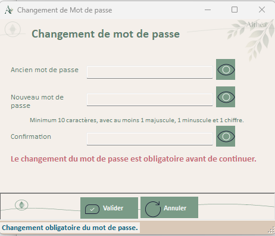

### Rôle général

`ChangePassword` permet à un utilisateur de changer son mot de passe applicatif.

Elle est utilisée notamment :

- lors d’un changement obligatoire après création ou reset
- lors d’une demande explicite future de changement de mot de passe

Elle ne stocke jamais le mot de passe en clair et délègue les règles de sécurité à la couche métier.

------

### Responsabilités

- Saisir l’ancien mot de passe.
- Saisir le nouveau mot de passe.
- Confirmer le nouveau mot de passe.
- Valider la cohérence des saisies.
- Appliquer les règles de complexité.
- Demander la modification via la couche métier.
- Afficher les erreurs de validation.
- Masquer tous les champs sensibles par défaut.
- Fournir des boutons Voir temporaires.
- Initialiser ses ToolTips locaux via `InitializeToolTips()`.

> `ChangePassword` peut être ouvert depuis `Login`, donc avant `Home`.
> Il reste autonome et conserve ses composants UI locaux.

------

### Dépendances

| Élément                  | Type          | Rôle                                                |
| ------------------------ | ------------- | --------------------------------------------------- |
| `GestionUtilisateurs`    | Module métier | Modification du mot de passe utilisateur.           |
| `PasswordSecurityHelper` | Module        | Validation de complexité et génération hash/salt.   |
| `UtilisateurApplication` | Classe        | Utilisateur concerné par le changement.             |
| `AuthenticationResult`   | Classe        | Peut être utilisé en amont pour déclencher la Form. |
| `GestionLog`             | Module        | Journalisation des changements et erreurs.          |
| `UtilsButtons`           | Module        | Initialisation des boutons standards.               |
| `UITheme`                | Module        | Référence graphique centralisée.                    |

------

### Variables internes

| Variable                     | Type                     | Rôle                                                         |
| ---------------------------- | ------------------------ | ------------------------------------------------------------ |
| `_utilisateur`               | `UtilisateurApplication` | Utilisateur concerné par le changement de mot de passe.      |
| `_mustChangePasswordContext` | `Boolean`                | Indique si le changement est obligatoire dans le flux login. |

Les noms peuvent différer, mais la Form doit connaître l’utilisateur concerné et le contexte de validation.

------

### Contrôles

| Contrôle              | Type                 | Rôle                                       |
| --------------------- | -------------------- | ------------------------------------------ |
| `pnlForm`             | Panel                | Conteneur principal avec fond graphique.   |
| `pnlTitre`            | Panel                | Zone titre.                                |
| `lblTitreForm`        | Label                | Titre du formulaire.                       |
| `pnlCenter`           | Panel                | Zone centrale du formulaire.               |
| `tlpChangePW`         | TableLayoutPanel     | Structure les champs password.             |
| `lblOldPassword`      | Label                | Libellé ancien mot de passe.               |
| `txtOldPassword`      | TextBox              | Ancien mot de passe.                       |
| `btnVoirOldPassword`  | Button               | Affichage temporaire ancien mot de passe.  |
| `lblNewPassword`      | Label                | Libellé nouveau mot de passe.              |
| `txtNewPassword`      | TextBox              | Nouveau mot de passe.                      |
| `btnVoirNewPassword`  | Button               | Affichage temporaire nouveau mot de passe. |
| `lblConfirmation`     | Label                | Libellé confirmation.                      |
| `txtConfirmation`     | TextBox              | Confirmation du nouveau mot de passe.      |
| `btnVoirConfirmation` | Button               | Affichage temporaire confirmation.         |
| `lblMessage`          | Label                | Message utilisateur / erreur.              |
| `pnlActions`          | Panel                | Zone des boutons d’action.                 |
| `btnValider`          | Button               | Valide le changement.                      |
| `btnAnnuler`          | Button               | Annule l’opération.                        |
| `stsStatus`           | StatusStrip          | Barre de statut locale.                    |
| `stsLabelStatus`      | ToolStripStatusLabel | Message d’état.                            |
| `errProvider`         | ErrorProvider        | Erreurs de validation.                     |
| `ttMain`              | ToolTip              | Aide utilisateur.                          |

------

### Méthodes principales

| Méthode                           | Rôle                                                      |
| --------------------------------- | --------------------------------------------------------- |
| `ChangePassword_Load()`           | Initialise les boutons et l’état UI.                      |
| `InitializeToolTips()`            | Initialise les aides contextuelles locales de la Form.    |
| `btnValider_Click()`              | Lance la validation et le changement.                     |
| `ValiderSaisie()`                 | Vérifie champs obligatoires et confirmation.              |
| `ChangerMotDePasse()`             | Appelle `GestionUtilisateurs`.                            |
| `AfficherMessageErreur()`         | Affiche les retours utilisateur.                          |
| `btnAnnuler_Click()`              | Annule ou refuse la fermeture selon contexte obligatoire. |
| `btnVoirOldPassword_MouseDown()`  | Affiche temporairement l’ancien mot de passe.             |
| `btnVoirNewPassword_MouseDown()`  | Affiche temporairement le nouveau mot de passe.           |
| `btnVoirConfirmation_MouseDown()` | Affiche temporairement la confirmation.                   |

------

### Gestion des boutons Voir

Chaque bouton Voir fonctionne uniquement pendant l’appui :

```
MouseDown → UseSystemPasswordChar = False
MouseUp → UseSystemPasswordChar = True
MouseLeave → UseSystemPasswordChar = True
```

Cette règle évite de laisser un mot de passe visible accidentellement.

---

### Gestion des ToolTips

`ChangePassword` utilise son `ttMain` local.

Les ToolTips sont centralisés dans :

```vb
InitializeToolTips()
```
La Form ne dépend pas de UserControlContext, car elle peut être utilisée dans le flux de login avant ouverture de Home.

------

### Validation sécurité

Validation minimale attendue :

- ancien mot de passe obligatoire
- nouveau mot de passe obligatoire
- confirmation obligatoire
- nouveau mot de passe = confirmation
- nouveau mot de passe conforme aux règles
- ancien mot de passe correct
- nouveau mot de passe différent de l’ancien si règle activée

Les règles de complexité doivent rester dans `PasswordSecurityHelper`.

------

### Règles d’état

| Situation                     | Effet UI                               |
| ----------------------------- | -------------------------------------- |
| Champ vide                    | `errProvider` + status.                |
| Confirmation différente       | Validation refusée.                    |
| Password trop faible          | Validation refusée avec message clair. |
| Ancien password incorrect     | Refus changement.                      |
| Changement réussi             | `DialogResult.OK`.                     |
| Changement obligatoire annulé | Refus de poursuivre le login.          |

------

### Points d’attention

- Ne jamais afficher les passwords automatiquement.
- Ne jamais logguer ancien ou nouveau password.
- Ne jamais faire le hash dans la Form si la couche sécurité le fait déjà.
- Ne pas dupliquer les règles de complexité dans l’UI.
- La Form doit rester un écran de saisie, pas un moteur sécurité.

### Message au repreneur

`ChangePassword` est une Form de sécurité.
 Elle doit rester stricte, simple et prévisible.

Toute évolution des règles password doit se faire dans `PasswordSecurityHelper` ou `GestionUtilisateurs`, pas dans le code UI.

...

## **Form : ElevationAcces**

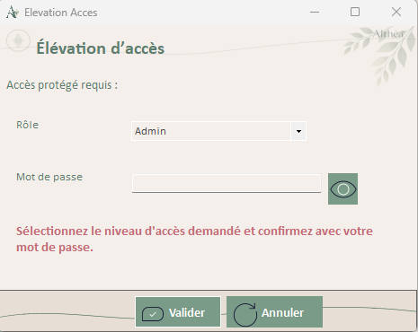

### Rôle général

`ElevationAcces` permet à un utilisateur connecté d’élever temporairement son rôle applicatif.

Cette élévation :

- ne modifie jamais le rôle stocké en base
- ne dure que pendant la session
- nécessite le mot de passe de l’utilisateur connecté
- respecte le rôle maximal autorisé

------

### Responsabilités

- Afficher les rôles accessibles.
- Demander le mot de passe de l’utilisateur courant.
- Valider l’élévation via la couche métier.
- Appliquer le rôle temporaire dans `UserSession`.
- Refuser toute élévation non autorisée.
- Afficher un message sobre en cas d’échec.
- Journaliser la tentative et son résultat.

------

### Dépendances

| Élément                  | Type           | Rôle                                                         |
| ------------------------ | -------------- | ------------------------------------------------------------ |
| `UserSession`            | Classe         | Session courante, rôle actuel et état d’élévation.           |
| `UtilisateurApplication` | Classe         | Utilisateur connecté, rôle naturel et rôle maximal autorisé. |
| `AppRole`                | Enum           | Rôles applicatifs disponibles.                               |
| `GestionUtilisateurs`    | Module métier  | Validation du password et des droits d’élévation.            |
| `PasswordSecurityHelper` | Module         | Utilisé indirectement pour vérifier le mot de passe.         |
| `GestionLog`             | Module         | Logs sécurité liés aux élévations.                           |
| `UtilsButtons`           | Module         | Initialisation boutons standards.                            |
| `UITheme`                | Module         | Référence graphique centralisée.                             |
| `Home`                   | Form appelante | Peut fournir le contexte temporaire pendant ouverture modale. |

------

### Variables internes

| Variable            | Type                     | Rôle                                                      |
| ------------------- | ------------------------ | --------------------------------------------------------- |
| `_userSession`      | `UserSession`            | Session dont le rôle courant sera modifié temporairement. |
| `_utilisateur`      | `UtilisateurApplication` | Utilisateur demandant l’élévation.                        |
| `_rolesDisponibles` | `List(Of AppRole)`       | Liste des rôles accessibles selon les droits.             |

------

### Contrôles

| Contrôle          | Type                 | Rôle                                         |
| ----------------- | -------------------- | -------------------------------------------- |
| `pnlForm`         | Panel                | Conteneur principal avec fond graphique.     |
| `pnlTitre`        | Panel                | Zone de titre.                               |
| `lblTitreForm`    | Label                | Titre du formulaire.                         |
| `pnlTop`          | Panel                | Bandeau explicatif.                          |
| `lblTop`          | Label                | Message introductif.                         |
| `pnlCenter`       | Panel                | Zone centrale de saisie.                     |
| `tlpElevation`    | TableLayoutPanel     | Structure rôle/password/message.             |
| `lblRole`         | Label                | Libellé du rôle demandé.                     |
| `cboRoleDemande`  | ComboBox             | Liste des rôles accessibles.                 |
| `lblPassword`     | Label                | Libellé mot de passe.                        |
| `txtPassword`     | TextBox              | Mot de passe utilisateur, masqué par défaut. |
| `btnVoirPassword` | Button               | Affichage temporaire du mot de passe.        |
| `lblMessage`      | Label                | Message utilisateur ou refus.                |
| `pnlActions`      | Panel                | Zone boutons.                                |
| `btnValider`      | Button               | Valide la demande d’élévation.               |
| `btnAnnuler`      | Button               | Annule l’opération.                          |
| `stsStatus`       | StatusStrip          | Barre de statut locale.                      |
| `stsLabelStatus`  | ToolStripStatusLabel | Message d’état.                              |
| `errProvider`     | ErrorProvider        | Erreurs de saisie.                           |
| `ttMain`          | ToolTip              | Aide utilisateur.                            |

------

### Méthodes principales

| Méthode                        | Rôle                                                         |
| ------------------------------ | ------------------------------------------------------------ |
| `ElevationAcces_Load()`        | Initialise la Form et charge les rôles disponibles.          |
| `ChargerRolesDisponibles()`    | Remplit `cboRoleDemande` selon `CurrentRole` et `RoleMaxElevation`. |
| `btnValider_Click()`           | Lance la validation d’élévation.                             |
| `ValiderSaisie()`              | Vérifie rôle sélectionné et password saisi.                  |
| `ValiderElevation()`           | Appelle la couche métier sécurité.                           |
| `AppliquerElevation()`         | Met à jour `UserSession.CurrentRole` et `IsElevated`.        |
| `btnAnnuler_Click()`           | Ferme sans appliquer.                                        |
| `btnVoirPassword_MouseDown()`  | Affiche temporairement le password.                          |
| `btnVoirPassword_MouseUp()`    | Masque le password.                                          |
| `btnVoirPassword_MouseLeave()` | Masque le password par sécurité.                             |

------

### Chargement des rôles disponibles

La ComboBox ne doit afficher que les rôles réellement atteignables.

Critères :

```
rôle demandé > rôle courant
rôle demandé <= RoleMaxElevation
```

Exemple :

| Situation            | Rôles proposés       |
| -------------------- | -------------------- |
| User, max SuperUser  | SuperUser            |
| User, max Admin      | SuperUser, Admin     |
| SuperUser, max Admin | Admin                |
| Admin                | Aucun rôle supérieur |

------

### Validation sécurité

Validation métier attendue :

- utilisateur non null
- session non null
- compte actif
- compte non verrouillé
- password correct
- rôle demandé autorisé
- rôle demandé supérieur au rôle courant

La validation doit passer par :

```
GestionUtilisateurs.VerifierElevationUtilisateur(...)
```

ou méthode métier équivalente.

------

### Gestion du mot de passe

Même principe que `Login` :

- password masqué par défaut
- affichage temporaire uniquement
- jamais loggué
- jamais conservé après validation

------

### Règles d’état

| Situation              | Effet UI                               |
| ---------------------- | -------------------------------------- |
| Aucun rôle disponible  | Form inutile ou validation impossible. |
| Aucun rôle sélectionné | Erreur via `errProvider`.              |
| Password vide          | Erreur via `errProvider`.              |
| Password incorrect     | Élévation refusée.                     |
| Rôle non autorisé      | Élévation refusée.                     |
| Validation OK          | `DialogResult.OK`, session élevée.     |

------

### Points d’attention

- Ne jamais utiliser un mot de passe Admin/SuperUser partagé.
- Ne jamais modifier `RoleUtilisateur` en base.
- Ne jamais proposer un rôle supérieur à `RoleMaxElevation`.
- Ne jamais afficher un message trop détaillé qui aide à contourner la sécurité.
- Toujours recalculer les droits après retour à l’appelant.
- Toujours mettre à jour l’affichage global de l’utilisateur connecté après élévation.

------

### Message au repreneur

`ElevationAcces` est un écran de sécurité temporaire, pas une gestion de rôles.

Il applique une règle fondamentale :

```
un utilisateur s’élève lui-même,
avec son propre mot de passe,
dans les limites prévues par son compte.
```

La gestion permanente des rôles appartient au futur `UC_Utilisateurs`.

---

## **UserControl : UC_RichTextEditorSimple**

### Rôle général

`UC_RichTextEditorSimple` est la variante allégée de `UC_RichTextEditor`. Elle est destinée aux zones de commentaires et notes courtes embarquées dans d'autres UserControls ou Forms (référentiels, fiches patient, dossiers, contacts…). Elle réutilise `RichTextEditorHelper` à 100 % sans dupliquer de logique.

### Responsabilités

- Fournir une toolbar minimale de 7 boutons : Gras, Italique, Souligné, Annuler, Rétablir, Effacer formatage, Insérer date/heure
- Exposer `RtfContent` et `TextContent` pour sauvegarde en double format (RTF + TXT brut)
- Gérer le mode lecture seule (`ReadOnlyMode`)
- Permettre d'afficher/masquer la toolbar (`ShowToolbar`)
- Notifier les modifications via l'événement `ContentChanged`
- Recevoir optionnellement le contexte UI via `IContextAwareUserControl`

### Dépendances

| Élément | Type | Rôle |
|---|---|---|
| `RichTextEditorHelper` | Module | Toute la logique métier partagée (formatage, insertion date) |
| `IContextAwareUserControl` | Interface | Contexte UI partagé (optionnel — fonctionne sans contexte) |
| `UserControlContext` | Classe | Contexte injecté par Home si disponible |
| `UITheme` | Module | Couleurs charte graphique |

### Propriétés publiques principales

| Propriété | Type | Rôle |
|---|---|---|
| `RtfContent` | String | Lecture/écriture du contenu RTF (formatage préservé) |
| `TextContent` | String | Lecture du texte brut (pour recherche full-text SQL) |
| `ReadOnlyMode` | Boolean | Active/désactive le mode lecture seule |
| `ShowToolbar` | Boolean | Affiche/masque la toolbar |

### Événement

| Événement | Déclencheur |
|---|---|
| `ContentChanged` | À chaque modification de contenu dans le RichTextBox |

### Différences avec UC_RichTextEditor

| Fonctionnalité | UC_RichTextEditor | UC_RichTextEditorSimple |
|---|---|---|
| Toolbar | 30 boutons | 7 boutons |
| Police / Taille | ✅ | ❌ |
| Alignement, puces, retraits | ✅ | ❌ |
| Couleurs texte / fond | ✅ | ❌ |
| Couper/Copier/Coller | ✅ boutons | ✅ raccourcis OS natifs |
| Impression Win32 | ✅ | ❌ |
| Export PDF / Word | ✅ Syncfusion | ❌ |
| Double format RTF + TXT | ✅ | ✅ |
| ReadOnly / ShowToolbar | ✅ | ✅ |
| Contexte UI | ✅ obligatoire | ✅ optionnel |
| Taille | Fixe (grande) | Pilotée par le parent |

### Règles importantes

- La **sauvegarde reste obligatoirement en double format** (règle 21 de `Rules.md`) : `RtfContent` (formatage) + `TextContent` (texte brut pour recherche full-text SQL).
- Ne jamais intégrer ce composant dans un écran sans vérifier que la table cible possède les deux champs `*_rtf` et `*_txt`.
- La taille est entièrement pilotée par le parent (Dock ou Anchor) ; ne pas fixer de taille dans le Designer.
- `IContextAwareUserControl` est implémenté de façon **optionnelle** : appeler `SetContext()` si disponible, mais le composant fonctionne sans.

---

## **Module : UC_ReferentielBase + Architecture référentiels**

### Rôle général

`UC_ReferentielBase` est la **classe de base héritable** pour tous les écrans de gestion de référentiels (`ref_*`). Elle centralise : chargement, modes (Consultation / Création / Modification), CRUD via points d'extension, validation (unicité code + libellé, longueur max, format), droits, journalisation, activation/désactivation (soft-delete).

Chaque référentiel concret **hérite** de `UC_ReferentielBase` et n'implémente que ses spécificités métier (métadonnées + branchement couche métier). Aucune logique n'est dupliquée.

### Responsabilités de UC_ReferentielBase

- Afficher la liste des éléments dans une grille générique (`dgvReferentiel`)
- Gérer la recherche et le filtre « Afficher inactifs »
- Orchestrer les modes et l'état des boutons
- Valider les saisies (champs requis, longueur code, unicité code et libellé)
- Appliquer les droits d'accès selon le rôle (`RoleMinimum`)
- Journaliser via `GestionLog`
- Fournir des **hooks champ supplémentaire** pour les référentiels avec champ additionnel (ex. `tarif_defaut`)

### Points d'extension (Overridable)

#### Métadonnées

| Propriété | Rôle |
|---|---|
| `TitreReferentiel` | Titre affiché dans l'en-tête |
| `SousTitreReferentiel` | Sous-titre descriptif |
| `CheminContexte` | Fil d'Ariane (`Référentiels > X`) |
| `RoleMinimum` | Rôle minimal requis pour modifier |
| `LongueurMaxCode` | Longueur max du code (selon la table) |
| `RemplacerEspacesParUnderscore` | Remplace les espaces par `_` dans le code (défaut : True) |

#### Données

| Méthode | Rôle |
|---|---|
| `ChargerElements(afficherInactifs)` | Retourne les éléments sous forme de `List(Of ReferentielLigne)` |
| `CodeExisteDeja(code, idExclu)` | Vérifie l'unicité du code |
| `LibelleExisteDeja(libelle, idExclu)` | Vérifie l'unicité du libellé |
| `InsererElement(code, libelle, ordre, actif)` | Insère un nouvel élément |
| `MettreAJourElement(id, code, libelle, ordre, actif)` | Met à jour un élément existant |
| `DefinirActivation(id, actif)` | Active ou désactive (soft-delete) |

#### Hooks champ supplémentaire

| Méthode | Rôle |
|---|---|
| `ConfigurerChampSupplementaire()` | Crée et ajoute le contrôle additionnel au panneau d'édition (appelé au Load) |
| `AfficherChampSupplementaire(ligne)` | Affiche la valeur depuis la `ReferentielLigne` sélectionnée |
| `ViderChampSupplementaire()` | Réinitialise le champ (mode création / vidage) |
| `ActiverChampSupplementaire(enEdition)` | Active/désactive selon le mode |
| `ValiderChampSupplementaire()` | Valide avant enregistrement (retourne Boolean) |

> 💡 Ces hooks ont des implémentations vides par défaut (no-op / retour `True`). Seul `UC_TypesSeance` les surcharge pour gérer `tarif_defaut`.

### UC_ReferentielHome

Hub d'accueil de la section Référentiels. Présente 9 tuiles navigables.

#### Responsabilités

- Afficher les 9 tuiles de référentiels
- Activer/désactiver les tuiles selon le rôle (SuperUser / Admin uniquement)
- Gérer l'élévation temporaire et le retour au rôle de base
- Naviguer vers chaque UC référentiel via `Home.NavigateToReferentielView()`

#### Méthodes principales

| Méthode | Rôle |
|---|---|
| `AppliquerDroitsUtilisateur()` | Configure les tuiles et boutons selon le rôle courant |
| `ActiverReferentielsDisponibles()` | Active les 9 tuiles (rôle SuperUser/Admin) |
| `DesactiverTousLesReferentiels()` | Désactive toutes les tuiles (rôle insuffisant) |
| `btnXxx_Click()` | Navigue vers le UC référentiel correspondant |

### Les 9 référentiels concrets

Chaque UC référentiel hérite de `UC_ReferentielBase` et ne contient que :
1. Les **métadonnées** (titre, sous-titre, fil d'Ariane, rôle minimum, longueur code)
2. Le **branchement métier** (implémentation des 6 points d'extension Données)
3. Optionnellement : les **hooks champ supplémentaire** (`UC_TypesSeance` uniquement)

| UC | Table | Code max | Couche métier | Particularité |
|---|---|---|---|---|
| `UC_Domaines` | `ref_domaines` | 10 | `GestionDomaines` / `Domaine` | `RemplacerEspacesParUnderscore = False` |
| `UC_LiensPatient` | `ref_liens_patient` | 50 | `GestionLiensPatient` / `LienPatient` | — |
| `UC_RolesIntervenant` | `ref_roles_intervenant` | 30 | `GestionRolesIntervenant` / `RoleIntervenant` | — |
| `UC_SituationsFamiliales` | `ref_situations_familiales` | 50 | `GestionSituationsFamiliales` / `SituationFamiliale` | — |
| `UC_StatutsDossier` | `ref_statuts_dossier` | 30 | `GestionStatutsDossier` / `StatutDossier` | — |
| `UC_StatutsSeance` | `ref_statuts_seance` | 30 | `GestionStatutsSeance` / `StatutSeance` | — |
| `UC_TypesDocuments` | `ref_types_documents` | 30 | `GestionTypesDocuments` / `TypeDocument` | — |
| `UC_TypesRendezVous` | `ref_types_rendez_vous` | 30 | `GestionTypesRendezVous` / `TypeRendezVous` | — |
| `UC_TypesSeance` | `ref_types_seance` | 30 | `GestionTypesSeance` / `TypeSeance` | ⭐ `tarif_defaut decimal(10,2)` via hooks |

### Modèle de présentation générique : ReferentielLigne

```vb
Public Class ReferentielLigne
    Public Property IdReferentiel As ULong
    Public Property Code         As String
    Public Property Libelle      As String
    Public Property OrdreAffichage As Integer
    Public Property Actif        As Boolean
    Public Property Tarif        As Decimal?   ' Optionnel : renseigné uniquement par UC_TypesSeance
End Class
```

### Cas spécial : UC_TypesSeance et tarif_defaut

`ref_types_seance` est le seul référentiel avec un champ additionnel (`tarif_defaut decimal(10,2) NOT NULL`). Ce champ est géré **sans modifier `UC_ReferentielBase`** :

1. `UC_TypesSeance.ConfigurerChampSupplementaire()` crée un `Label` + `NumericUpDown` et les ajoute dynamiquement dans `pnlEdition` (Y=262, sous le champ État).
2. `AfficherChampSupplementaire(ligne)` charge `ligne.Tarif` dans le NumericUpDown.
3. `InsererElement` et `MettreAJourElement` lisent `_numTarif.Value` et le transmettent à `GestionTypesSeance`.
4. `ReferentielLigne.Tarif As Decimal?` transporte la valeur entre la couche métier et l'affichage.

### Architecture complète d'une pile référentiel

```
Core\Database\Queries\Query<X>.vb          → SQL (SELECT actifs/tous, COUNT code/libellé/usage,
                                              UPDATE, INSERT, DELETE soft+hard)
Metier\Referentiels\<X>.vb                 → Modèle (id, code, libelle, actif, ordre [+ tarif])
Metier\Referentiels\Gestion<X>.vb          → Service CRUD + unicité + <X>EstUtilise()
UI\Controls\Referentiels\UC_<X>.vb         → UserControl concret héritant UC_ReferentielBase
```

### Règles importantes

- **Un UC par référentiel** : jamais de logique partagée dans l'UC, toujours déléguée à la couche métier.
- **Nommage réel** : `UC_Domaines`, `UC_LiensPatient`, `UC_RolesIntervenant`… (sans préfixe supplémentaire).
- **Soft-delete prioritaire** : si `<X>EstUtilise()` retourne `True`, désactiver via `Desactiver<X>()` ; suppression physique uniquement si non utilisé.
- **Unicité vérifiée avant écriture** : `CodeExisteDeja` et `LibelleExisteDeja` sont appelés par `UC_ReferentielBase.SaisieValide()` avant tout INSERT/UPDATE.
- **Aucun accès DB dans l'UC** : tout passe par la couche `Gestion<X>`.

---


...


> ---
> **Contact** : ***Joëlle (Manou)  - Les Artefacts de Manou***
>
> Projet réalisé pour ma fille, Psychologue et Graphologue, pour l'aider à gérer ses patients et documents de manière structurée, fiable et évolutive.
> - Site web P.Nguyen Duy:  https://pearlnguyenduy.be/
> - mailto: `joelle@nguyen.eu`
>
> - GitHub privé: Althea    https://github.com/AngeljoNG/Althea
> - GitHub public : Althea None
> ---


[TOC]

