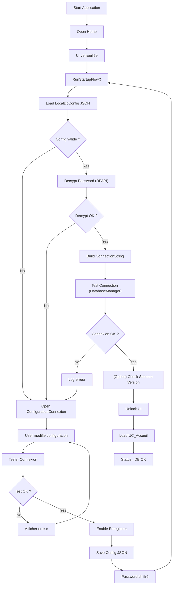
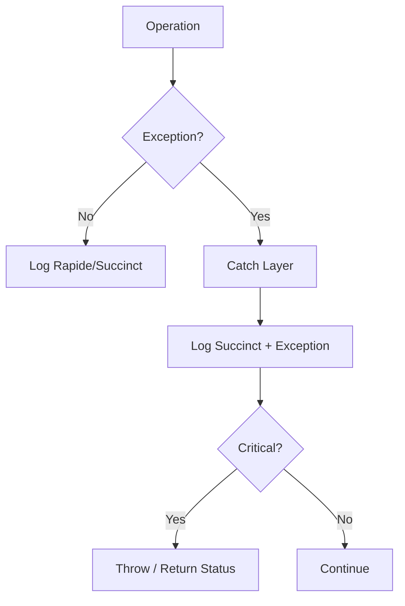
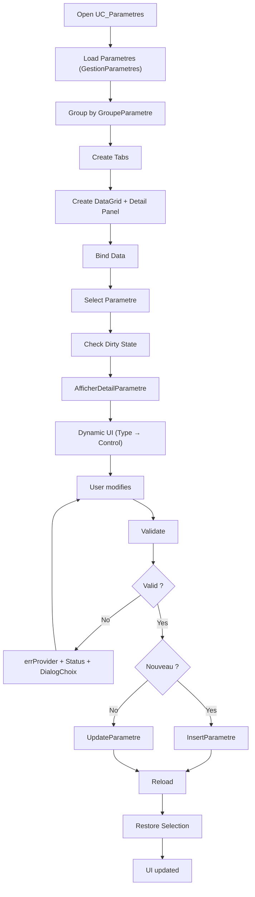
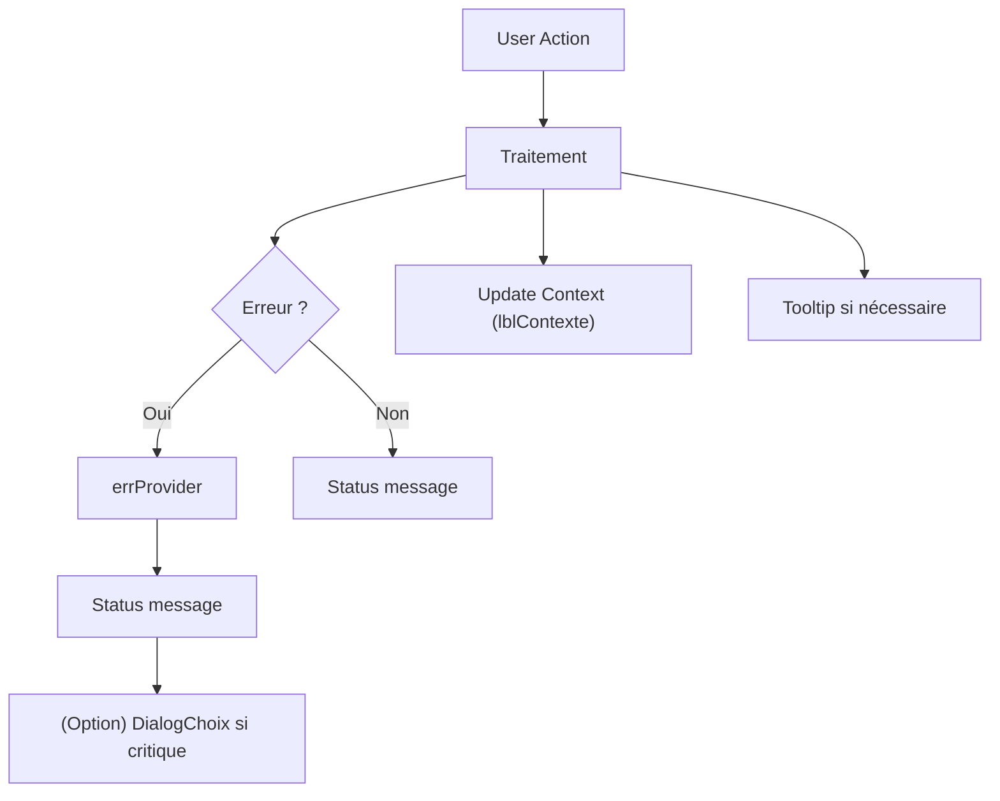
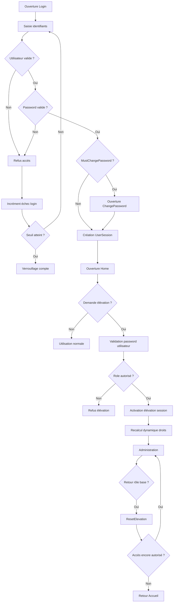
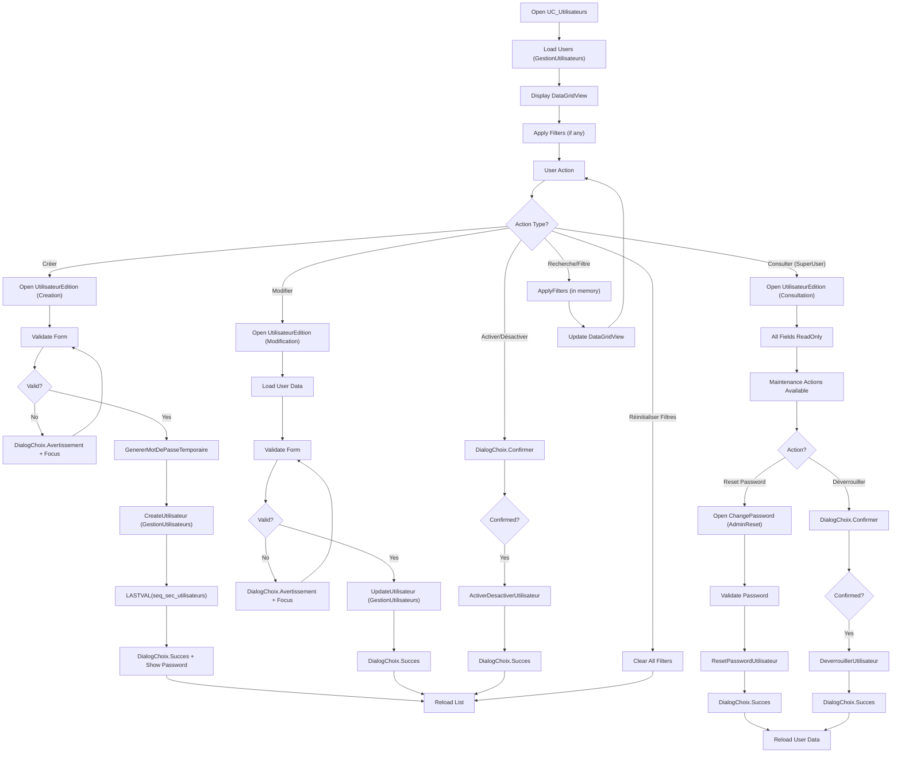
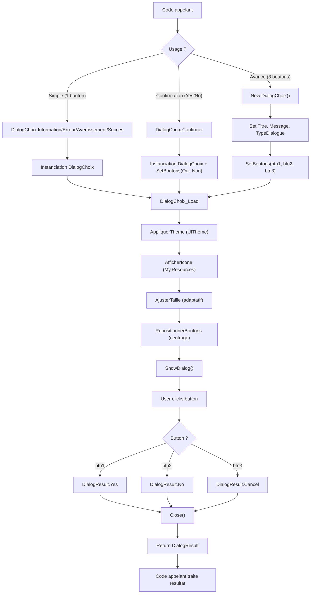
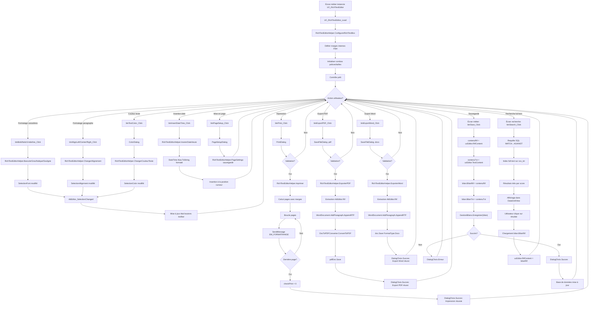

# Processus Althéa - Documentation technique

>  *Dernière mise à jour : 07/06/2026*

Ce document décrit les processus métier et techniques clés de l'application Althéa.
Chaque processus est détaillé avec son statut, ses fichiers associés, et un diagramme Mermaid pour visualiser le flux.

---

# Processus 01 – Démarrage & Connexion MariaDB

**Statut : Implémenté**

**Traçabilité mainteneur (VB) :**
- [`Core/Startup/AppStartupManager.vb`](../Core/Startup/AppStartupManager.vb)
- [`Core/Database/DatabaseManager.vb`](../Core/Database/DatabaseManager.vb)
- [`Core/Configuration/ConfigManager.vb`](../Core/Configuration/ConfigManager.vb)
- [`UI/Forms/Database/ConfigurationConnexion.vb`](../UI/Forms/Database/ConfigurationConnexion.vb)
- [`UI/Forms/Home.vb`](../UI/Forms/Home.vb)

## Objectif

Garantir qu'Althéa ne démarre jamais sans :

- Une configuration locale valide
- Une connexion MariaDB opérationnelle

**Principe** : Le démarrage est **bloquant par conception** - sans connexion valide, l'application ne peut pas fonctionner.

Ce choix est volontaire pour :

- éviter toute incohérence de données
- garantir la fiabilité du système dès l'ouverture
- simplifier le diagnostic en cas de problème

---

## Vue d'ensemble du flow

1. La Form `Home` se charge
2. L'interface est immédiatement **verrouillée**
3. Le processus de démarrage est exécuté (`RunStartupFlow`)
4. Ce processus :
   - lit la configuration locale
   - teste la connexion à la base
   - (optionnel) vérifie la version du schéma
5. Si un problème est détecté :
   - ouverture de la Form `ConfigurationConnexion`
6. L'utilisateur corrige et reteste
7. Le processus recommence jusqu'à succès ou abandon
8. Si succès :
   - l'interface est déverrouillée
   - l'application devient utilisable

**Principe** : Ce fonctionnement garantit que **toute l'application repose sur une base saine**

---

## Étapes détaillées

### 1. Lecture configuration locale

- Fichier : `%APPDATA%\Althea\althea.local.json`
- Rôle : **source de vérité au démarrage**

Contient :

- Host
- Port
- DatabaseName
- UserName
- EncryptedPassword
- AdditionalOptions

Le mot de passe est :

- chiffré via **DPAPI (lié à l'utilisateur Windows)**
- jamais stocké en clair

#### Important pour le repreneur

- Si ce fichier est supprimé → l'application demandera une nouvelle configuration
- Si le fichier est corrompu → même comportement

---

### 2. Test connexion MariaDB

- La connexion est :

  - construite uniquement via `DatabaseManager`
  - jamais directement ailleurs dans le code

  Processus :

  1. Déchiffrement du mot de passe
  2. Construction de la connection string
  3. Test de connexion

  #### Important

  - Si la connexion échoue :
	- ce n'est pas bloquant techniquement
	- mais c'est bloquant fonctionnellement (par choix)

---

### 3. Vérification version schéma

- Cette étape permet de vérifier que :

  - la structure de la base correspond à l'application

  **Note** : Dans Althéa :

  - le mécanisme est prévu
  - mais peut être activé plus tard

  #### Important pour le futur

  - toute modification structurelle devra incrémenter une version

---

### 4. Correction via UI

- Si une erreur est détectée :

  - ouverture de la Form `ConfigurationConnexion`

  Cette Form permet :

  - modifier les paramètres
  - tester la connexion
  - sauvegarder la configuration

  #### Règles importantes

  - impossible d'enregistrer sans test valide
  - le mot de passe :
	- n'est jamais affiché en clair
	- peut être modifié explicitement
  - la sauvegarde est sécurisée automatiquement

  #### Comportement utilisateur

  L'utilisateur reste dans cette boucle :

  ```
  Modifier → Tester → Corriger → Tester → ...
  ```

  jusqu'à obtenir une connexion valide.

---

### 5. Déverrouillage

- Quand tout est valide :

  - la navigation est activée
  - le menu devient utilisable
  - le premier écran (`UC_Accueil`) est chargé

  Le StatusStrip affiche :

  ```
  Connexion DB OK
  ```

---

## Principes fondamentaux

- Ces règles sont essentielles pour comprendre le fonctionnement global :

  - `Home` :
	- gère uniquement l'interface
  - `AppStartupManager` :
	- orchestre le démarrage
  - `DatabaseManager` :
	- est le seul point d'accès à la base
  - `GestionLog` :
	- centralise tous les logs

  **Règle** : Aucun autre code ne doit contourner ces composants

---

## Cas critiques

### Abandon utilisateur

  - fermeture volontaire de l'application
  - état contrôlé (pas de demi-démarrage)

  ## Message au repreneur (important)

  **Important** : Cette procédure est **le cœur du démarrage de l'application**

  Si elle est modifiée :

  - il faut conserver :
	- le blocage tant que la DB n'est pas valide
	- la centralisation via `DatabaseManager`
	- la sécurisation du mot de passe

  **Attention** : Toute déviation peut entraîner :

  - des erreurs difficiles à diagnostiquer
  - des incohérences de données

---

## Flowchart – Processus 01 (Startup)



---
---

# Processus 02 – Gestion des erreurs & Logs

**Statut : Implémenté**

**Traçabilité mainteneur (VB) :**
- [`Core/Logging/GestionLog.vb`](../Core/Logging/GestionLog.vb)
- [`Core/Startup/AppStartupManager.vb`](../Core/Startup/AppStartupManager.vb)
- [`Core/Database/DatabaseManager.vb`](../Core/Database/DatabaseManager.vb)
- [`UI/Forms/Home.vb`](../UI/Forms/Home.vb)

## Objectif

Garantir :

- Traçabilité complète
- Aucune fuite de secret
- Diagnostic possible en production
- Séparation claire responsabilités / UI

---

## Architecture du logging

Module central : `GestionLog`

- Fichier journalier :
  `%APPDATA%\Althea\Logs\Althea_YYYY-MM-DD.log`
- Purge automatique > 7 jours
- Header session au premier log
- Thread-safe (SyncLock)

---

## Niveaux de log

| Niveau     | Usage |
|------------|--------|
| Rapide     | Étapes majeures |
| Succinct   | Erreurs / informations importantes |
| Complet    | Détails techniques (stack, inner) |

**Note** : Pas de filtre global.  
Le niveau est un marqueur de profondeur, pas un mécanisme de réduction.

---

## Catégories

- General
- Startup
- Database
- UI
- Process
- Security

Permet lecture ciblée des logs.

---

## Flow de gestion d'erreur

### 1. Couche basse (Crypto, IO)

- Throw exception explicite
- Aucun log direct

### 2. Couche intermédiaire (DatabaseManager)

- Catch technique
- Log Succinct + ex
- Throw si critique

### 3. Orchestrateur (AppStartupManager)

- Catch métier
- Log structuré
- Retourne un statut

### 4. UI

- Affiche message seulement si blocage
- Ne masque jamais une erreur critique

---

## Protection des secrets

- Masquage automatique `Password=` / `Pwd=`
- Aucune connection string complète logguée
- Mot de passe jamais affiché sauf action volontaire

---

## Principes clés

- Une erreur non logguée est un bug
- Un secret loggué est une faute grave
- Une MsgBox n'est jamais un mécanisme de gestion d'erreur
- Les exceptions doivent être explicites et enrichies

---

## Flowchart – Processus 02 (Erreur & Log)



------

------

# Processus 03 – Gestion des paramètres applicatifs

**Statut : Implémenté**

**Traçabilité mainteneur (VB) :**
- [`UI/Controls/Administration/UC_Parametres.vb`](../UI/Controls/Administration/UC_Parametres.vb)
- [`Metier/Parametres/GestionParametres.vb`](../Metier/Parametres/GestionParametres.vb)
- [`Metier/Parametres/ParametreApplication.vb`](../Metier/Parametres/ParametreApplication.vb)
- [`Core/Database/Queries/QueryParametres.vb`](../Core/Database/Queries/QueryParametres.vb)

## Objectif

Garantir une gestion :

- Centralisée
- Sécurisée
- Typée
- Évolutive

des paramètres applicatifs.

**Principe** : Les paramètres sont le **cœur de configuration fonctionnelle d'Althéa**.

Ils permettent :

- d'adapter le comportement sans modification du code
- de centraliser les chemins, options et réglages
- de préparer l'évolution vers une gestion multi-utilisateur

------

## Vue d'ensemble du flow

1. L'utilisateur ouvre `UC_Parametres`
2. Les paramètres sont chargés depuis la base
3. Ils sont regroupés par `GroupeParametre`
4. Un onglet est créé par groupe
5. Chaque paramètre est affiché dans une grille
6. La sélection affiche le détail dynamique
7. L'utilisateur peut :
   - consulter
   - modifier (selon rôle)
   - créer (Admin)
   - désactiver
8. Une validation complète est effectuée avant sauvegarde
9. Les modifications sont persistées en base

------

## Étapes détaillées

### 1. Chargement des paramètres

- Source : `GestionParametres.GetParametres(...)`
- Paramètres :
  - mode d'accès (Admin / SuperUser)
  - affichage actifs / inactifs

Les données sont ensuite :

- groupées par `GroupeParametre`
- triées par `OrdreAffichage`

**Note** : Chaque groupe devient un onglet

------

### 2. Construction dynamique UI

Pour chaque groupe :

- Création d'un `DataGridView`
- Ajout des colonnes :
  - état (icône)
  - libellé
  - valeur
- Création d'un panneau détail

**Principe** : Aucun formulaire figé : tout est généré dynamiquement

------

### 3. Sélection d'un paramètre

Lorsqu'un paramètre est sélectionné :

- vérification des modifications en cours
- chargement du détail
- mise à jour du contexte (`lblContexte`)
- nettoyage des erreurs (`errProvider`)

------

### 4. Affichage dynamique du détail

Le champ **Valeur** dépend du type :

| Type          | Contrôle       |
| ------------- | -------------- |
| BOOL          | CheckBox       |
| INT           | NumericUpDown  |
| DECIMAL       | NumericUpDown  |
| DATE          | DateTimePicker |
| STRING / PATH | TextBox        |

**Principe** : Le formulaire est donc **adaptatif**

------

### 5. Validation avant sauvegarde

Validation multi-niveaux :

- champs obligatoires
- unicité de la clé (mode Nouveau uniquement)
- cohérence Type / Valeur

Les erreurs sont :

- affichées via `errProvider`
- résumées dans le Status
- détaillées via DialogChoix si blocage

------

### 6. Sauvegarde

Deux cas :

- Nouveau → `InsertParametre`
- Modification → `UpdateParametre`

Après sauvegarde :

- rechargement complet
- restauration de la sélection
- mise à jour UI

------

### 7. Gestion des états

Un paramètre peut être :

- Actif
- Désactivé

Les paramètres désactivés :

- restent en base
- peuvent être affichés via un filtre
- sont visuellement atténués

------

## Principes fondamentaux

- Une clé technique est :
  - unique
  - immuable après création
- Les données sont normalisées :
  - MAJUSCULES
  - sans accents
  - sans espaces
- Le type est contrôlé (ComboBox)
- La valeur est validée selon le type

------

## Message au repreneur

**Important** : Ce module est un **modèle de conception pour les futurs UserControls**

Il illustre :

- la génération dynamique UI
- la validation structurée
- la séparation UI / métier
- l'usage du contexte global

**Règle** : Toute évolution doit respecter :

- la cohérence type / valeur
- la centralisation via `GestionParametres`
- la non-duplication du code

------

## Flowchart – Processus 03 (Paramètres)



------

------

# Processus 04 – Gestion UI globale (Tooltip, Status, Errors, Contexte)

**Statut : Implémenté**

**Traçabilité mainteneur (VB) :**
- [`UI/Context/UserControlContext.vb`](../UI/Context/UserControlContext.vb)
- [`UI/Forms/Home.vb`](../UI/Forms/Home.vb)
- [`UI/Navigation/NavigationManager.vb`](../UI/Navigation/NavigationManager.vb)
- [`UI/Navigation/IContextAwareUserControl.vb`](../UI/Navigation/IContextAwareUserControl.vb)
- [`UI/Navigation/IContextAwareForm.vb`](../UI/Navigation/IContextAwareForm.vb)

## Objectif

Garantir une **communication utilisateur cohérente, non intrusive et centralisée**.

Les composants concernés :

- `ttMain` → Tooltip
- `stsStatus` → StatusStrip
- `errProvider` → erreurs champ
- `lblContexte` → contexte global

**Principe** : Ensemble, ils remplacent les DialogChoix/MessageBox non critiques.

------

## Architecture

Composant central :

**`UserControlContext`**

Rôle :

- injecté dans chaque UserControl
- fournit des méthodes unifiées :
  - `SetStatus()`
  - `SetHeader()`
  - `SetError()`
  - `ClearError()`

**Règle** : Aucun UC ne manipule directement les contrôles UI globaux

------

## Rôle de chaque élément

### 1. StatusStrip (`stsStatus`)

- messages courts
- retour utilisateur immédiat

Exemples :

- "Paramètre enregistré"
- "Chargement terminé"

------

### 2. Tooltip (`ttMain`)

- aide contextuelle
- information non bloquante

Exemples :

- description d'un champ
- explication d'un bouton

------

### 3. ErrorProvider (`errProvider`)

- validation champ par champ
- visuel immédiat

Exemples :

- clé manquante
- valeur invalide

------

### 4. Contexte (`lblContexte`)

- localisation dans l'application

Exemple :

```
Administration > Paramètres > PATHS (Mode Admin)
```

**Principe** : Permet de comprendre où l'on se trouve

------

## Flow de gestion UI

1. Action utilisateur
2. Traitement métier
3. Mise à jour UI via UserControlContext :

- erreurs → `errProvider`
- info → `StatusStrip`
- contexte → `lblContexte`

**Règle** : Pas de DialogChoix/MessageBox sauf blocage

------

## Règles importantes

- Une erreur :
  - doit être visible localement
  - doit être compréhensible
- Une action réussie :
  - ne doit pas interrompre l'utilisateur
- Un message critique :
  - doit utiliser DialogChoix

------

## Gestion des rôles

Le contexte UI intègre :

- rôle courant (User / SuperUser / Admin)
- adaptation des actions disponibles
- affichage du mode dans `lblContexte`

**Exemple** :

```
Administration > Utilisateurs > Consultation (SuperUser)
```

------

## Message au repreneur

**Important** : Ce système est essentiel pour :

- éviter la surcharge de DialogChoix/MessageBox
- uniformiser le comportement UI
- faciliter la maintenance

**Règle** : Toute nouvelle fonctionnalité doit :

- utiliser `UserControlContext`
- respecter la hiérarchie des messages

------

## Flowchart – Processus 04 (UI globale)


------
# Processus 05 – Sécurité applicative & gestion des rôles

**Statut : Implémenté**

**Traçabilité mainteneur (VB) :**
- [`Core/Security/AppRole.vb`](../Core/Security/AppRole.vb)
- [`Core/Security/UserSession.vb`](../Core/Security/UserSession.vb)
- [`Metier/Security/UtilisateurApplication.vb`](../Metier/Security/UtilisateurApplication.vb)
- [`Metier/Security/AuthenticationResult.vb`](../Metier/Security/AuthenticationResult.vb)
- [`Metier/Security/GestionAuthentification.vb`](../Metier/Security/GestionAuthentification.vb)
- [`UI/Forms/Login/Login.vb`](../UI/Forms/Login/Login.vb)
- [`UI/Forms/Login/ElevationAcces.vb`](../UI/Forms/Login/ElevationAcces.vb)
- [`UI/Forms/Login/ChangePassword.vb`](../UI/Forms/Login/ChangePassword.vb)
- [`UI/Controls/Administration/UC_AdminHome.vb`](../UI/Controls/Administration/UC_AdminHome.vb)

## Objectifs

Le système de sécurité Althéa vise à :

- sécuriser l'accès à l'application
- gérer les rôles utilisateurs
- permettre une élévation temporaire contrôlée
- assurer la traçabilité des actions sensibles
- protéger les données patients
- empêcher les élévations permanentes non contrôlées

---

## Architecture sécurité

Le système repose sur :

### AppRole

Enum des rôles applicatifs :

- User (0)
- SuperUser (1)
- Admin (2)

---

### UtilisateurApplication

Contient :
- identité utilisateur
- password hash (PBKDF2-SHA256)
- password salt
- rôle de base
- rôle maximal autorisé
- état actif/verrouillé
- flag `must_change_password`

---

### UserSession

Contient :
- utilisateur connecté
- rôle courant
- état d'élévation
- session active

Important :
- le rôle courant peut différer du rôle de base
- uniquement pendant la session

---

### AuthenticationResult

Résultat normalisé d'authentification :
- succès
- erreur
- changement password requis
- compte verrouillé

---

## Authentification

Validation :
- utilisateur actif
- compte non verrouillé
- password correct (PBKDF2-SHA256)
- règles sécurité respectées

Gestion :
- incrément échecs login
- verrouillage automatique après seuil
- logs sécurité

---

## Élévation temporaire

Principe :

Un utilisateur peut temporairement élever son rôle :
- uniquement pendant la session
- uniquement avec son propre password
- uniquement dans les limites autorisées

Aucune modification n'est faite en base de données.

---

## RoleMaxElevation

Chaque utilisateur possède :

- RoleUtilisateur (rôle de base)
- RoleMaxElevation (rôle maximal autorisé)

**Exemples** :

`User` (rôle de base)
	→ peut devenir `SuperUser` (si RoleMaxElevation = SuperUser)

`SuperUser` (rôle de base)
	→ peut devenir `Admin` (si RoleMaxElevation = Admin)

## Retour rôle de base

Méthode :

```vb
ResetElevation()
```

Comportement :

- restauration rôle naturel
- recalcul dynamique droits
- mise à jour labels
- retour Accueil si accès insuffisant

## Navigation sécurisée

Les écrans sensibles :

- vérifient le rôle courant
- recalculent les droits dynamiquement

Le contexte UI est synchronisé via :

```vb
SetContext()
```

## UX sécurité

Ajouts :

- labels rôle courant
- indicateur élévation active
- boutons Voir password temporaires

Les passwords ne sont jamais affichés par défaut.

------

## Logs sécurité

Logs générés pour :

- login (succès/échec)
- verrouillage compte
- élévation
- retour rôle base
- changement de mot de passe

------

## Flowchart sécurité



------

# Processus 06 – Gestion des utilisateurs

**Statut : Implémenté**

**Traçabilité mainteneur (VB) :**
- [`UI/Controls/Administration/UC_Utilisateurs.vb`](../UI/Controls/Administration/UC_Utilisateurs.vb)
- [`UI/Forms/Utilisateur/UtilisateurEdition.vb`](../UI/Forms/Utilisateur/UtilisateurEdition.vb)
- [`Metier/Security/GestionUtilisateurs.vb`](../Metier/Security/GestionUtilisateurs.vb)
- [`Core/Database/Queries/QueryUtilisateurs.vb`](../Core/Database/Queries/QueryUtilisateurs.vb)

## Objectif

Structurer le processus complet de gestion des utilisateurs applicatifs avec :

- Création avec mot de passe temporaire
- Modification selon les droits
- Consultation pour SuperUser
- Actions de maintenance (reset password, déverrouillage, activation/désactivation)
- Recherche et filtrage multi-critères
- Journalisation exhaustive des actions de sécurité

---

## Architecture

Le système repose sur :

### UC_Utilisateurs

UserControl principal de gestion :
- Liste des utilisateurs (DataGridView)
- Recherche multi-critères (texte, rôle, date, comptes verrouillés)
- Bouton de réinitialisation des filtres
- Actions : Créer, Modifier, Activer/Désactiver
- Accès différencié Admin / SuperUser

### UtilisateurEdition

Form modale d'édition avec 3 modes :

- **Creation** : génération mot de passe temporaire, copie presse-papiers
- **Modification** : modification des champs (login en lecture seule)
- **Consultation** : lecture seule + actions de maintenance limitées (SuperUser)

### GestionUtilisateurs

Couche métier centralisée :
- `CreateUtilisateur()` : création avec hash PBKDF2
- `UpdateUtilisateur()` : modification avec vérification droits
- `GenererMotDePasseTemporaire()` : génération sécurisée (12 caractères)
- `ResetPasswordUtilisateur()` : reset avec mot de passe auto-généré
- `ResetPasswordUtilisateurWithCustomPassword()` : reset avec mot de passe personnalisé
- `DeverrouillerUtilisateur()` : déverrouillage de compte
- `ActiverDesactiverUtilisateur()` : activation/désactivation
- `GetUtilisateurPourEdition()` : récupération pour édition/consultation
- `GetUtilisateursPourListe()` : récupération pour affichage liste

---

## Étapes détaillées

### 1. Chargement de la liste

1. Ouverture de `UC_Utilisateurs`
2. Chargement via `GestionUtilisateurs.GetUtilisateursPourListe()`
3. Affichage dans DataGridView avec :
   - Icône d'état (Verrouillé → Lock, Actif → OK, Inactif → OFF)
   - Code, Login, Nom, Rôle, Max Élévation
   - Actif, Verrouillé, Dernier login
4. Adaptation des boutons selon le rôle connecté :
   - **Admin** : tous les boutons visibles
   - **SuperUser** : boutons création/modification masqués

---

### 2. Recherche et filtrage

Critères disponibles :
- **Texte** : recherche dans login, nom affichage, code utilisateur
- **Rôle** : filtre par User, SuperUser, Admin
- **Date dernier login** : filtre par date exacte
- **Comptes verrouillés uniquement** : affichage des comptes bloqués

Filtrage en mémoire sur `_utilisateurs` (performance optimisée).

Bouton **Réinitialiser filtres** : remise à zéro de tous les critères (activé uniquement si filtres actifs).

---

### 3. Création d'un utilisateur (Admin uniquement)

1. Clic sur **Créer**
2. Ouverture de `UtilisateurEdition` en mode `Creation`
3. Saisie des champs :
   - Login (unique, obligatoire)
   - Nom affichage (obligatoire)
   - Rôle utilisateur (User, SuperUser, Admin)
   - Rôle max élévation (User, SuperUser, Admin)
   - Actif (Oui/Non)
4. Validation du formulaire :
   - Champs obligatoires
   - Cohérence rôles (RoleUtilisateur ≤ RoleMaxElevation)
5. Génération automatique du mot de passe temporaire (12 caractères)
6. Appel `GestionUtilisateurs.CreateUtilisateur()`
7. Récupération ID via `LASTVAL(seq_sec_utilisateurs)` (MariaDB)
8. Affichage du mot de passe temporaire + copie dans presse-papiers
9. Flag `must_change_password = True` automatique
10. Rechargement de la liste

---

### 4. Modification d'un utilisateur (Admin)

1. Double-clic sur ligne ou clic sur **Modifier**
2. Ouverture de `UtilisateurEdition` en mode `Modification`
3. Chargement des données via `GestionUtilisateurs.GetUtilisateurPourEdition()`
4. Affichage avec :
   - Login en **lecture seule** (non modifiable)
   - Autres champs modifiables
   - États de sécurité visibles (verrouillage, nb échecs, dates)
5. Validation du formulaire (même logique que création)
6. Appel `GestionUtilisateurs.UpdateUtilisateur()`
7. Rechargement de la liste

---

### 5. Consultation (SuperUser)

1. Double-clic sur ligne
2. Ouverture de `UtilisateurEdition` en mode `Consultation`
3. Tous les champs en **lecture seule**
4. Bouton **Enregistrer** masqué
5. Actions de maintenance accessibles :
   - **Réinitialiser mot de passe** (via `ChangePassword` en mode `AdminReset`)
   - **Déverrouiller compte** (si verrouillé)

---

### 6. Actions de maintenance

#### Reset mot de passe (Admin ou SuperUser)

1. Clic sur **Réinitialiser mot de passe** (dans UtilisateurEdition)
2. Ouverture de `ChangePassword` en mode `AdminReset`
3. Saisie du nouveau mot de passe (double saisie pour confirmation)
4. Validation de la complexité
5. Appel `GestionUtilisateurs.ResetPasswordUtilisateurWithCustomPassword()`
6. Flag `must_change_password = True` automatique
7. Rechargement des données

#### Déverrouillage de compte (Admin ou SuperUser)

1. Clic sur **Déverrouiller** (bouton actif uniquement si compte verrouillé)
2. Confirmation via `DialogChoix.Confirmer()`
3. Appel `GestionUtilisateurs.DeverrouillerUtilisateur()`
4. Remise à zéro des échecs de login
5. Suppression de la date de verrouillage
6. Rechargement des données

#### Activation/Désactivation (Admin uniquement)

1. Sélection d'un utilisateur dans la liste
2. Clic sur **Activer** ou **Désactiver** (texte dynamique)
3. Confirmation via `DialogChoix.Confirmer()`
4. Appel `GestionUtilisateurs.ActiverDesactiverUtilisateur()`
5. Rechargement de la liste

---

## Validation du formulaire

Validations appliquées :

1. **Login** : obligatoire, non vide
2. **Nom affichage** : obligatoire, non vide
3. **Rôle utilisateur** : obligatoire, sélection valide
4. **Rôle max élévation** : obligatoire, sélection valide
5. **Cohérence rôles** : RoleUtilisateur ≤ RoleMaxElevation

En cas d'erreur :
- Affichage via `DialogChoix.Avertissement()`
- Focus sur le champ en erreur

---

## Journalisation

Toutes les actions de sécurité sont loggées avec :
- Catégorie : `Security`
- Niveau : `Succinct` ou `Complet` selon l'action
- Informations tracées :
  - Utilisateur exécutant l'action
  - Utilisateur cible
  - Type d'action (création, modification, reset password, déverrouillage, activation/désactivation)
  - Résultat (succès/échec)

**Attention** : Les mots de passe ne sont jamais loggués.

---

## Gestion des droits

| Action | User | SuperUser | Admin |
|--------|------|-----------|-------|
| Voir liste | Non | Oui (lecture seule) | Oui |
| Créer | Non | Non | Oui |
| Modifier | Non | Non | Oui |
| Consulter | Non | Oui | Oui |
| Reset password | Non | Oui | Oui |
| Déverrouiller | Non | Oui | Oui |
| Activer/Désactiver | Non | Non | Oui |

---

## Principes fondamentaux

- **Login immuable** : le login ne peut jamais être modifié après création
- **Mot de passe temporaire** : généré automatiquement à la création, copié dans le presse-papiers
- **Flag must_change_password** : forcé à True lors de la création et du reset password
- **Verrouillage automatique** : après N échecs de login (configurable)
- **Aucune suppression physique** : les utilisateurs sont désactivés, jamais supprimés
- **PBKDF2-SHA256** : algorithme de hachage obligatoire pour les mots de passe
- **MariaDB séquences** : utilisation de `LASTVAL(seq_sec_utilisateurs)` pour récupérer l'ID généré

---

## Message au repreneur

**Important** : Ce module illustre :

- La gestion complète CRUD avec contrôle d'accès
- L'utilisation des interfaces `IContextAwareUserControl` et `IContextAwareForm`
- La séparation stricte UI / Métier / Database
- L'usage de `DialogChoix` pour les confirmations et messages
- La centralisation des icônes via `UtilsIcons`
- La journalisation détaillée des actions de sécurité

**Règle** : Toute évolution doit respecter :

- La validation exhaustive des formulaires
- La centralisation via `GestionUtilisateurs`
- La traçabilité des actions de sécurité
- La cohérence avec les autres modules (Paramètres, etc.)

---

## Flowchart – Processus 06 (Gestion Utilisateurs)



---

# Processus 07 – DialogChoix - Système de dialogue personnalisé

**Statut : Implémenté**

**Traçabilité mainteneur (VB) :**
- [`UI/Forms/Communs/DialogChoix.vb`](../UI/Forms/Communs/DialogChoix.vb)
- [`UI/Forms/Communs/DialogChoix.Designer.vb`](../UI/Forms/Communs/DialogChoix.Designer.vb)

## Objectif

Fournir un **système de dialogue personnalisé** remplaçant les `MessageBox` standards de Windows Forms pour :

- Garantir une cohérence visuelle avec la charte graphique Althéa
- Supporter des icônes GIF animées
- Permettre une configuration flexible (1 à 3 boutons)
- Appliquer le thème via `UITheme`
- Adapter la taille automatiquement au contenu

---

## Architecture

### Enum TypeDialogue

Définit les types de dialogue disponibles :

- `Information` : messages informatifs généraux
- `Warning` : avertissements
- `Error` : erreurs
- `Question` : questions (déprécié, utiliser `Confirmer`)
- `Success` : confirmations de succès
- `Loading` : opérations en cours (icône animée)
- `Processing` : opérations en cours (icône animée)

### Propriétés publiques

- `Titre` : titre affiché dans la barre de titre
- `Message` : message principal affiché
- `TypeDialogue` : type de dialogue (détermine l'icône)

### Configuration des boutons

Méthodes `SetBoutons()` surchargées :

```vb
' 1 bouton
SetBoutons(bouton1 As String)

' 2 boutons
SetBoutons(bouton1 As String, bouton2 As String)

' 3 boutons
SetBoutons(bouton1 As String, bouton2 As String, bouton3 As String)
```

**Mapping DialogResult** :
- Bouton 1 → `DialogResult.Yes`
- Bouton 2 → `DialogResult.No`
- Bouton 3 → `DialogResult.Cancel`

---

## Méthodes statiques simplifiées

Pour les cas d'usage courants :

```vb
' Information
DialogChoix.Information(message As String, Optional titre As String = "Information")

' Avertissement
DialogChoix.Avertissement(message As String, Optional titre As String = "Attention")

' Erreur
DialogChoix.Erreur(message As String, Optional titre As String = "Erreur")

' Succès
DialogChoix.Succes(message As String, Optional titre As String = "Succès")

' Confirmation Yes/No
DialogChoix.Confirmer(message As String, Optional titre As String = "Confirmation") As DialogResult

' Question personnalisée
DialogChoix.Question(message As String, Optional titre As String = "Question") As DialogResult
```

---

## Étapes détaillées

### 1. Initialisation

Au chargement de la Form (`DialogChoix_Load`) :

1. Application du thème via `AppliquerTheme()`
   - Fond : `UITheme.ColorBeigeClair`
   - Texte : `UITheme.DynamicTextFore`
2. Affichage de l'icône via `AfficherIcone()`
   - Chargement depuis `My.Resources` selon `TypeDialogue`
   - Support GIF animés
3. Ajustement de la taille via `AjusterTaille()`
   - Calcul de la hauteur nécessaire selon le message
   - Min : 200px, Max : 600px
4. Repositionnement des boutons via `RepositionnerBoutons()`
   - Centrage horizontal des boutons visibles
   - Espacement uniforme

---

### 2. Configuration des boutons

Via `SetBoutons()` :

1. Définition du texte de chaque bouton
2. Masquage des boutons non utilisés
3. Application du style via `UtilsButtons.InitStandardButton()`

---

### 3. Gestion des clics

Événements `btn1_Click`, `btn2_Click`, `btn3_Click` :

1. Définition du `DialogResult` correspondant
2. Fermeture de la Form (`Close()`)

---

### 4. Affichage modal

Depuis le code appelant :

```vb
' Utilisation simple
DialogChoix.Information("Opération terminée")

' Utilisation avec résultat
If DialogChoix.Confirmer("Continuer ?") = DialogResult.Yes Then
	' action
End If

' Configuration avancée
Dim dlg As New DialogChoix()
dlg.Titre = "Suppression"
dlg.Message = "Confirmer la suppression définitive ?"
dlg.TypeDialogue = TypeDialogue.Warning
dlg.SetBoutons("Supprimer", "Annuler", "Aide")
Select Case dlg.ShowDialog()
	Case DialogResult.Yes
		' Supprimer
	Case DialogResult.No
		' Annuler
	Case DialogResult.Cancel
		' Aide
End Select
```

---

## Principes fondamentaux

- **Cohérence visuelle** : thématisation complète via `UITheme`
- **Icônes personnalisées** : chargement depuis `My.Resources`, support GIF animés
- **Taille adaptative** : calcul automatique selon le contenu
- **Configuration flexible** : de 1 à 3 boutons
- **Mapping DialogResult** : fixe et cohérent (Yes/No/Cancel)
- **Centrage parent** : `StartPosition = CenterParent`
- **Form modale** : `ShowDialog()` obligatoire

---

## Remplacement systématique de MessageBox

**Règle** : Tous les `MessageBox.Show` de l'application UI ont été remplacés par `DialogChoix`.

**Modules concernés** (34 occurrences au total) :
- `UC_AdminHome.vb` : 3 remplacements
- `UC_Parametres.vb` : 3 remplacements
- `Home.vb` : 4 remplacements
- `ElevationAcces.vb` : 1 remplacement
- `UC_Utilisateurs.vb` : 4 remplacements
- `UtilisateurEdition.vb` : 19 remplacements

**Exception** : `MessageBox` toléré uniquement pour les erreurs critiques système (démarrage, avant chargement des ressources).

---

## Message au repreneur

**Important** : Ce composant est central pour l'UX Althéa.

Il garantit :
- Une expérience utilisateur cohérente
- Une charte graphique respectée
- Une maintenance facilitée (un seul point de modification)

**Règle** : Toute évolution doit respecter :
- Le thème `UITheme`
- Le mapping DialogResult fixe
- La taille adaptative
- Le support des icônes animées

---

## Flowchart – Processus 07 (DialogChoix)



---

# Processus 08 – UC_RichTextEditor - Édition de texte riche avec impression et exports

**Statut : Implémenté**

**Traçabilité mainteneur (VB) :**
- [`UI/Controls/Communs/UC_RichTextEditor.vb`](../UI/Controls/Communs/UC_RichTextEditor.vb)
- [`UI/Controls/Communs/UC_RichTextEditor.Designer.vb`](../UI/Controls/Communs/UC_RichTextEditor.Designer.vb)
- [`Utils/Helpers/RichTextEditorHelper.vb`](../Utils/Helpers/RichTextEditorHelper.vb)
- [`UI/Forms/Test/TestRichTextEditor.vb`](../UI/Forms/Test/TestRichTextEditor.vb)

**Documentation associée :**
- [`Docs/UC_RichTextEditor_Documentation.md`](../UC_RichTextEditor_Documentation.md)
- [`Docs/Historique_Implementation_RichTextEditor.md`](../Historique_Implementation_RichTextEditor.md)
- [`Docs/Tests/PLAN_TESTS_UC_RICHTEXTEDITOR.md`](../Tests/PLAN_TESTS_UC_RICHTEXTEDITOR.md)
- [`Docs/Rules/Rules.md`](../Rules/Rules.md) §21
- [`Docs/Rules/ARCHITECTURE_DECISIONS.md`](../Rules/ARCHITECTURE_DECISIONS.md) ADR-15

## Objectif

Fournir un composant standard et réutilisable pour l'édition de documents formatés dans le cadre professionnel psychologique et graphothérapeutique (anamnèses, bilans, comptes-rendus, plans d'accompagnement, correspondances).

Le composant doit offrir :
- **Édition formatée complète** : 30 boutons toolbar (caractères, paragraphes, polices, insertion, outils)
- **Impression fidèle** : API Win32 native préservant 100% du formatage RTF
- **Export PDF** : pour archivage et envoi (via Syncfusion)
- **Export Word/DOCX** : pour collaboration et modification (via Syncfusion)
- **Sauvegarde double format** : RTF (formatage) + TXT (recherche full-text SQL)
- **Intégration architecture** : `IContextAwareUserControl`, thématisation Althéa

**Principe** : Toute note formatée dans l'application utilise `UC_RichTextEditor` et respecte la **règle stricte de sauvegarde double format** (RTF + TXT en base de données).

---

## Vue d'ensemble du flow

### Flow d'édition

1. L'écran métier instancie `UC_RichTextEditor`
2. Le contrôle charge le contenu RTF depuis la base
3. L'utilisateur édite avec la toolbar (formatage, insertion, etc.)
4. L'utilisateur déclenche la sauvegarde
5. Le contrôle expose deux propriétés :
   - `RtfContent` : formatage complet préservé
   - `TextContent` : texte brut pour recherche
6. L'écran métier sauvegarde les deux formats en base
7. Index full-text SQL permet recherche performante sur le champ TXT

### Flow d'impression

1. L'utilisateur clique sur "Mise en page" (📄)
2. Dialogue `PageSetupDialog` : format papier, marges, orientation
3. L'utilisateur clique sur "Imprimer" (🖨)
4. Dialogue `PrintDialog` : sélection imprimante, copies, plages
5. Impression via API Win32 `EM_FORMATRANGE` :
   - Calcul automatique des pages avec marges
   - Formatage RTF préservé intégralement
   - Envoi page par page à l'imprimante

### Flow export PDF

1. L'utilisateur clique sur "Export PDF" (📑)
2. Dialogue `SaveFileDialog` : choix nom et emplacement
3. Conversion RTF → WordDocument → PDF via Syncfusion
4. Sauvegarde fichier PDF (formatage préservé)
5. Message succès avec option ouvrir le fichier

### Flow export Word

1. L'utilisateur clique sur "Export Word" (📝)
2. Dialogue `SaveFileDialog` : choix nom et emplacement
3. Conversion RTF → WordDocument → DOCX via Syncfusion
4. Sauvegarde fichier DOCX éditable
5. Message succès avec option ouvrir le fichier
6. (Futur) Intégration POC documentaire : stockage local + sync Google Drive

---

## Architecture technique

### Séparation UI / Logique métier

**UserControl `UC_RichTextEditor`** (UI uniquement) :
- Toolbar 30 boutons + RichTextBox
- Handlers événements → délégation au helper
- Gestion état visuel boutons (enfoncés/désactivés)
- Implémentation `IContextAwareUserControl`
- Propriétés publiques : `RtfContent`, `TextContent`, `ReadOnlyMode`, `ShowToolbar`

**Module `RichTextEditorHelper`** (logique métier) :
- Configuration et thématisation
- Formatage (caractères, paragraphes, polices)
- Impression Win32 (API `EM_FORMATRANGE`)
- Export PDF (Syncfusion.DocIO + DocToPDFConverter)
- Export Word/DOCX (Syncfusion.DocIO)
- Extraction contenu RTF/TXT
- Insertion date/heure

**Principe** : Aucune logique métier dans le UserControl, tout est centralisé dans le helper pour réutilisabilité et maintenance.

### Sauvegarde double format (règle stricte)

Toute table contenant des notes doit avoir **deux champs obligatoires** :

```sql
CREATE TABLE xxx_bilans (
    id_bilan INT PRIMARY KEY,
    -- autres champs métier
    bilan_rtf MEDIUMTEXT,        -- Formatage complet préservé
    bilan_txt MEDIUMTEXT,        -- Texte brut pour recherche full-text
    -- ...
);

-- Index full-text obligatoire pour recherche performante
CREATE FULLTEXT INDEX idx_bilan_txt ON xxx_bilans(bilan_txt);
```

Code sauvegarde :
```vb
bilan.BilanRtf = ucEditor.RtfContent  ' Formatage
bilan.BilanTxt = ucEditor.TextContent ' Recherche
GestionBilans.Enregistrer(bilan)
```

Code chargement :
```vb
ucEditor.RtfContent = bilan.BilanRtf  ' RTF uniquement
```

### Impression Win32 native

Utilisation API Windows `EM_FORMATRANGE` via interop pour préserver 100% du formatage RTF :

```vb
<DllImport("user32.dll", CharSet:=CharSet.Auto)>
Private Function SendMessage(hWnd As IntPtr, msg As Integer, 
                             wParam As IntPtr, lParam As IntPtr) As IntPtr
End Function
```

Avantages :
- Formatage RTF préservé intégralement (gras, couleurs, alignement, puces, polices, retraits)
- Pagination automatique avec respect marges configurées
- Compatible avec toute imprimante Windows

### Exports Syncfusion

**Packages requis** :
```xml
<PackageReference Include="Syncfusion.DocIO.WinForms" Version="33.2.10" />
<PackageReference Include="Syncfusion.DocToPDFConverter.WinForms" Version="33.2.10" />
<PackageReference Include="Syncfusion.Licensing" Version="33.2.10" />
```

**Licence Community gratuite** (< 1M USD revenus/an) enregistrée dans `Program.vb` :
```vb
SyncfusionLicenseProvider.RegisterLicense("VOTRE-CLE-SYNCFUSION")
```

**Export PDF** :
```vb
Dim doc As New WordDocument()
doc.AddSection()
doc.LastSection.AddParagraph().AppendRTF(rtfContent)
Dim converter As New DocToPDFConverter()
Dim pdfDoc As PdfDocument = converter.ConvertToPDF(doc)
pdfDoc.Save(cheminFichier)
```

**Export Word/DOCX** :
```vb
Dim doc As New WordDocument()
doc.AddSection()
doc.LastSection.AddParagraph().AppendRTF(rtfContent)
doc.Save(cheminFichier, FormatType.Docx)
```

---

## Étapes détaillées

### 1. Initialisation du contrôle

**Où :** `UC_RichTextEditor_Load`

1. Appel `RichTextEditorHelper.ConfigurerRichTextBox(rtbEditor)`
   - Police : Calibri 11pt
   - Couleur fond : `UITheme.ColorBeigeClair`
   - Mode multiligne, scrollbars auto
2. Définition marges internes : 10px gauche/droite
3. Initialisation combos polices (9 familles) et tailles (14 tailles)
4. État initial toolbar visible si mode édition

**Résultat :** Contrôle prêt à l'emploi, thématisé Althéa

### 2. Formatage du texte

**Où :** Handlers boutons toolbar → `RichTextEditorHelper`

**Formatage caractères** :
- Gras/Italique/Souligné/Barré : bascule via `SelectionFont`
- Couleur texte : `ColorDialog` → `SelectionColor`
- Surbrillance : `ColorDialog` → `SelectionBackColor`

**Formatage paragraphes** :
- Alignement : `SelectionAlignment` (Left/Center/Right)
- Puces : bascule via `SelectionBullet`
- Retraits : `SelectionIndent` ± 20 pixels

**Polices et tailles** :
- Police : `SelectionFont` avec nouvelle famille
- Taille : `SelectionFont` avec nouvelle taille

**État visuel** : `rtbEditor_SelectionChanged` met à jour boutons toolbar (enfoncés si actifs)

### 3. Presse-papiers et annulation

**Presse-papiers** :
- Couper : `rtbEditor.Cut()`
- Copier : `rtbEditor.Copy()`
- Coller : `rtbEditor.Paste()`

**Annulation** :
- Annuler : `rtbEditor.Undo()`
- Rétablir : `rtbEditor.Redo()`

**Raccourcis clavier** (`rtbEditor_KeyDown`) :
- Ctrl+B : Gras
- Ctrl+I : Italique
- Ctrl+U : Souligné
- Ctrl+Z : Annuler
- Ctrl+Y : Rétablir
- Ctrl+X/C/V : Couper/Copier/Coller

### 4. Insertion et nettoyage

**Insertion date/heure** :
```vb
RichTextEditorHelper.InsererDateHeure(rtbEditor, "dd/MM/yyyy HH:mm")
' Exemple : 07/06/2026 14:30
```

**Effacement formatage** :
1. Sélection temporaire du texte complet
2. Reset police (Calibri 11pt), couleur (noir), fond (blanc)
3. Restauration sélection originale

### 5. Configuration mise en page

**Où :** `btnPageSetup_Click`

1. Affichage `PageSetupDialog` Windows natif
2. Configuration accessible :
   - Format papier : A4, A3, Letter, Legal, etc.
   - Marges : haut, bas, gauche, droite (en pouces)
   - Orientation : Portrait ou Paysage
3. Sauvegarde configuration dans `RichTextEditorHelper.PageSettings`

**Utilisation :** Ces paramètres sont appliqués lors de l'impression

### 6. Impression

**Où :** `btnPrint_Click` → `RichTextEditorHelper.Imprimer`

1. Affichage `PrintDialog` : sélection imprimante, copies, plages pages
2. Si validation :
   - Récupération `PageSettings` (marges, orientation)
   - Calcul zone imprimable en twips (1440 twips = 1 pouce)
   - Boucle sur les pages :
     ```vb
     For Each page In pages
         SendMessage(rtbEditor.Handle, EM_FORMATRANGE, wParam:=1, lParam:=structPage)
     Next
     ```
   - Variable `checkPrint` remise à 0 après impression (évite pages blanches)

**Formatage préservé** : Gras, italique, couleurs, alignement, puces, polices, retraits

### 7. Export PDF

**Où :** `btnExportPDF_Click` → `RichTextEditorHelper.ExporterPDFAvecDialogue`

1. `SaveFileDialog` : filtre "*.pdf", nom par défaut
2. Si validation :
   - Extraction RTF : `rtbEditor.Rtf`
   - Création `WordDocument` + section + paragraphe RTF
   - Conversion via `DocToPDFConverter.ConvertToPDF`
   - Sauvegarde fichier PDF
   - Message succès via `DialogChoix.Succes`
3. Si erreur : `DialogChoix.Erreur` avec détails exception

**Usage métier :** Archivage, envoi par email, documents finalisés non modifiables

### 8. Export Word/DOCX

**Où :** `btnExportWord_Click` → `RichTextEditorHelper.ExporterWordAvecDialogue`

1. `SaveFileDialog` : filtre "*.docx", nom par défaut
2. Si validation :
   - Extraction RTF : `rtbEditor.Rtf`
   - Création `WordDocument` + section + paragraphe RTF
   - Sauvegarde `FormatType.Docx`
   - Message succès via `DialogChoix.Succes`
3. Si erreur : `DialogChoix.Erreur` avec détails exception

**Usage métier :** Collaboration (écoles, médecins, parents), documents évolutifs, templates réutilisables

**Intégration POC documentaire (futur)** :
- Stockage local : `Patients/{id_patient}/{id_dossier}/Documents/`
- Synchronisation Google Drive automatique
- DOCX = source principale (éditable Word local ou Google Docs cloud)
- PDF = dérivé (archivage)

### 9. Sauvegarde en base de données

**Où :** Écran métier appelant

1. Récupération contenu :
   ```vb
   Dim contenuRtf As String = ucEditor.RtfContent
   Dim contenuTxt As String = ucEditor.TextContent
   ```
2. Affectation objet métier :
   ```vb
   bilan.BilanRtf = contenuRtf  ' Formatage complet
   bilan.BilanTxt = contenuTxt  ' Texte brut pour recherche
   ```
3. Sauvegarde via classe métier :
   ```vb
   GestionBilans.Enregistrer(bilan)
   ```

**⚠️ Règle stricte** : Vérifier avant intégration que la table possède bien les deux champs `xxx_rtf` + `xxx_txt` avec index full-text sur `xxx_txt`.

### 10. Recherche full-text

**Où :** Écran recherche Dossier/Patient

Exemple recherche dans tous les bilans d'un patient :
```sql
SELECT b.id_bilan, b.date_bilan, 
       MATCH(b.bilan_txt) AGAINST ('graphomotricité' IN NATURAL LANGUAGE MODE) AS score
FROM xxx_bilans b
INNER JOIN xxx_dossiers d ON b.id_dossier = d.id_dossier
WHERE d.id_patient = @idPatient
  AND MATCH(b.bilan_txt) AGAINST ('graphomotricité' IN NATURAL LANGUAGE MODE)
ORDER BY score DESC, b.date_bilan DESC;
```

**Performances** : Index full-text MariaDB permet recherche quasi-instantanée même sur milliers de documents.

---

## Diagramme Mermaid - Flow complet UC_RichTextEditor



---

## Points de vigilance pour le mainteneur

### Règles strictes de sauvegarde

1. **Interdiction de stocker uniquement RTF** : sans TXT, pas de recherche full-text possible
2. **Interdiction de stocker uniquement TXT** : perte du formatage professionnel
3. **Vérification création tables** : avant d'ajouter un `UC_RichTextEditor` dans un nouvel écran, vérifier que la table possède les deux champs `xxx_rtf` + `xxx_txt`
4. **Cohérence noms champs** : même préfixe (ex. : `anamnese_rtf` / `anamnese_txt`, pas `anamnese_rtf` / `notes_txt`)
5. **Types de champs** : `TEXT` (64KB max) ou `MEDIUMTEXT` (16MB max), **jamais VARCHAR**
6. **Index full-text obligatoire** : créer index full-text sur champ `xxx_txt` pour performances recherche

### Maintenance API Win32

L'impression via `EM_FORMATRANGE` utilise interop Windows :
- Le `RichTextBox` ne doit pas être modifié pendant l'impression
- La variable `checkPrint` **doit être remise à 0** après chaque impression (évite pages blanches)
- Les calculs de marges utilisent des **twips** (1440 twips = 1 pouce)
- Tester l'impression après toute modification du `RichTextBox` ou du helper

### Dépendance Syncfusion

- **Licence Community gratuite** : si revenus > 1M USD/an, migration vers licence commerciale nécessaire
- **Enregistrement obligatoire** : `SyncfusionLicenseProvider.RegisterLicense()` dans `Program.vb` avant tout usage
- **Packages versions** : maintenir versions synchronisées (actuellement 33.2.10)
- **Guide licence** : voir [`Docs/Guide_Licence_Syncfusion.md`](../Guide_Licence_Syncfusion.md)

### Séparation UI / Logique

- **Toute logique métier doit rester dans `RichTextEditorHelper`**
- Le UserControl ne contient que la structure UI et les handlers déléguant au helper
- Ne pas dupliquer la logique de formatage/impression/export dans les écrans métier
- Toujours passer par les méthodes publiques du helper

### Intégration contexte UI

- Le contrôle implémente `IContextAwareUserControl`
- Accès au `StatusBar`, `ToolTip`, `ErrorProvider` via `Context`
- Les messages de succès/erreur utilisent `DialogChoix` (jamais `MessageBox`)
- La thématisation respecte `UITheme` (couleurs toolbar/boutons/fond)

### Modules métier cibles (à venir)

Lors de l'implémentation de ces modules, vérifier la structure base de données **avant** d'intégrer `UC_RichTextEditor` :

- **Patients** : notes générales patient (`notes_patient_rtf` / `notes_patient_txt`)
- **Dossiers** : synthèse dossier (`synthese_rtf` / `synthese_txt`)
- **Anamnèses** : historique patient (`anamnese_rtf` / `anamnese_txt`)
- **Bilans** : comptes-rendus bilans (`bilan_rtf` / `bilan_txt`)
- **Séances** : notes consultation (`notes_seance_rtf` / `notes_seance_txt`)
- **Correspondances** : courriers professionnels (`courrier_rtf` / `courrier_txt`)
- **Plans d'accompagnement** : documents évolutifs (`plan_rtf` / `plan_txt`)

---

> **Contact** : ***Joëlle (Manou)  - Les Artefacts de Manou***
>
> Projet réalisé pour ma fille, Psychologue et Graphologue, pour l'aider à gérer ses patients et documents de manière structurée, fiable et évolutive.
>
> - Site web P.Nguyen Duy:  https://pearlnguyenduy.be/
> - mailto: `joelle@nguyen.eu`
>
> - GitHub privé: Althea    https://github.com/AngeljoNG/Althea
> - GitHub public : https://github.com/Les-Artefacts-de-Manou/Althea.git
>
> ---

[TOC]
